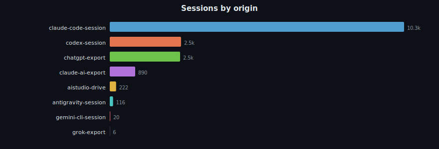
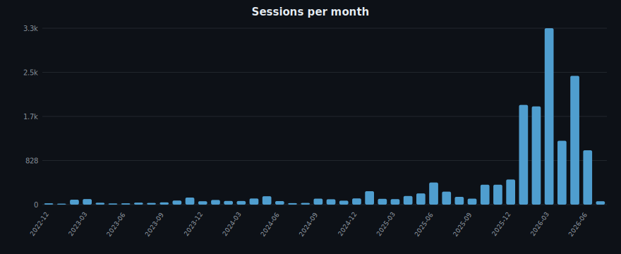
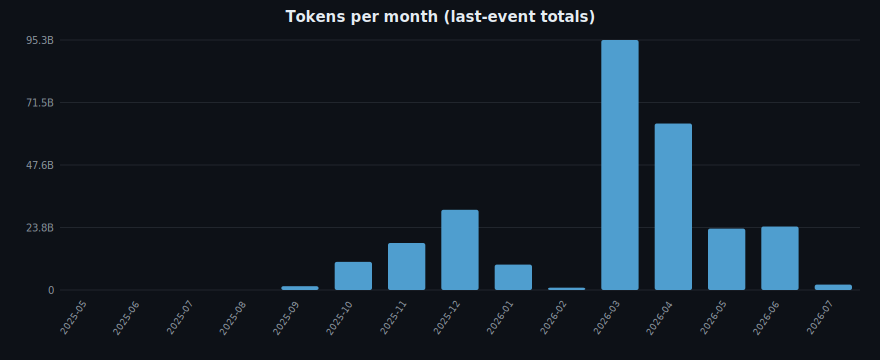
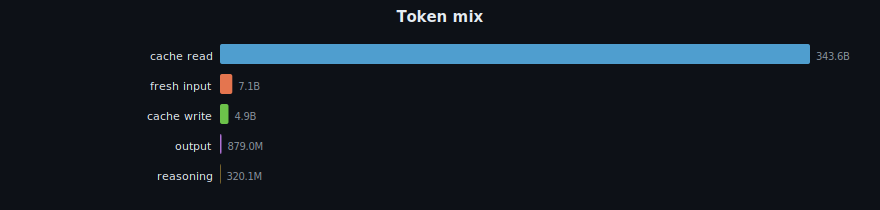
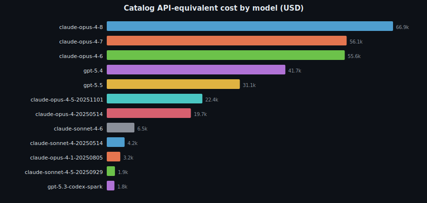
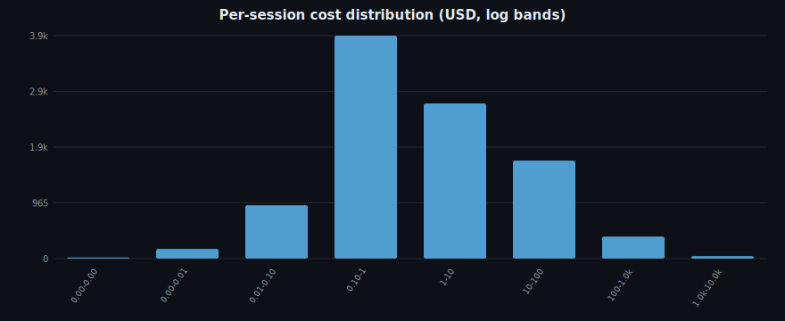
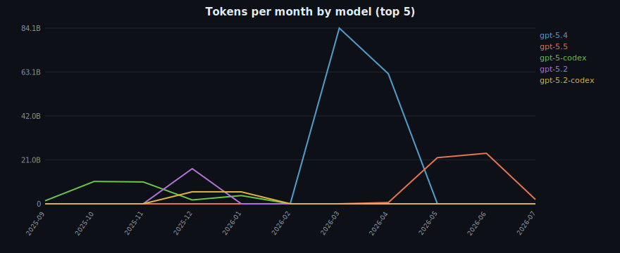
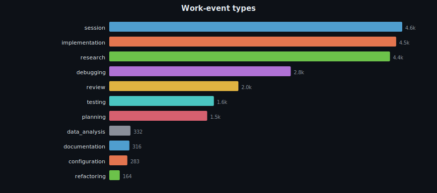
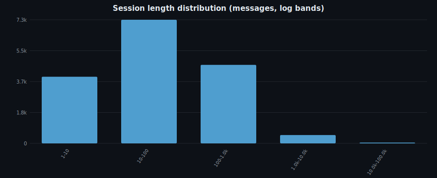

# AI-Agent Forensics

*Generated 2026-07-03 against `/home/sinity/.local/share/polylogue` (read-only).
Aggregate statistics only — no message content. This is the latest full
forensics report, but its schema-v23 archive cardinality is now historical; use
the refreshed temporal/archive-debt demo packets for current schema-v24
cardinality until this full packet is regenerated after profile convergence.*

## Headline

- **Span:** 2022-12-11 → 2026-07-03
- **Sessions at report generation:** 16,498
- **Messages at report generation:** 4,142,175
- **Current v24 archive scale:** 16,627 physical sessions, 8,730 logical root
  sessions, 4,254,615 messages.
- **Physical archive tokens accounted:** 395.3B (all providers; physical-session grain)
- **Logical high-water tokens accounted:** 288.7B (all providers;
  logical-session-model-high-water grain), a 106.6B replay-chain gap.
- **Claude Code logical high-water tokens:** 153.5B vs 175.8B physical-session
  Claude Code tokens, a 22.3B replay-chain gap.
- **Codex logical high-water tokens:** 135.2B vs 219.5B physical-session Codex
  tokens, an 84.2B replay-chain gap.
- **Catalog API-equivalent cost:** $337,565.03 (all matched provenances, provisional; see cost caveats).
- **Stored/provider-priced subset:** $243,392.19 from archive `cost_usd` rows.

## Corpus by origin



## Temporal rhythm



Peak month: **2026-03** with 3,311 sessions.



## Token economy

Token classes are priced very differently and are accounted by evidence
provenance. **priced** rows carry stored archive `cost_usd`; **origin_reported**
rows carry provider-reported token counts but no stored dollar amount. The
report layers a separate catalog API-equivalent estimate over both provenances
when the shared vendored LiteLLM catalog can match the model. This is not
provider billing truth.

Token totals have a second axis: grain. Physical-session rows answer "what is
materialized in the archive"; logical-session high-water rows answer "what is
the best current non-replay view of a fork/resume chain." Both are useful, but
they are not interchangeable.

All-provider live audit (`polylogue --plain analyze usage --detail headline
--format json --limit 0`):

| grain | input | output | cache read | cache write | total |
|---|---:|---:|---:|---:|---:|
| physical_session | 9.5B | 990.0M | 379.9B | 5.0B | 395.3B |
| logical_session_model_high_water | 4.9B | 707.5M | 279.3B | 3.8B | 288.7B |

Live audit command:

```bash
POLYLOGUE_ARCHIVE_ROOT=/home/sinity/.local/share/polylogue \
  polylogue --plain analyze usage --detail headline --origin <origin> --format json --limit 0
```

Claude Code:

| grain | input | output | cache read | cache write | total |
|---|---:|---:|---:|---:|---:|
| physical_session | 769.2M | 353.7M | 169.7B | 5.0B | 175.8B |
| logical_session_model_high_water | 386.7M | 309.6M | 148.9B | 3.8B | 153.5B |

Codex:

| grain | input | output | cache read | cache write | total |
|---|---:|---:|---:|---:|---:|
| physical_session | 8.7B | 567.0M | 210.2B | 0 | 219.5B |
| logical_session_model_high_water | 4.5B | 328.6M | 130.4B | 0 | 135.2B |

| provenance | input | output | cache read | cache write | stored cost | catalog API-equivalent | catalog matched rows |
|---|---|---|---|---|---|---|---:|
| priced | 769.2M | 423.0M | 169.7B | 5.0B | $243,392.19 | $243,392.19 | 12,650/13,889 |
| origin_reported | 8.7B | 567.0M | 210.2B | 0 | — | $94,172.84 | 2,302/2,308 |
| **all** | 9.5B | 990.0M | 379.9B | 5.0B | **$243,392.19** | **$337,565.03** | — |

**Cache amplification (priced lane): 221×.** Prompt caching served 169.7B cache-read tokens against only 769.2M fresh input — the model re-reads cached context ~221× more than it ingests fresh. Effective blended stored rate **$1.384/M** across priced-lane tokens (vs $15+/M list for fresh Opus input), because cache reads dominate the volume and are cheap. A token counter that ignores cache reads understates real usage by orders of magnitude.

Reasoning output (provider events, per-event deltas): **320.1M**.



## Cost



| model | provenances | sessions | stored cost | catalog API-equivalent | normalized | caveats |
|-------|-------------|----------|-------------|------------------------|------------|---------|
| claude-opus-4-8 | priced | 469 | $66,916.28 | $66,916.28 | claude-opus-4-8 | — |
| claude-opus-4-7 | priced | 663 | $56,070.17 | $56,070.17 | claude-opus-4-7 | — |
| claude-opus-4-6 | origin_reported, priced | 1,883 | $55,626.34 | $55,626.34 | claude-opus-4-6 | — |
| gpt-5.4 | origin_reported, priced | 531 | $0.00 | $41,749.60 | gpt-5.4 | — |
| gpt-5.5 | origin_reported, priced | 492 | $0.00 | $31,112.09 | gpt-5.5 | — |
| claude-opus-4-5-20251101 | priced | 578 | $22,352.70 | $22,352.70 | claude-opus-4-5 | — |
| claude-opus-4-20250514 | priced | 276 | $19,662.21 | $19,662.21 | claude-opus-4 | — |
| claude-sonnet-4-6 | origin_reported, priced | 1,037 | $6,462.88 | $6,462.88 | claude-sonnet-4-6 | — |
| claude-sonnet-4-20250514 | priced | 204 | $4,169.57 | $4,169.57 | claude-sonnet-4 | — |
| claude-opus-4-1-20250805 | priced | 21 | $3,168.39 | $3,168.39 | claude-opus-4-1 | — |
| claude-sonnet-4-5-20250929 | priced | 552 | $1,920.35 | $1,920.35 | claude-sonnet-4-5 | — |
| gpt-5.3-codex-spark | origin_reported, priced | 241 | $0.00 | $1,789.85 | gpt-5.3-codex | — |

Per-session cost (priced sessions: 9,780): median **$0.92**, p90 **$32.18**, max **$3,192.37**.



Cost provenance: priced (13,889 rows), origin_reported (2,308 rows).

Catalog pricing source: `litellm-model-prices-vendored+polylogue-curated-overrides` (effective date `2026-06-27`). Provider-reported token rows remain `origin_reported`; the catalog column is a derived API-list-equivalent estimate using stored disjoint token lanes.
Catalog caveats by affected row count: missing_cache_read_price=542, missing_cache_write_price=8, missing_price=6.
Known construct-validity caveat: all-provider logical-session repricing is still
under active repair. Treat physical-session totals as current archive
measurements; use logical-session high-water totals for logical work claims
where that grain is available.

## Subscription reality

The priced cost above is **API-list-equivalent**. The operator runs Claude Code on a **Max subscription**, where the economics differ sharply: **cache reads are free** (the API charges 10% of input), and usage is metered in *credits* — `(input + cache_write) × in_rate + output × out_rate`, cache reads excluded. (Credit rates reverse-engineered by [she-llac.com](https://she-llac.com/claude-limits); estimate, not official.)

Estimated subscription credits consumed: **3.6B** (haiku 90.4M, opus 3.0B, sonnet 567.5M).

At the Max-20× cap (~361.1M credits/month, $200/mo), that is **~10 plan-months** of capacity — but cache reads, which dominate the token volume (379.9B read), cost **zero** credits. The same priced-lane workload on the API would bill **$243,392.19** (list-equivalent), so the subscription captures the bulk of that as value: the free-cache-read effect is exactly why plan pricing beats the API by ~13–37× for agentic, cache-heavy use.

## Model evolution



## Workflow shape



Session length: median **51** messages, p90 **333**, max **96,748**.



## Structured failure follow-up

This section is the claim-vs-evidence core: it anchors on structured tool outcomes, not prose-mined success claims. A failed outcome is any action row with `is_error=1` or non-zero `exit_code`. The next assistant turn is then classified as `acknowledged`, `silent_proceed`, or `ambiguous` by a small, auditable acknowledgment-marker rule. The primary silent rate below is a conservative lower bound over all failed outcomes; `ambiguous` rows stay in the denominator instead of being forced into either class. Treat this as the structured core plus a lexical acknowledgment heuristic, not an LLM judgment.

This run is bounded to the first **5,000** structured failed outcome(s) returned by the canonical action view. Use the same command without `--failure-followup-limit` for a deliberate whole-archive scan.

Failed structured outcomes: **4,965**. Acknowledged: **622**; silent-proceed: **1,952** (39.3% lower bound over all failures; 75.8% among classified follow-ups); ambiguous: **2,391**.

| tool | failed outcomes | acknowledged | silent-proceed | ambiguous | silent lower bound | silent among classified |
|---|---:|---:|---:|---:|---:|---:|
| Bash | 2,531 | 542 | 1,067 | 922 | 42.2% | 66.3% |
| Edit | 1,106 | 36 | 391 | 679 | 35.4% | 91.6% |
| Read | 734 | 11 | 207 | 516 | 28.2% | 95.0% |
| MultiEdit | 225 | 14 | 144 | 67 | 64.0% | 91.1% |
| Grep | 102 | 5 | 31 | 66 | 30.4% | 86.1% |
| Write | 90 | 4 | 24 | 62 | 26.7% | 85.7% |
| Agent | 26 | 0 | 12 | 14 | 46.2% | 100.0% |
| Task | 21 | 0 | 10 | 11 | 47.6% | 100.0% |
| Glob | 17 | 1 | 2 | 14 | 11.8% | 66.7% |
| TaskOutput | 14 | 1 | 7 | 6 | 50.0% | 87.5% |
| mcp__lynchpin__query_substrate | 13 | 0 | 7 | 6 | 53.8% | 100.0% |
| ExitPlanMode | 9 | 0 | 8 | 1 | 88.9% | 100.0% |

| model | failed outcomes | acknowledged | silent-proceed | ambiguous | silent lower bound | silent among classified |
|---|---:|---:|---:|---:|---:|---:|
| claude-haiku-4-5-20251001 | 821 | 28 | 328 | 465 | 40.0% | 92.1% |
| claude-sonnet-4-20250514 | 782 | 176 | 364 | 242 | 46.5% | 67.4% |
| claude-opus-4-6 | 664 | 66 | 135 | 463 | 20.3% | 67.2% |
| claude-opus-4-8 | 504 | 4 | 193 | 307 | 38.3% | 98.0% |
| deepseek-v4-pro | 445 | 128 | 267 | 50 | 60.0% | 67.6% |
| claude-opus-4-20250514 | 436 | 75 | 232 | 129 | 53.2% | 75.6% |
| claude-opus-4-5-20251101 | 339 | 89 | 154 | 96 | 45.4% | 63.4% |
| claude-sonnet-4-6 | 297 | 18 | 43 | 236 | 14.5% | 70.5% |
| claude-opus-4-7 | 284 | 8 | 56 | 220 | 19.7% | 87.5% |
| deepseek-v4-flash | 196 | 12 | 67 | 117 | 34.2% | 84.8% |
| claude-opus-4-1-20250805 | 68 | 7 | 32 | 29 | 47.1% | 82.1% |
| claude-sonnet-4-5-20250929 | 53 | 6 | 24 | 23 | 45.3% | 80.0% |

Sample ref-backed instances:

- `acknowledged` `str_replace` exit=`None` error=`1` [message:claude-ai-export:064df125-82df-44d7-9e29-6bcc15dbd2a7:019e06f5-20a1-7221-af70-4a1cbf2e1ac0] -> [message:claude-ai-export:064df125-82df-44d7-9e29-6bcc15dbd2a7:019e06f9-a45f-7e07-b03f-be805839b828] — `{&quot;description&quot;:&quot;Remove interpersonal risk/anger section from Polish file&quot;,&quot;new_str&quot;:&quot;**Ogólne sformułowanie:**&quot;,&quot;old_str&quot;:&quot;**Ryzyko interpersonalne/gniew: jeden`
- `ambiguous` `present_files` exit=`None` error=`1` [message:claude-ai-export:064df125-82df-44d7-9e29-6bcc15dbd2a7:019e07d8-1cd7-711f-a578-3837217c2cad] -> [no-next-assistant-turn] — `{&quot;filepaths&quot;:[&quot;/home/claude/zunifikowana.md&quot;]}`
- `silent_proceed` `web_fetch` exit=`None` error=`1` [message:claude-ai-export:0e59100a-ba5a-4be6-8f45-0e02ee0c8b1b:019d5930-2e1d-7dae-ad29-dea1c55e31cf] -> [message:claude-ai-export:0e59100a-ba5a-4be6-8f45-0e02ee0c8b1b:019d593c-0237-7153-ab71-4290920aa537] — `{&quot;url&quot;:&quot;https://support.claude.com/en/articles/13189465-logging-in-to-your-claude-account&quot;}`
- `silent_proceed` `web_fetch` exit=`None` error=`1` [message:claude-ai-export:0e59100a-ba5a-4be6-8f45-0e02ee0c8b1b:019d5930-2e1d-7dae-ad29-dea1c55e31cf] -> [message:claude-ai-export:0e59100a-ba5a-4be6-8f45-0e02ee0c8b1b:019d593c-0237-7153-ab71-4290920aa537] — `{&quot;url&quot;:&quot;https://x.com/bcherny/status/2040206443094446558&quot;}`
- `silent_proceed` `view` exit=`None` error=`1` [message:claude-ai-export:2c2eab57-fc6c-4c61-99fa-f61af3b7ac57:019f0491-acfb-7fc2-b6df-f2ae55930f89] -> [message:claude-ai-export:2c2eab57-fc6c-4c61-99fa-f61af3b7ac57:019f06cc-676b-738d-9759-74ba097358dd] — `{&quot;path&quot;:&quot;/mnt/user-data/uploads/tempchat.md&quot;}`
- `silent_proceed` `str_replace` exit=`None` error=`1` [message:claude-ai-export:2c2eab57-fc6c-4c61-99fa-f61af3b7ac57:019f0857-a693-7157-84d6-a0e70d9b6f5b] -> [message:claude-ai-export:2c2eab57-fc6c-4c61-99fa-f61af3b7ac57:019f0941-cba2-70a8-b0bb-4de18fa961e5] — `{&quot;description&quot;:&quot;Strengthen CV independent-work bullet with verified agentic-engineering scale&quot;,&quot;new_str&quot;:&quot;**Independent developer / open-source** — Remote · 202`
- `acknowledged` `create_file` exit=`None` error=`1` [message:claude-ai-export:2c2eab57-fc6c-4c61-99fa-f61af3b7ac57:019f0941-cba2-70a8-b0bb-4de18fa961e5] -> [message:claude-ai-export:2c2eab57-fc6c-4c61-99fa-f61af3b7ac57:019f094c-94ba-7637-b70a-464e655d31ef] — `{&quot;description&quot;:&quot;Regenerated HTML CV matching the optimized markdown, same proven styling&quot;,&quot;file_text&quot;:&quot;&lt;!DOCTYPE html&gt;\n&lt;html lang=\&quot;en\&quot;&gt;\n&lt;head&gt;\n&lt;meta charse`
- `silent_proceed` `web_fetch` exit=`None` error=`1` [message:claude-ai-export:86789970-6838-4d1d-ab15-526095c51d09:019cd7b6-95d5-702d-80c3-f9c7b6936ee9] -> [message:claude-ai-export:86789970-6838-4d1d-ab15-526095c51d09:019cd814-ac85-74bd-b6d3-e2c2885e31d6] — `{&quot;url&quot;:&quot;https://claude.ai/oauth/authorize?code=true&amp;client_id=9d1c250a-e61b-44d9-88ed-5944d1962f5e&amp;response_type=code&amp;redirect_uri=https%3A%2F%2Fplatform.claude`

Stratified audit samples:

- `acknowledged`
  - `str_replace` exit=`None` error=`1` [message:claude-ai-export:064df125-82df-44d7-9e29-6bcc15dbd2a7:019e06f5-20a1-7221-af70-4a1cbf2e1ac0] -> [message:claude-ai-export:064df125-82df-44d7-9e29-6bcc15dbd2a7:019e06f9-a45f-7e07-b03f-be805839b828] — `{&quot;description&quot;:&quot;Remove interpersonal risk/anger section from Polish file&quot;,&quot;new_str&quot;:&quot;**Ogólne sformułowanie:**&quot;,&quot;old_str&quot;:&quot;**Ryzyko interpersonalne/gniew: jeden`
  - `create_file` exit=`None` error=`1` [message:claude-ai-export:2c2eab57-fc6c-4c61-99fa-f61af3b7ac57:019f0941-cba2-70a8-b0bb-4de18fa961e5] -> [message:claude-ai-export:2c2eab57-fc6c-4c61-99fa-f61af3b7ac57:019f094c-94ba-7637-b70a-464e655d31ef] — `{&quot;description&quot;:&quot;Regenerated HTML CV matching the optimized markdown, same proven styling&quot;,&quot;file_text&quot;:&quot;&lt;!DOCTYPE html&gt;\n&lt;html lang=\&quot;en\&quot;&gt;\n&lt;head&gt;\n&lt;meta charse`
  - `view` exit=`None` error=`1` [message:claude-ai-export:b4db10b0-ec36-4b43-99c2-9a8812f62cbe:019e03e5-6711-734b-bb65-7d370d0beb37] -> [message:claude-ai-export:b4db10b0-ec36-4b43-99c2-9a8812f62cbe:019e0400-4362-7c1f-83ff-6e0e651d16d2] — `{&quot;path&quot;:&quot;/mnt/skills/public/frontend-design/SKILL.md&quot;}`
- `silent_proceed`
  - `web_fetch` exit=`None` error=`1` [message:claude-ai-export:0e59100a-ba5a-4be6-8f45-0e02ee0c8b1b:019d5930-2e1d-7dae-ad29-dea1c55e31cf] -> [message:claude-ai-export:0e59100a-ba5a-4be6-8f45-0e02ee0c8b1b:019d593c-0237-7153-ab71-4290920aa537] — `{&quot;url&quot;:&quot;https://support.claude.com/en/articles/13189465-logging-in-to-your-claude-account&quot;}`
  - `web_fetch` exit=`None` error=`1` [message:claude-ai-export:0e59100a-ba5a-4be6-8f45-0e02ee0c8b1b:019d5930-2e1d-7dae-ad29-dea1c55e31cf] -> [message:claude-ai-export:0e59100a-ba5a-4be6-8f45-0e02ee0c8b1b:019d593c-0237-7153-ab71-4290920aa537] — `{&quot;url&quot;:&quot;https://x.com/bcherny/status/2040206443094446558&quot;}`
  - `view` exit=`None` error=`1` [message:claude-ai-export:2c2eab57-fc6c-4c61-99fa-f61af3b7ac57:019f0491-acfb-7fc2-b6df-f2ae55930f89] -> [message:claude-ai-export:2c2eab57-fc6c-4c61-99fa-f61af3b7ac57:019f06cc-676b-738d-9759-74ba097358dd] — `{&quot;path&quot;:&quot;/mnt/user-data/uploads/tempchat.md&quot;}`
- `ambiguous`
  - `present_files` exit=`None` error=`1` [message:claude-ai-export:064df125-82df-44d7-9e29-6bcc15dbd2a7:019e07d8-1cd7-711f-a578-3837217c2cad] -> [no-next-assistant-turn] — `{&quot;filepaths&quot;:[&quot;/home/claude/zunifikowana.md&quot;]}`
  - `bash` exit=`None` error=`1` [message:claude-ai-export:a5b2daf8-3a28-410f-8f75-66ebdfe6de4a:019c9739-852b-732a-a680-2b9480791e32] -> [no-next-assistant-turn] — `{&quot;command&quot;:&quot;cat &gt; /mnt/user-data/outputs/gender-bias-distillation.md &lt;&lt; 'EOF'\n# Distillation: Gender-Based Asymmetry in AI Responses\n\n## Initial Introspectio`
  - `file_create` exit=`None` error=`1` [message:claude-ai-export:a5b2daf8-3a28-410f-8f75-66ebdfe6de4a:019c9739-852b-732a-a680-2b9480791e32] -> [no-next-assistant-turn] — `{&quot;content&quot;:&quot;# Distillation: Gender-Based Asymmetry in AI Responses\n\n## Initial Introspection\nWhen asked to reflect on reactions to requests for gender-based `

---

*Reproduce token-grain audit: `POLYLOGUE_ARCHIVE_ROOT=<root> polylogue --plain analyze usage --detail headline --format json --limit 0`.
Use `--origin claude-code-session` or `--origin codex-session` for origin drilldowns.
Reproduce cost rollups: `POLYLOGUE_ARCHIVE_ROOT=<root> polylogue --plain analyze insights cost-rollups --format json`.
Numbers are read directly from the archive's materialized analytics and action
tables (`session_model_usage`, `session_provider_usage_events`,
`session_work_events`, `sessions`, `actions`, `messages`, `blocks`).*
