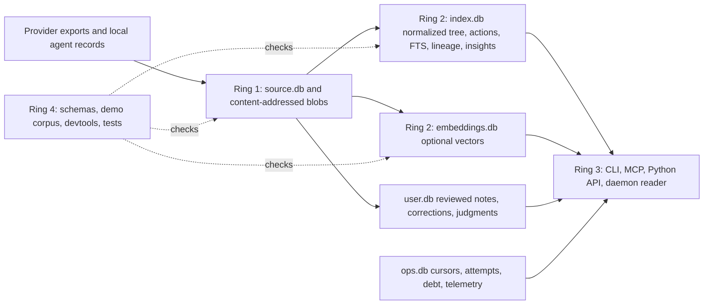

# Polylogue README and positioning rewrite

Snapshot audited: commit `536a53efac0cbe4a2473ad379e4db49ef3fce74d`, dirty working tree, package version `0.2.0+536a53ef-dirty`.

## Executive result

The strongest opening is not “chat history search.” Polylogue is a local-first archive and forensics layer for AI and agent sessions. The source supports that category through durable raw evidence, normalized action outcomes, lineage-aware reads, separated cost provenance, and a shared CLI/MCP archive substrate.

The rewrite below leads with a deterministic receipt, then shows provider fidelity, bounded field findings, and one explicit refusal. Architecture comes after those artifacts. Claims about memory uplift, billing accuracy, universal provider fidelity, ambient activity reconstruction, and six-tool MCP simplicity are excluded or left behind marked integration slots.

One blocking contradiction prevents the supplied snapshot from supporting the requested published quickstart. `polylogue import --demo --wait` stages and ingests the expanded fixture world, but it does not converge to the same archive as `polylogue demo seed`. The direct seeder verified 15 sessions, 62 messages, and every declared construct. The daemon path produced 15 sessions and 60 messages, changed one AI Studio session ID, and lacked provider usage, capture-gap, browser-capture variant, source-outage, and embedding constructs. Its integration test and success banner still expect the older 3-session, 19-message world. The draft therefore includes the exact intended command path behind a merge gate and publishes no canonical demo count.

The dedicated demo export also fails its global packet-registry verifier because three packets lack recorded `run.log` files and contain stale receipt hashes. Its shelf check reports drift in the manifest, summary index, shelf README, and curated catalog. The affected refusal claim still reproduces through its narrower archive-schema oracle, but the shelf must be regenerated before the README can cite a clean global demo gate.

Observed facts, source-supported inferences, unresolved questions, and recommendations are separated in `EVIDENCE.md`. Structural choices are recorded in `DECISIONS.md`. The exact repair and merge sequence is in `NEXT-ACTIONS.md`.

## README draft

The content below is the proposed root `README.md`. HTML comments are instructions for the integration lane and should not remain as visible prose. The quickstart is complete as copy, but its merge gate must pass before publication.

---

# Polylogue

Polylogue is a local-first archive and forensics layer for AI and agent sessions. `polylogue import` ingests provider exports and local agent logs into a daemon-owned, single-writer archive; `polylogue find`, `polylogue read`, and `polylogue analyze` inspect normalized messages, tool outcomes, lineage, and usage evidence. Raw source evidence and reviewed user state live in durable tiers, while search indexes, analytics, embeddings, and operational state are rebuildable; inspect the resolved layout with `polylogue config paths --format json`.

## Quickstart

<!-- [90-second timing proof]
Before labeling this section “90-second quickstart,” measure a clean released-package run on a named host. Record install time separately from daemon start, import convergence, and the three reads below.

MERGE GATE: snapshot 536a53ef does not pass `polylogue import --demo --wait`. Do not publish this section until NEXT-ACTIONS QA-01 passes and the generated demo report supplies the canonical expected state.
-->

Install the three console scripts in an isolated Python environment:

```bash
pipx install polylogue
polylogue --version
polylogued --help
polylogue-mcp --help
```

Use a throwaway deterministic corpus. It does not read personal transcripts or provider accounts.

In terminal 1:

```bash
export POLYLOGUE_DEMO_HOME="${TMPDIR:-/tmp}/polylogue-readme-demo"
export POLYLOGUE_ARCHIVE_ROOT="$POLYLOGUE_DEMO_HOME/archive"
export XDG_CONFIG_HOME="$POLYLOGUE_DEMO_HOME/config"
rm -rf "$POLYLOGUE_DEMO_HOME"
mkdir -p "$POLYLOGUE_ARCHIVE_ROOT/inbox"
polylogued run \
  --root "$POLYLOGUE_ARCHIVE_ROOT/inbox" \
  --no-browser-capture
```

In terminal 2:

```bash
export POLYLOGUE_DEMO_HOME="${TMPDIR:-/tmp}/polylogue-readme-demo"
export POLYLOGUE_ARCHIVE_ROOT="$POLYLOGUE_DEMO_HOME/archive"
export XDG_CONFIG_HOME="$POLYLOGUE_DEMO_HOME/config"

polylogue import --demo --wait --timeout 30
polylogue --plain find pytest
polylogue --plain find id:codex-session:demo-receipts then read --view messages
polylogue --plain 'actions where is_error:true | group by tool | count'
```

The first query returns sessions whose indexed evidence contains `pytest`. The exact-ref read shows a failed test receipt, an assistant success claim, a file edit, and a later successful test. The final query counts structurally failed actions by normalized tool, rather than counting prose that happens to contain the word “error.” Stop terminal 1 with `Ctrl-C` when finished.

## What it captures

Public query and read surfaces use `origin`, which names the source family. `capture_mode` says how bytes arrived. `provider_wire` remains an internal parser/schema coordinate. After the quickstart, inspect detector and parser decisions for its Codex receipt with `polylogue import "$POLYLOGUE_ARCHIVE_ROOT/demo-fixture-world-source/codex/receipts.jsonl" --explain --format json`. In a source checkout, inspect every package row with `python -m devtools lab provider completeness --json`.

“Complete” in the table means the accepted importer package has detector, parser, fixture, schema, query/read, explanation, privacy, and documentation evidence. It does not mean every provider field is lossless.

| Public origin | Accepted input or capture mode | Evidence retained | Fidelity boundary | Command that exposes the imported result |
|---|---|---|---|---|
| `claude-code-session` | Claude Code export JSONL | Roles, prose, thinking, tool calls/results, structural errors, file and git actions, subagent and compaction records, model and usage fields when present | Does not reconstruct workspace file history outside captured records | `polylogue --origin claude-code-session read --all --limit 1 --format json` |
| `codex-session` | Codex session JSONL across three detected format generations | Roles, prose, session metadata, git/system context, normalized action evidence for supported records, provider usage where counters exist | Fidelity varies by generation; current provider prose is stale about tool pairing and must be reconciled with parser tests | `polylogue --origin codex-session read --all --limit 1 --format json` |
| `chatgpt-export` | ChatGPT Takeout JSON, message lists, or JSONL | Message text, roles, ordering, session metadata, attachment metadata | Attachment binaries are not downloaded; usage is estimate-only | `polylogue --origin chatgpt-export read --all --limit 1 --format json` |
| `claude-ai-export` | Claude.ai export JSON or ZIP | Typed message IDs, text, sender, timestamps, normalized roles and blocks, attachment metadata | Attachment binaries are not copied; usage is estimate-only | `polylogue --origin claude-ai-export read --all --limit 1 --format json` |
| `aistudio-drive` | AI Studio or Drive-like export | Ordered prompt chunks, attachment references and provider IDs; Drive acquisition can store attachment bytes | Drive acquisition requires OAuth; usage coverage is partial | `polylogue --origin aistudio-drive read --all --limit 1 --format json` |
| `gemini-cli-session` | Gemini CLI local-agent document | Normalized session/message records and supported action evidence | Usage coverage is partial; fidelity follows the local-agent document shape | `polylogue --origin gemini-cli-session read --all --limit 1 --format json` |
| `antigravity-session` | Antigravity language-server export | Normalized sessions and messages from accepted export shapes | Provider usage is unsupported | `polylogue --origin antigravity-session read --all --limit 1 --format json` |
| `hermes-session` | Hermes `state.db` | Sessions, messages, and exact usage where state counters exist | ATIF trajectory import is a separate path: top-level and message-only mapping are exact, tool/observation/subagent shapes are inferred, and approval/error decisions are absent | `polylogue --origin hermes-session read --all --limit 1 --format json` |
| Generic fallback (`unknown-export` storage token) | Best-effort detector/parser fallback | Best-effort message extraction | No provider-specific fidelity guarantee; usage is unsupported | Run the fallback smoke below; the current CLI does not accept this token through `--origin` |

The fallback path is directly inspectable without importing personal data:

```bash
printf '%s\n' '{"id":"fallback-demo","messages":[{"role":"user","content":"hello"}]}' \
  > "${TMPDIR:-/tmp}/polylogue-fallback-demo.json"
polylogue import "${TMPDIR:-/tmp}/polylogue-fallback-demo.json" \
  --explain \
  --format json
```

The explanation reports `detected_origin` as `unknown-export`; the current public `--origin` filter does not accept that token. Browser capture is a capture mode, not a public origin. The current completeness registry marks the live receiver as proposed and maps captured page sessions to provider-specific origins during parsing. `grok-export` is a reserved origin token with no wired parser. Verify the registry boundaries in a checkout with `python -m devtools lab provider completeness --json`.

## Demonstrations with receipts

<!-- [demo numbers]
Refresh each card from one generated, commit-stamped metrics source. Keep one headline number per card. Do not copy counts from prose docs when the generated artifact disagrees.
-->

### Structural receipt: claim contradicted, then repaired

**Claim.** Polylogue can compare assistant prose with typed tool outcomes and retain the later repair. The deterministic receipt contains a failed `pytest` action with exit status **1**.

```bash
polylogue demo receipts --compact
```

**Honesty boundary.** This is a private-data-free contract proof. It does not estimate how often agents make unsupported completion claims in real archives.

### Bounded field finding: failure follow-up

**Claim.** Polylogue can anchor a field finding on normalized failed tool results, publish the sample frame, and reproduce the method without publishing private transcript rows. The current aggregate packet inspected **5,000** structured failures.

From a source checkout:

```bash
export POLYLOGUE_ARCHIVE_ROOT="${TMPDIR:-/tmp}/polylogue-claim-vs-evidence-demo"
export POLYLOGUE_CVE_OUT="${TMPDIR:-/tmp}/polylogue-claim-vs-evidence-repro"
rm -rf "$POLYLOGUE_ARCHIVE_ROOT" "$POLYLOGUE_CVE_OUT"

polylogue demo seed \
  --root "$POLYLOGUE_ARCHIVE_ROOT" \
  --force \
  --with-overlays \
  --format json
polylogue demo verify \
  --root "$POLYLOGUE_ARCHIVE_ROOT" \
  --require-overlays \
  --format json
polylogue --plain --format json \
  'actions where is_error:true | group by followup_class | count'
python -m devtools workspace claim-vs-evidence \
  --archive-root "$POLYLOGUE_ARCHIVE_ROOT" \
  --limit 5000 \
  --out-dir "$POLYLOGUE_CVE_OUT" \
  --json
```

**Honesty boundary.** The published field count is an aggregate over a private archive. The seeded corpus reproduces the predicate, classifier, report shape, and caveats, not the private rate. The classifier is marker-based, ambiguous rows remain in the denominator, and the field sample is bounded.

### Longitudinal usage forensics

**Claim.** `polylogue analyze usage` can keep physical-session totals, logical-session high-water totals, and pricing provenance in separate lanes. The current private packet covered **16,816** physical sessions.

```bash
export POLYLOGUE_USAGE_DEMO="${TMPDIR:-/tmp}/polylogue-usage-demo"
rm -rf "$POLYLOGUE_USAGE_DEMO"
polylogue demo seed \
  --root "$POLYLOGUE_USAGE_DEMO" \
  --force \
  --format json
POLYLOGUE_ARCHIVE_ROOT="$POLYLOGUE_USAGE_DEMO" \
  polylogue --plain analyze usage \
    --detail headline \
    --format json \
    --limit 0
```

**Honesty boundary.** The headline count comes from a committed aggregate over an operator archive; the seeded command reproduces the report lanes, not that private count. This is not provider billing truth. Missing usage is unknown, not zero, and catalog API-equivalent estimates are not summed with subscription-credit views.

### Refusal demo: absent ambient sources

**Claim.** Polylogue refuses a minute-by-minute desktop reconstruction when the archive has no window-focus, independent shell-history, or browser-tab source tables. The current schema packet found **0** required ambient source tables.

From a source checkout:

```bash
grep -h "CREATE TABLE" polylogue/storage/sqlite/archive_tiers/*.py \
  | grep -iE "window|focus|shell_history|browser_tab|activitywatch" \
  | wc -l
```

The expected output is `0`. This narrow schema oracle is used because the snapshot-wide demo registry currently has unrelated packet receipt drift and does not pass as a global gate.

**Honesty boundary.** The result describes the current Polylogue archive schema. It does not claim that cross-source reconstruction is impossible in a future federated architecture.

## Architecture in one diagram



`polylogued run` owns archive writes. `source.db` and `user.db` carry durable evidence and human judgment. `index.db`, `embeddings.db`, and `ops.db` can be regenerated according to their tier contracts. Inspect paths and health with:

```bash
polylogue config paths --format json
polylogue ops status --format json
```

A source-to-index replay is explicit and authority-safe. Inspect the selected raw rows and weight before execution:

```bash
polylogue ops maintenance rebuild-index \
  --plan \
  --output-format json
```

After `polylogue ops reset --index --yes`, the current CLI directs the operator to `polylogue ops maintenance rebuild-index --output-format json`. Do not treat daemon startup alone as the replay command; older architecture prose in this snapshot still does and must be reconciled.

The ingest path is shape detection, provider parsing, NFC-normalized SHA-256 identity, idempotent storage, derived insight materialization, and FTS indexing. `polylogue import "$POLYLOGUE_ARCHIVE_ROOT/demo-fixture-world-source/codex/receipts.jsonl" --explain --format json` shows detector and parser decisions for the quickstart fixture before scheduling; `polylogue ops status --full --format json` shows convergence and archive health after scheduling.

## MCP and agent integration

`polylogue-mcp` is a standalone stdio server over the same local archive. Verify the runtime role surface with `polylogue-mcp --help`.

```json
{
  "mcpServers": {
    "polylogue": {
      "command": "polylogue-mcp",
      "args": ["--role", "read"]
    }
  }
}
```

<!-- [six-tool table]
Replace the current-state fallback below after the six-tool registry lands.
Required columns: tool, intent, minimum role, key input, result/ref semantics, and one copy-paste client example.
Generate the table from the registry and test the generated count. Do not publish the six-tool table and the 104-tool fallback together.
-->

**Current-state fallback.** At snapshot `536a53ef`, the generated MCP reference enumerates 104 registered tool names. Runtime roles are `read`, `write`, `review`, and `admin`; `read` is the default, while higher roles add mutation, candidate-review, and maintenance capabilities. The generated prose has not yet caught up with the runtime `review` role, so regenerate `docs/mcp-reference.md` before merging any MCP copy. Run `polylogue-mcp --help` for the executable contract and `python -m devtools render all --check` for generated-reference drift.

## Search boundaries

Ordinary text queries use the lexical FTS lane by default. `polylogue --semantic find 'prompt'` and the `--similar TEXT` option are explicit vector requests and require enabled embeddings; check readiness with `polylogue ops embed status`. Hybrid retrieval is also explicit with `--retrieval-lane hybrid`.

FTS indexes message prose, thinking/reasoning text, tool-result output, tool names, shell commands, and selected path fields. It does not index full `Write` content or `Edit` old/new bodies. Search those stored action inputs with the unindexed action-evidence predicate and constrain it on large archives:

```bash
polylogue 'actions where tool:edit AND text:"SharedClock"'
polylogue 'sessions where exists action(tool:edit AND text:"SharedClock")'
```

## Limitations and trust boundary

- Polylogue assumes a trusted, single-user host. The daemon binds to loopback by default, but it is not a multi-user isolation boundary. Use host disk encryption because raw archives can contain code, paths, tool output, secrets, and personal conversations. Check the active endpoint and archive state with `polylogue ops status --full --format json`.
- One daemon process owns writes. CPU-heavy parsing can use worker processes, but SQLite writes converge through the daemon. Start it with `polylogued run` and inspect debt with `polylogue ops debt`.
- Derived tiers are rebuildable, not disposable without consequence. Rebuilding vectors can incur provider calls; inspect `polylogue ops embed preflight --max-sessions 10 --format json` before enabling or backfilling embeddings.
- Provider fidelity is uneven. Run `polylogue import "$POLYLOGUE_ARCHIVE_ROOT/demo-fixture-world-source/codex/receipts.jsonl" --explain --format json` against the quickstart fixture and, in a checkout, `python -m devtools lab provider completeness --json` before claiming an importer is complete.
- Cost output is an evidence model, not an invoice. Run `polylogue analyze usage --detail full --format json --limit 0` to see missing models, provider events, cumulative counters, pricing provenance, and caveats.
- Polylogue does not record an ambient desktop timeline unless those source domains are explicitly ingested. The refusal demo above is the current structural proof.
- `grok-export` is reserved but has no parser. Browser capture is still a proposed package-completeness row. Check current status with `python -m devtools lab provider completeness --json`.
- Polylogue is pre-1.0. There is no long-term-support branch; run `polylogue --version` and verify the selected release channel before relying on a documented surface.

## Documentation and verification

- Query grammar and retrieval lanes: `docs/search.md`
- Provider identity and capture vocabulary: `docs/provider-origin-identity.md`
- Cost provenance: `docs/cost-model.md`
- Architecture and schema tiers: `docs/architecture.md`, `docs/schema.md`
- Generated CLI and MCP references: `docs/cli-reference.md`, `docs/mcp-reference.md`
- Bounded proof artifacts: `docs/proof-artifacts.md`, `.agent/demos/`

From a source checkout, the documentation gates are:

```bash
python -m devtools verify doc-commands
python -m devtools lab provider completeness --check
python -m devtools workspace demo-shelf --check
python -m devtools render all --check
```

---

## Positioning kit

### GitHub about line

Local-first archive and forensics for AI and agent sessions, with queryable evidence, lineage, and costs.

Character count: 105.

### Two-sentence description

Polylogue ingests AI chat exports and coding-agent session files into a local, single-writer archive. `polylogue find`, `polylogue read`, and `polylogue analyze` turn raw transcripts, tool outcomes, lineage, and usage records into reproducible evidence, while `polylogue-mcp` exposes the same archive to agent clients.

### One-paragraph description

Polylogue is a local-first archive and forensics layer for AI and agent sessions. It preserves acquired provider records, normalizes messages and typed tool outcomes, composes session lineage without discarding physical evidence, and keeps usage and pricing provenance explicit. Operators inspect the archive with `polylogue find`, `polylogue read`, and `polylogue analyze`; agent clients use the same local substrate through `polylogue-mcp`. Deterministic demos and generated verification surfaces show what each claim rests on and where the archive has no evidence.

### What it is not

- It is not an agent. It records and interrogates work produced by agents and chat systems.
- It is not a cloud service. The default trust model is a local, single-user host.
- It is not a memory-retrieval benchmark player. The snapshot does not support a publishable downstream uplift claim.
- It is not a billing authority. Provider-reported usage, catalog estimates, and subscription-credit views remain separate evidence lanes.
- It is not a desktop activity recorder. Window focus, independent shell history, and browser-tab timelines are absent unless a future source explicitly supplies them.

## Gap report

| Claim wanted for the README | Missing evidence in snapshot | Demo or feature that would supply it |
|---|---|---|
| “Run the complete demo through the daemon in one command.” | `polylogue import --demo --wait` does not converge to the canonical direct-seed construct set; the banner and integration test encode stale counts. | Unify daemon and direct seed orchestration, replace hardcoded counts with generated metrics, and add a live-daemon parity test. |
| “From install to evidence in 90 seconds.” | No released-package wall-clock capture on a named host; current daemon path fails. | Release-channel timing harness that records install, daemon readiness, ingest convergence, and first read separately. |
| “The demo corpus contains N sessions/messages/origins.” | Snapshot has incompatible 3/19, 13/55, 15/60, and 15/62 states in tests, prose, daemon output, and direct seed output. | One canonical generated corpus datasheet consumed by seeder, verifier, tests, banner, README, and docs. |
| “Six MCP tools cover the agent workflow.” | The six-tool registry is landing in a parallel lane and is absent from the snapshot. Current generated reference has 104 names. | Land the registry, generated six-tool table, role tests, client smoke, and old-tool migration map. |
| “Every supported provider preserves tool calls and results losslessly.” | Provider packages are accepted, but fidelity differs; Hermes ATIF has inferred and absent fields, and some provider docs are stale. | Per-origin golden fidelity matrix with real or redacted wire fixtures, expected losses, and read-view snapshots. |
| “Codex tool pairing is supported across every historical format.” | Current parser/demo has action pairing, while `docs/providers/openai-codex.md` says it is unimplemented; no single generation-by-generation proof is published. | Three-generation Codex fixture demo with paired/unpaired counts and generated provider docs. |
| “Browser capture is production-ready.” | Completeness registry marks the live receiver as proposed; no release-channel browser smoke was accessed. | Browser extension and daemon receiver smoke with auth, readiness, coalescing, raw variants, and release artifact version parity. |
| “Polylogue improves continuation quality.” | The current uplift pilot is `n=5`, uses hand-written summaries, has a compromised blind, and includes a false-fact counterexample. | Independent `n>=12` production-pack experiment with preregistered scoring, fresh generated packs, clean blinding, and counterexample reporting. |
| “Polylogue is fast on a large archive.” | No README-grade latency table tied to current schema, hardware, query lane, cold/warm state, and archive cardinality. | Reproducible benchmark packet for find, exact read, action aggregation, usage headline, and bounded MCP call latency. |
| “Cost totals match provider billing.” | Cost model explicitly does not query billing; some origins are estimate-only or partial. | Provider invoice reconciliation demo with matched periods, coverage ratios, model mapping, and explicit residuals. |
| “Search covers everything an agent wrote.” | FTS excludes `Write.content` and `Edit.old_string/new_string`; workaround is unindexed. | Live archive FTS size/latency probe, then either indexed field coverage with rebuild evidence or a dedicated indexed action-input lane. |
| “Grok exports are supported.” | `grok-export` is only a reserved token; no parser is wired. | Detector, raw model, parser, fixtures, ImportExplain, docs, privacy caveat, and provider-completeness row. |
| “A cold reader understands the category and can reproduce the proof.” | The reader-comprehension harness exists in tracker history, but no real three-arm result has promoted this framing. | Run `polylogue-3tl.19` with current, receipts-first, and alternative variants; publish sample size, scoring, and selection bias. |
| “All install channels expose the same current commands.” | Snapshot docs define the matrix, but this analysis did not access PyPI, Homebrew, Nix, GHCR, or browser artifacts. | Tagged release smoke across each channel with `polylogue`, `polylogued`, `polylogue-mcp`, version parity, and quickstart execution. |
| “Reset the derived index, then start the daemon to rebuild it.” | Current architecture/schema prose says `ops reset --index && polylogued run`, but the reset command instructs `ops maintenance rebuild-index`; daemon startup alone left the replay stale in an executed temp archive. | Reconcile doctrine and docs with the maintenance command, then add a reset-to-ready integration test over source authority. |

## Recommended merge stance

Adopt the category, evidence order, provider-fidelity table, architecture diagram, limitations, positioning kit, and demo-card format now. Hold the quickstart, fixed demo metrics, and MCP table behind their marked gates. A second iteration has high value after the daemon parity repair and six-tool registry land because it can remove the two largest placeholders, run the actual install-to-proof path, and convert this analysis draft into merge-ready public copy without weakening its evidence standard.
