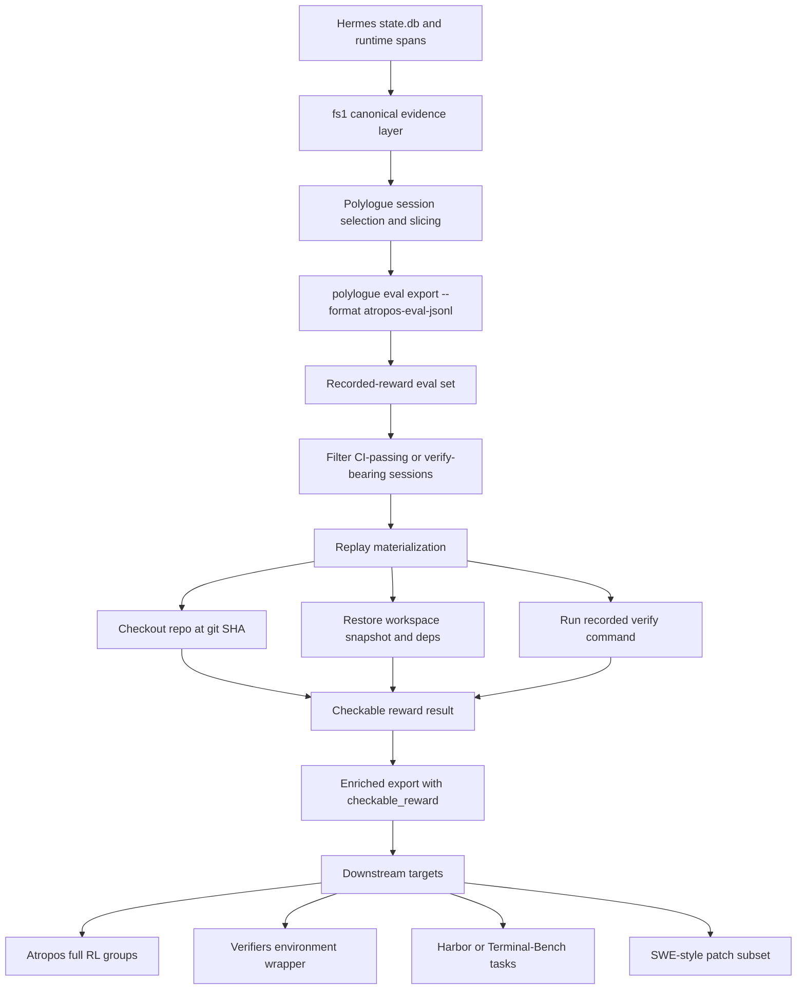

# Polylogue as a Local RL and Eval Environment

## Executive summary

The 2025–2026 landscape has split into two very different layers. One layer is **trajectory interchange and observability**, where the strongest current standard is NVIDIA NeMo Relay’s ATOF → ATIF pipeline: ATOF is a canonical event stream, and ATIF is a structured agent trajectory with steps, tool calls, observations, lineage, and token/cost metrics, but **no built-in reward semantics**. The second layer is **runnable evaluation and RL harnesses**, where the strongest practical families are Prime Intellect **Verifiers** for rubric-driven rollouts, **Terminal-Bench/Harbor** for terminal tasks with executable verification, and **SWE-bench-style** patch-evaluation harnesses for repository bug-fixing with test-based correctness. OpenAI’s stack now spans **trace grading, datasets, and legacy Evals**, but the legacy Evals platform is already on a deprecation path for 2026, so it is not the right long-term anchor for a local operator. citeturn31view0turn5view1turn12view2turn22search4turn25view2turn17view0turn39view0

For your use case, the decisive constraint is **minimal fabrication**. A personal Polylogue archive already contains real message/tool trajectories, structural outcomes, human corrections, and git provenance. That means the archive easily lowers into **trajectory-oriented formats** and **recorded-reward eval records**, but it does **not** natively contain everything needed for token-level RL data in Atropos’s full `ScoredDataGroup` contract, which expects token IDs, masks, and often aligned logprobs. Those can be produced later by replay. The least-lossy, most leverageable first export is therefore an **Atropos-shaped eval JSONL profile** that preserves messages, tool structure, outcomes, corrections, and replay metadata now, while deferring full RL tokenization until session reproduction exists. That recommendation matches the direction implied by your `fs1` bead and keeps the bridge narrow: `state.db + spans → canonical evidence → eval export`. citeturn10view0turn9view0turn34view0turn36view0

The most important high-signal subset in your corpus is the set of **CI-passing sessions** where a recorded verify/test command finished with `exit_code = 0`. For those sessions, the verify command is not merely metadata. It is the beginning of a **verifiable reward function**. Once you can replay the repository at the recorded git SHA with the right environment and workspace state, the reward becomes re-runnable rather than merely historical. That makes these sessions much more valuable than generic “good looking” agent traces: they are seeds for **checkable reward**, not just judged reward. This is exactly the direction the 2026 verifier literature emphasizes: executable checks remain the gold standard when they are reproducible, even as reward design becomes the bottleneck for coding agents. citeturn32view0turn32view1turn22search4turn26view4turn26view5

**Defended recommendation.** Export first to **`atropos-eval-jsonl`**, not directly to Harbor, SWE-bench, OpenAI Evals, or NeMo ATIF. ATIF is the best observability carrier but not an eval target; Harbor and Terminal-Bench have the best checkable rewards but require heavy task materialization; SWE-bench is too patch-centric for a heterogeneous personal archive; OpenAI Evals is strategically weakened by deprecation. An Atropos-shaped eval JSONL gives you the fastest path from archive to something queryable, viewable, filterable, and later replay-upgradable, while staying close to the export lane already contemplated in your `fs1` bridge. citeturn34view0turn39view0turn22search4turn5view1turn10view0

## The current landscape

### Comparison across the requested systems

| System | Primary unit | Input or trajectory schema | Reward model | Human-correction signals | Replayability requirements |
|---|---|---|---|---|---|
| **Atropos** | `ScoredDataGroup` or grouped rollouts | Core typed group fields include `tokens`, `masks`, `scores`, optional `advantages`, `ref_logprobs`, `messages`, `generation_params`, `inference_logprobs`, `group_overrides`, `overrides`, `images`, and optional distillation arrays `distill_token_ids` / `distill_logprobs`. Atropos treats environments as async rollout-producing microservices and makes groups, not single trajectories, the atomic unit. citeturn10view0turn9view0turn8view0 | Environment-defined scalar `scores` per rollout, with optional token- or sequence-level `advantages`. Reward can be sparse, dense, group-relative, or process-shaped because `collect_trajectories` fuses inference and scoring. citeturn10view0turn9view0 | **Not first-class in the transport schema.** Atropos supports RLHF/RLAIF environments and offline SFT/DPO generation, but corrections/preferences are not a dedicated core field in `ScoredDataGroup`. citeturn8view0turn10view0 | Requires an environment service plus inference endpoint. Historical traces become truly checkable only if you can replay the environment and regenerate valid tokens/logprobs. Saved JSONL groups are usable offline, but command-level reproduction is not built into the schema. citeturn8view0turn9view0 |
| **Prime Intellect Verifiers** | `RolloutInput`, `State`, `RolloutOutput`, `TrajectoryStep` | Input is typically `prompt`, optional `answer`, optional `info`. State carries `trajectory`, `tool_defs`, timing, completion, reward, advantage, metrics, stop condition, and error. `RolloutOutput` serializes `prompt`, `completion`, `reward`, `timing`, `is_completed`, `is_truncated`, `metrics`, optional `trajectory`, `tool_defs`, and state columns. `TrajectoryStep` includes `prompt`, `completion`, `response`, tokens, reward, advantage, truncation flag, trajectory id, and extras. Tool environments use OpenAI-compatible tool schemas derived from Python functions. citeturn14view0turn14view1turn14view2turn14view3turn13view0 | Rubric-based weighted reward functions. Each reward function returns floats, the final reward is the weighted sum, and group-level reward functions are supported. Monitor rubrics add observable metrics without affecting reward. Judge rubrics can use LLM-as-judge. citeturn12view2turn13view0 | **Partially first-class, but indirect.** Human labels can live naturally in `answer`, `info`, dataset columns, or annotations you define in environment data, but there is no dedicated correction object in the core rollout schema. That is a schema inference from the documented types. citeturn12view2turn14view2 | Strong replay potential if you materialize the environment and tools. Sandbox and Python environments provide persistent execution contexts, but a historical archive still needs a replay wrapper to turn recorded commands into live reward. citeturn14view1turn13view0 |
| **NeMo Relay with ATOF and ATIF** | Canonical event stream and exported trajectory | ATOF is the canonical event format with shared envelope fields `kind`, `atof_version`, `uuid`, `parent_uuid`, `timestamp`, `name`, `data`, `data_schema`, `metadata`, plus scope-specific `scope_category`, `category`, `attributes`, and optional `category_profile`. ATIF v1.7 exports trajectories with `schema_version`, `session_id`, optional `trajectory_id`, `agent`, `steps`, and `notes`. Events map into ATIF steps: LLM start → user step, LLM end → agent step with promoted `tool_calls`, Tool end → observation, Mark → system step. `AtifToolCall` includes `tool_call_id`, `function_name`, `arguments`, and optional `extra`. citeturn31view0turn4search5turn4search6turn5view1turn27view4turn30search1turn30search4 | **No built-in reward model.** ATIF carries step metrics and final metrics such as token/cost statistics, but Relay is an observability/runtime substrate rather than a scorer. Any reward must be attached downstream. citeturn27view3turn30search4turn36view0 | **Not first-class.** Human review can be represented only as marks, metadata, or external overlays. Relay’s public schema is event/trajectory oriented, not annotation-native. This is an inference from the documented event and ATIF structures. citeturn31view0turn5view1 | Excellent for replayable observability if the producer can emit or mirror lifecycle events with explicit timestamps. It is ideal as a canonical evidence carrier, not a final reward harness. Relay 0.4 explicitly improved coding-agent trace fidelity and Hermes exports. citeturn31view0turn36view0turn36view1 |
| **OpenAI evals and trace grading** | Dataset item, eval run, or agent trace | Legacy Evals API centers on `data_source_config` with JSON `item_schema`, optional `include_sample_schema`, and `testing_criteria` graders. The Agents SDK trace surface records model calls, tool calls, handoffs, guardrails, and custom spans. Datasets also support generated outputs and annotations in the dashboard. citeturn38view0turn38view1turn35search1turn17view0turn39view0 | Automated graders: exact string check, text similarity, score-model graders, label-model graders, Python code execution, plus trace graders on workflow traces. Reward is effectively grader output, not an RL-native reward carrier. citeturn38view2turn39view0turn17view0 | **Yes on the datasets surface, weakly on the API surface.** OpenAI’s datasets UI makes human annotation explicit through ratings and `output_feedback`, and the docs call annotations a key part of the eval process. In legacy Evals API, human labels typically appear as ordinary dataset columns referenced by graders. citeturn39view0turn38view1turn17view1 | Good for rerunning prompts or grading traces, but platform-bound. Also, OpenAI has announced the Evals platform deprecation timeline for late 2026, which materially weakens it as a local long-term archive target. citeturn17view0turn39view0 |
| **Terminal-Bench and Harbor** | Task bundle | A task consists of an instruction, environment, tests, reference solution, and time limit. Harbor’s task structure is explicit: `instruction.md`, `task.toml`, `environment/`, `solution/`, `tests/`. Terminal-Bench-style evaluation verifies the **final container state**, not the exact command history. citeturn22search4turn21view1turn23search0turn23search3 | Primarily sparse executable reward: pass/fail from tests or verifier scripts. Harbor generalizes this into verifiers and multi-step tasks, but the benchmark philosophy is still checkable outcome over recorded process. citeturn22search4turn23search5 | **No first-class correction carrier.** Human effort enters mainly in task authoring, oracle solutions, and review, not as per-trajectory correction annotations. That is an inference from the documented task format. citeturn22search4turn23search0 | Requires fully materialized environment and verifier. Best choice when you can package a task reproducibly; worst choice for raw archive export because it demands the most downstream fabrication. citeturn22search4turn23search0 |
| **SWE-bench-style harnesses** | Repository issue instance plus patch prediction | Dataset instances include fields like `instance_id`, `repo`, `issue_id`, `base_commit`, `problem_statement`, `version`, `issue_url`, `pr_url`, `patch`, and `test_patch`. Predictions minimally contain `instance_id`, `model_name_or_path`, and `model_patch`. Evaluation compares fail-to-pass and pass-to-pass tests. citeturn26view0turn26view1turn26view2turn26view4turn26view5 | Reward is executable and structured: full resolution requires `FAIL_TO_PASS = 1` and `PASS_TO_PASS = 1`; partial exists when some target failures are fixed while maintenance is preserved. citeturn26view4turn26view5 | **No first-class correction carrier.** Human intent is mostly encoded in issue text, curated tests, and dataset selection. Correction data would need to be layered on top. citeturn26view0turn26view5 | Very strong replayability when you have repo, base commit, test patch, and test runner. Poor fit for heterogeneous personal sessions that do not end as a patch against an issue. citeturn26view0turn25view2 |

### Evidence and inference

**Evidence.** The systems above are converging on a shared shape: prompt or input, structured trajectory, tool surface, and grader or verifier. But they diverge sharply on where the “truth” lives. In Atropos and Verifiers, reward lives inside the environment contract; in Terminal-Bench and SWE-bench, reward lives in executable tests; in NeMo Relay, reward is absent and trajectory fidelity is the point; in OpenAI, traces and graders are separate surfaces. citeturn10view0turn12view2turn31view0turn22search4turn26view5turn17view0

**Inference.** Because Polylogue is already a **trajectory archive** with structural outcomes and corrections, your shortest path is not to a heavy benchmark task format. It is to a **trajectory-preserving export** that can later be replayed into a benchmark harness when the session is reproducible.

## Designing the minimal Polylogue bridge

### The bridge principle

The minimal bridge should do exactly three things.

First, it should preserve the archive’s **existing evidence** without inventing anything. That means assistant turns, tool calls, tool results, error markers, exit codes, git SHAs, workspace provenance, timestamps, and human correction overlays should all survive the export. Second, it should compute a **recorded score** from evidence you already have, such as CI or verify success, without pretending that recorded success is always reproducible. Third, it should attach enough replay metadata that a later runner can turn a recorded score into a **checkable score**. That separation between observed reward and replayed reward is the central design choice. It is also the safest response to the verifier literature’s main warning: reward proxies drift away from intent under optimization pressure unless the checking mechanism itself is explicit and reproducible. citeturn32view0turn32view1turn22search4turn26view5

### Polylogue fields to target fields

The following mapping minimizes fabrication while keeping the export future-compatible with later replay.

| Polylogue evidence | Recommended export field | Notes |
|---|---|---|
| Session id / keystone id | `trajectory_id`, `session_id`, `group_overrides.polylogue_session_id` | Stable identity. |
| Ordered conversation turns | `messages` | Preserve exact turn order; do not flatten tool messages into prose. |
| Tool call name and args | `tool_trace[].call` and, where possible, `messages[*].tool_calls` | Keep both human-readable and machine-readable forms. |
| Tool result payload | `tool_trace[].result` | Preserve raw text or structured JSON. |
| `tool_result_is_error` | `tool_trace[].is_error`, `metrics.tool_error_count`, `recorded_reward.reason` | Structural outcome signal. |
| `tool_result_exit_code` | `tool_trace[].exit_code`, `metrics.verify_exit_code`, `recorded_reward.scalar` | Strongest observed executable signal. |
| Verify/test command text | `verify.command` | This is the seed of rerunnable reward. |
| Verify command cwd and shell | `verify.cwd`, `verify.shell` | Needed for faithful replay. |
| Git SHA | `repo.git_sha` | Required for repository checkout and provenance. |
| Workspace / repo locator | `repo.root`, `repo.remote`, `workspace_snapshot_ref` | Needed for later materialization. |
| Timestamps | `started_at`, `ended_at`, `tool_trace[].started_at`, `tool_trace[].ended_at` | Supports timing analysis and replay diagnostics. |
| Human corrections in `user.db` | `human_feedback.corrections[]` and `quality_labels.correction_present` | Treat as weak supervision unless correction granularity is step-level. |
| Index v16 keystone / canonical evidence row | `evidence_ref` | Export should point back to the archive’s authoritative evidence row. |

This mapping intentionally avoids fabricating token IDs, attention masks, or logprobs, because your archive description does not imply those are already present. That is the biggest reason the first slice should be an **eval export** rather than a full RL training export. Atropos can carry `messages` and `scores` now, and acquire `tokens`, `masks`, and aligned logprobs later through replay. citeturn10view0turn34view0

### Recorded reward versus checkable reward

A recorded session where the last verify command returned exit code zero deserves a high confidence **observed reward**. But it becomes a **checkable reward** only when a runner can reproduce the repository and rerun the command under the correct environment. This distinction is not semantics. It determines whether the export is suitable for dashboards and selection only, or whether it can drive RL and formal benchmark claims. That is exactly why your bridge should carry both:

- `recorded_reward`, derived from observed archive evidence.
- `replay_spec`, which declares what must be reconstructed for the reward to be rerun.
- `checkable_reward`, initially `null`, populated only after replay succeeds.

That three-way split is the cleanest way to keep the archive honest while making it useful.

## Why CI-passing sessions are the highest-value slice

### Evidence

Terminal-Bench evaluates tasks through executable tests over the final environment state. SWE-bench resolves instances through fail-to-pass and pass-to-pass test outcomes. The 2026 verifier literature still treats execution-based verification as the gold standard when it is available, even while arguing that it is expensive and incomplete. Dockerless exists precisely because environment setup is costly, not because executable checks stopped mattering. citeturn22search4turn26view4turn26view5turn32view1

### Inference

That makes your **CI-passing sessions** unusually valuable. A session ending in `tool_result_exit_code = 0` on a verify or test command is already much closer to a benchmark task than a generic “successful” coding chat. It contains:

- a natural-language problem statement in the conversation,
- a real-world process trace,
- a candidate solution embodied in workspace changes,
- and a verifier command that already emitted a success signal.

For a solo operator, this is the best substrate for both eval and RL because the reward did not need to be invented after the fact. It was already used in the original workflow.

### Replay prerequisites

To convert that observed reward into a rerunnable reward, the bridge should capture or reconstruct these prerequisites:

| Requirement | Why it matters |
|---|---|
| **Repository state**: git SHA, dirty diff, submodules | The same verify command at the wrong code state is meaningless. SWE-bench’s `base_commit` exists for exactly this reason. citeturn26view0 |
| **Workspace snapshot** | Some successful sessions depend on unstaged edits, generated files, or local artifacts not captured by commit alone. |
| **Environment manifest**: OS, shell, language runtime, package manager, container/image or lockfiles | Dockerless emphasizes that environment setup is the bottleneck. Reproducibility requires explicit environment information. citeturn32view1 |
| **Dependency state** | Tests can pass or fail based on resolved versions, caches, and local installs. |
| **Verify command and cwd** | The command itself is the reward procedure. |
| **Network and secret policy** | A test that needed remote services or secrets is not replayable without matching policy. Harbor makes network policy explicit for the same reason. citeturn23search0 |
| **Seed or nondeterminism controls** | If the verifier is stochastic, reward has to be stabilized. |
| **Timeout and resource caps** | Terminal-Bench-style tasks are defined with time limits and resource assumptions. citeturn22search4turn23search0 |

If those exist, the verify command is not just metadata. It is the **re-runnable reward**.

## The single export target I recommend

### Recommendation

I recommend the first-slice target be:

`polylogue eval export --format atropos-eval-jsonl`

This is not a claim that Atropos is the best final destination for every downstream use. It is a claim that **Atropos-shaped eval JSONL is the most leverageable first export for a solo operator**.

The reasons are straightforward.

Atropos is already oriented around grouped rollouts and reward-bearing trajectories, and its existing viewer path accepts a very lightweight `messages` + `scores` JSONL shape. That means you can export immediately from the archive without fabricating token-level RL details, inspect the result right away, and later enrich the same records with replay-generated tokens, masks, logprobs, or stronger reward semantics. By contrast, Harbor and Terminal-Bench demand per-task filesystem materialization; SWE-bench demands issue/patch/test framing; OpenAI Evals is strategically weak because of platform deprecation; and ATIF is an excellent canonical trajectory carrier but not itself an eval harness. citeturn34view0turn10view0turn22search4turn39view0turn5view1

### Exact JSONL shape

The shape below is the recommended **export profile**, not a claim that Atropos ships this exact formal schema today. It is designed to be:

- viewer-compatible now,
- minimally fabricated,
- replay-upgradable later,
- and easy to lower into Verifiers, Harbor, or SWE-style tasks once you choose a narrower slice.

```json
{
  "schema": "atropos-eval-jsonl-v0",
  "trajectory_id": "polylogue:sess_01JZ8P6V2A4F...",
  "session_id": "sess_01JZ8P6V2A4F...",
  "messages": [
    [
      {"role": "system", "content": "You are working in the repo checkout."},
      {"role": "user", "content": "Fix failing tests in parser module."},
      {"role": "assistant", "content": "I will inspect the failures and run the test suite."},
      {
        "role": "assistant",
        "content": "",
        "tool_calls": [
          {
            "id": "call_01",
            "type": "function",
            "function": {
              "name": "shell",
              "arguments": "{\"command\":\"pytest tests/test_parser.py -q\",\"cwd\":\"/workspace/repo\"}"
            }
          }
        ]
      },
      {
        "role": "tool",
        "tool_call_id": "call_01",
        "content": "2 failed, 18 passed\n..."
      },
      {"role": "assistant", "content": "The failure is in quote escaping. I will patch parser.py and rerun tests."}
    ]
  ],
  "scores": [1.0],
  "recorded_reward": {
    "kind": "verify_exit_code",
    "scalar": 1.0,
    "observed": true,
    "checkable": false,
    "reason": "final verify command exited 0 in archived session"
  },
  "metrics": {
    "tool_error_count": 0,
    "verify_exit_code": 0,
    "assistant_turns": 7,
    "tool_calls": 3,
    "correction_count": 1
  },
  "tool_trace": [
    {
      "tool_name": "shell",
      "call_id": "call_01",
      "args": {"command": "pytest tests/test_parser.py -q", "cwd": "/workspace/repo"},
      "result_text": "2 failed, 18 passed\n...",
      "is_error": false,
      "exit_code": 1,
      "started_at": "2026-07-01T12:11:03Z",
      "ended_at": "2026-07-01T12:11:06Z"
    },
    {
      "tool_name": "apply_patch",
      "call_id": "call_02",
      "args": {"path": "parser.py"},
      "result_text": "Applied patch",
      "is_error": false,
      "exit_code": 0
    },
    {
      "tool_name": "shell",
      "call_id": "call_03",
      "args": {"command": "pytest tests/test_parser.py -q", "cwd": "/workspace/repo"},
      "result_text": "20 passed in 0.84s",
      "is_error": false,
      "exit_code": 0
    }
  ],
  "human_feedback": {
    "corrections": [
      {
        "kind": "AssertionKind.CORRECTION",
        "text": "Good fix, but explanation skipped why escaping broke multiline input.",
        "scope": "session"
      }
    ]
  },
  "repo": {
    "git_sha": "4f2a9b0d56d3...",
    "root": "/workspace/repo",
    "remote": "git@github.com:owner/repo.git"
  },
  "verify": {
    "command": "pytest tests/test_parser.py -q",
    "cwd": "/workspace/repo",
    "shell": "/bin/bash",
    "expected_exit_code": 0
  },
  "replay_spec": {
    "workspace_snapshot_ref": "polylogue://workspace/sess_01JZ8P6V2A4F...",
    "env_ref": "polylogue://env/python-3.11-poetry-lock",
    "seed": null,
    "network_policy": "offline-preferred",
    "timeouts_sec": {"verify": 600}
  },
  "group_overrides": {
    "polylogue_session_id": "sess_01JZ8P6V2A4F...",
    "polylogue_keystone": "idxv16:keystone:...",
    "evidence_ref": "polylogue://evidence/idxv16/...",
    "export_profile": "fs1"
  }
}
```

### Why this is the right first slice

**Evidence.** Atropos’s viewer path only requires `messages` and `scores`, while the core environment contract can later absorb richer rollout material such as tokens, masks, advantages, and distillation arrays. citeturn34view0turn10view0

**Inference.** That means this export gives you an immediate “eval substrate” without pretending you already have training-grade token data. It is honest about the present archive and it creates the shortest path to richer RL later.

## The export and replay pipeline



The pipeline above is the minimal form that respects your `fs1` anchor: **Hermes bridge first, eval export second, replay third**. Relay-like observability formats and benchmark task bundles are downstream consumers, not the canonical store. That ordering is the right one. NeMo Relay itself is built around the same separation between lifecycle capture and downstream export. Harbor’s adapter model makes the same move in a different direction: preserve original benchmark/task semantics, then translate. citeturn31view0turn23search2

## Open questions for the operator

Should the first export lane cover **all sessions** with recorded rewards, or only the high-confidence slice where there is an explicit verify/test command and a stable git SHA? I recommend the latter for the first benchmarkable slice.

Should human corrections from `user.db` be treated as **session-level weak supervision only**, or do you already have enough span-anchored correction provenance to emit step-level labels? If not, keep them session-scoped and resist inventing per-step truth.

Do you want the first replay runner to operate from **git SHA plus dirty diff**, or from a **full workspace snapshot**? The git-first route is easier to reason about; the snapshot-first route is more faithful for sessions that created generated files or modified local state outside version control.

Do you want the first downstream consumer after export to be **Atropos full RL**, **Verifiers replay**, or **Harbor task materialization**? My recommendation is still to export Atropos-shaped JSONL first, then choose one replay consumer based on the subset that proves easiest to reproduce.

## What's missing

The biggest missing piece is a **replay substrate**. Without that, the archive can produce only **recorded rewards**, not **checkable rewards**. That is enough for ranking, triage, and qualitative eval work, but not enough for robust RL or benchmark claims.

The second missing piece is a **formalized replay environment manifest**. The captured verify command is necessary, but not sufficient. You need a durable way to record runtime, dependency, workspace, network, and timeout assumptions.

The third missing piece is a **tokenization and logprob lane** for sessions you eventually want to train in Atropos proper. Until replay produces aligned tokens, masks, and optionally logprobs, the export remains eval-first rather than RL-ready.

The fourth missing piece is a **correction-granularity contract**. Your archive already has human corrections, which is unusually valuable, but unless those corrections are anchored to specific spans or steps, they should be treated as session-level weak labels rather than exact ground truth. The verifier literature’s core warning applies here: proxy signals are useful, but only if their limits stay visible. citeturn32view0turn39view0