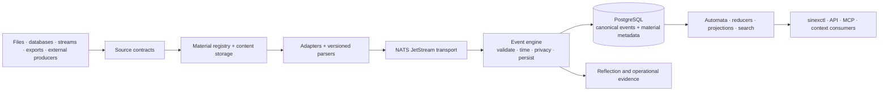

# Sinex

<p align="center">
  <a href="LICENSE"></a>
  
  
</p>

**Sinex is a local evidence substrate for digital life and agent work.** It records the material your tools leave behind—commands, files, browser activity, desktop state, Git, exports, system events, and AI sessions—and turns it into a replayable history without erasing provenance, uncertainty, or missing coverage.

Sinex is not primarily an activity dashboard. It is infrastructure for answering questions such as:

- **What was happening around this failure?** Reconstruct a bounded interval across sources on occurrence time.
- **What does this result rest on?** Resolve an interpretation to the exact source material or upstream events that support it.
- **Did the source go quiet, or did nothing happen?** Surface coverage gaps and stale capture instead of returning a misleading empty result.
- **What changed when the parser changed?** Replay preserved material under new semantics while retaining the previous interpretation for audit.
- **May this model-generated claim become durable state?** Keep proposals, confidence, judgment, and authority separate.
- **Can another agent resume this work responsibly?** Build evidence packs with provenance, caveats, and explicit omissions rather than a free-floating summary.

The compact analogy is **Nix for personal data**: content-addressed material, declarative schema convergence, and reproducible interpretation through replay. The analogy is directional rather than literal; Sinex also has to model occurrence identity, late evidence, privacy, and authority.

## Run the deterministic walkthrough

From a checkout with the Nix development shell loaded:

```bash
git clone https://github.com/Sinity/sinex.git
cd sinex
direnv allow

xtask infra start
xtask run core --logs
sinexctl ops verify --demo
```

The walkthrough seeds a deterministic dataset when needed, executes bounded queries through the normal API, writes machine-readable and human-readable receipts under `.sinex/demo/`, and exits nonzero when an expectation fails.

Current scope: this is an end-to-end operational smoke proof, not yet the project’s full thesis demonstration. The planned public demo portfolio is designed to prove replay, coverage honesty, idempotence, authority, and cross-source reconstruction directly.

## The evidence model

Sinex keeps adjacent kinds of information separate:

| Layer | Examples | Authority |
|---|---|---|
| **Source material** | Export files, SQLite snapshots, logs, transcript archives, document bytes | What was acquired |
| **Material interpretations** | Parsed commands, visits, messages, file events | What a versioned parser inferred from material |
| **Domain projections** | Current task state, current transcript view, attention timeline | Rebuildable current state |
| **Derived graph and products** | Work episodes, relations, context candidates, findings | Evidence-backed computation |
| **Workspace artifacts** | Context packs, reports, semantic diffs | Saved work products, not automatic truth |

The default flow is:

```text
source material
    → versioned material interpretation
        → typed events and domain objects
            → rebuildable projections and cross-source products
                → reports, context packs, and agent-facing views
```

Reverse flow is explicit. A generated context pack does not become canonical evidence merely because a model later repeats it.

## Three clocks, not one

One observation can have several relevant times:

- `ts_orig` — when the occurrence happened in the source domain;
- `ts_coided` — when this interpretation was minted;
- `ts_persisted` — when it became durable in Sinex.

A historical import should preserve the conversation’s original timestamp rather than pretend it happened at import time. A replay should normally preserve occurrence time while producing a new interpretation identity and coining time.

This allows Sinex to distinguish “the command ran Tuesday” from “the command was discovered Friday” and “the parser was corrected next month.”

## Replay means the system can change its mind honestly

`core.events` is append-only. A parser fix or new derivation does not silently rewrite history:

1. preserve or resolve the source material;
2. archive the prior interpretation where lifecycle policy requires it;
3. emit a new semantics-versioned interpretation;
4. rebuild the affected projection;
5. retain enough provenance to explain the difference.

A source occurrence and an interpretation are not the same identity. Re-reading the same occurrence should not invent another occurrence; reinterpreting it under changed semantics should produce a new interpretation.

## Missing evidence is a result

An empty query result can mean several different things:

- nothing happened;
- the source was disabled;
- capture was stale;
- material was acquired but not interpreted;
- the projection is behind;
- the requested evidence is not replayable;
- privacy policy suppressed the view.

Sinex’s coverage and readiness work is intended to make those states explicit. The system should return less rather than quietly turn a capture outage into a factual claim about the operator’s life.

## Confidence is not authority

Models and heuristics may propose entities, relations, episode labels, lessons, or context candidates. A confidence score does not grant permission to mutate canonical state.

The intended lifecycle is:

```text
evidence → proposal → judgment or declared policy → promoted state
```

The proposal, evidence, decision, and resulting state remain separately inspectable. This makes Sinex suitable as an agent substrate without letting agents recursively canonize their own guesses.

## Architecture



The deployed stack is Rust, PostgreSQL 18 with TimescaleDB/pgvector/pg_jsonschema, NATS JetStream, and NixOS/systemd.

NATS is transport, not the archive. Large or sensitive bytes belong in the material plane; compact typed observations carry stable material anchors through the event path.

## Current surfaces

- source contracts, material staging, adapters, and parsers under `crate/sinexd/src/sources/`;
- a single-writer event-engine path into append-only canonical storage;
- replay-aware automata and domain projections;
- JSON-RPC API and `sinexctl` query/control surfaces;
- 68 read-only MCP tools for bounded evidence access;
- NixOS modules, systemd hardening, operational checks, replay, archive, and restore controls;
- content-addressed blobs, temporal ledgers, operations logs, and public refs;
- deterministic demo verification and tracked real-archive proof artifacts.

The project has been exercised against a live archive with tens of millions of events. Those private-deployment observations are field evidence, not general performance guarantees. Public claims should resolve to bounded proof packets with the exact corpus, query, caveat, and regeneration path.

## Polylogue on Sinex

Polylogue is the AI-work domain product; Sinex is the generalized evidence backend.

The maximal target is not a metadata-only bridge and not an ontology merger:

```text
Sinex stores:
  provider-native transcript material
  normalized transcript material
  durable transcript-domain history
  judgments, lifecycle, and model effects

Polylogue owns:
  provider normalization semantics
  sessions, messages, blocks, tools, lineage, and compaction
  physical-versus-logical accounting
  reviewed AI memory and context compilation
  transcript, forensic, and coordination UX

SQLite remains:
  Polylogue's standalone store and local/offline projection
```

See `crate/sinexd/docs/sources/integration_authority.md` for the current integration boundary. The full Sinex-backed architecture is an active Beads program and should be presented as direction until the rebuild and parity proofs land.

## Security and privacy

Sinex currently assumes a trusted single-user local host. The hardened API boundary uses TLS, bearer tokens, rate limits, and request auditing; the NixOS deployment applies systemd sandboxing and managed NATS transport policy.

The archive can contain secrets, health information, source code, personal text, browser activity, and agent tool output. Full-disk encryption and capture-time privacy controls are part of the operating baseline. Generic agent surfaces are intentionally read-only and redacted; broader raw-material capabilities require explicit policy.

A local-first design reduces third-party exposure. It does not make the archive harmless. Selective forgetting, effect/cache invalidation, and proof of physical excision remain important active work.

## Project status

Sinex is pre-1.0 and built first for a demanding single-user deployment. It is a substantial working system, not yet a polished general-purpose product.

Current Beads priorities include:

1. **Substrate honesty** — no silent data loss, false readiness, or invisible coverage gaps.
2. **Robustness under load** — bounded backlog, resumable replay, paced historical import, and recovery without manual stream surgery.
3. **Derived products that pay rent** — moments, work episodes, evidence packs, and Agent Work Packets that answer real questions.
4. **Operator and agent experience** — fast orientation, judgment, context budgets, and bounded agent triggers.
5. **Construct-valid public demos** — replay, idempotence, source outages, authority, retrieval, and crash recovery with explicit falsifiers.
6. **Polylogue on Sinex** — full transcript evidence and durable AI-work history without erasing Polylogue’s domain semantics.

Roadmap authority lives in Beads, not GitHub Issues:

```bash
bd ready
bd list --status open
```

## Documentation

Start in this order:

1. `crate/sinex-primitives/docs/knowledge_boundaries.md` — material, interpretations, projections, graph, and artifacts.
2. `crate/sinexd/docs/sources/evidence_lanes.md` — acquisition payloads versus replay evidence.
3. `crate/sinex-db/docs/schema/event-taxonomy.md` — canonical event storage.
4. `crate/sinex-primitives/docs/domain_reducers.md` — current-state projection semantics.
5. `crate/sinexd/docs/runtime_qos.md` — backpressure and loss policy.
6. `crate/sinexctl/docs/mcp_readonly_server.md` — the current agent evidence boundary.
7. `crate/sinexd/docs/sources/integration_authority.md` — sibling-system authority.
8. `CONTRIBUTING.md` and `TESTING.md` — repository workflow and verification.

## Development

```bash
xtask doctor
xtask status --summary
xtask infra status
cargo nextest run
```

Use `xtask/docs/README.md` for the supported development commands and `TESTING.md` for the current verification matrix.

## License

MIT.
