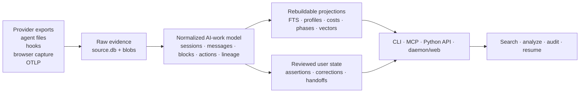

README.polylogue.receipts-first.md
<!-- Generated first-impression candidate: polylogue-receipts-first. Reconcile commands, statuses, and generated media against current master before merge. -->

<!-- component: polylogue.hero-receipts | status: current-safe -->
# Polylogue

<p align="center">
  <a href="https://pypi.org/project/polylogue/"></a>
  <a href="https://github.com/sinity/polylogue/actions/workflows/ci.yml"></a>
  <a href="https://sinity.github.io/polylogue/"></a>
</p>

## Know what the agents actually did.

Polylogue is a local, cross-provider evidence archive for AI work. It turns chats, coding-agent sessions, tool calls, results, forks, costs, and reviewed notes into work you can search, audit, and resume without trusting a transcript summary.

[Run the proof](#run-the-proof) · [Search and read](#what-you-can-do) · [Evidence model](#the-model) · [Security](#security)

<!-- component: polylogue.proof-receipts | status: current deterministic proof -->
## A claim is not a receipt

<p align="center">
  
</p>

In the deterministic fixture, the assistant says **“All tests pass. The clock fix is complete.”** The structural receipt at that claim boundary is a `pytest` action with exit code `1`. A later rerun succeeds. Polylogue preserves both facts and returns **contradicted at claim time, then repaired** instead of allowing the later success to rewrite the earlier claim.

A separate control session contains the word `error` twice and contributes **zero** structurally failed actions. This is why the proof is more than grep.

> **Visual status:** this layout is derived from the current deterministic contract but remains a prototype. Regenerate it from the real command through the visual-tape owner before merging.

<!-- component: polylogue.run-proof | status: command winner must be measured -->
## Run the proof

Candidate no-install route:

```bash
uvx polylogue demo receipts --compact
```

Already installed:

```bash
polylogue demo receipts --compact
```

The command creates a throwaway private-data-free archive, imports provider-shaped artifacts through normal parser/storage paths, and prints the claim-time failure, later repair, anti-grep control, and source evidence refs.

> This fixture proves the evidence contract. It does not prove how often real agents make unsupported claims.

Before making `uvx` the primary public command, benchmark it against pipx, Homebrew, Nix, and source checkout on supported clean environments. Keep the measured winner here.

<!-- component: polylogue.capabilities | status: current -->
## What you can do

### Find and read the work

Search supported origins through one query grammar, then inspect messages, actions, attachments, subagents, context boundaries, and raw evidence refs.

### Audit outcomes, lineage, and cost

Resolve claims to typed tool results, keep later repairs temporally distinct, compose copied prefixes without double-counting, and keep provider usage, estimates, and subscription-credit views separate.

### Compile reviewed context

Build a bounded handoff from evidence and accepted notes while recording omissions, caveats, lossiness, and the exact delivered context. This is a capability statement, not a performance-uplift claim.

<!-- component: polylogue.local-boundary | status: current -->
Polylogue is local-first. Lexical search and the core archive stay on the machine. Optional semantic search is disabled by default and sends only selected text to the embedding provider you configure. Archives may contain source code, secrets, personal conversations, paths, and tool output; use the documented trusted-host security boundary.

<!-- component: polylogue.status | status: current -->
> **Current boundary:** Polylogue is pre-1.0, actively dogfooded, and designed for a trusted single-user/local host. The receipt demo is deterministic and private-data-free; it proves the evidence contract, not the prevalence of unsupported agent claims or a measured improvement in later-agent performance.

<!-- component: polylogue.install | status: current -->
## Install

```bash
# Isolated Python CLI
pipx install polylogue
# or
uv tool install polylogue

# macOS or Linux via Homebrew
brew tap sinity/polylogue
brew install polylogue

# Nix one-shot
nix run github:Sinity/polylogue -- --help
```

All routes expose `polylogue`; Python and Nix distributions also provide `polylogued` and `polylogue-mcp`. See [Installation](docs/installation.md) for checkout, managed-service, container, and verification paths.

## The model



One rule governs the archive:

> **Source evidence and irreplaceable user judgment are durable. Search indexes, analytics, embeddings, and operational telemetry are rebuildable.**

The local archive is split accordingly:

| Tier | Responsibility | Durability |
|---|---|---|
| `source.db` | Acquired artifacts, raw sessions, hook events, source evidence | Durable evidence |
| `index.db` | Normalized sessions, messages, blocks, actions, topology, FTS, analytics | Rebuildable |
| `embeddings.db` | Optional vectors and catch-up state | Rebuildable |
| `user.db` | Notes, corrections, judgments, assertions, saved views | Irreplaceable |
| `ops.db` | Cursors, attempts, convergence debt, daemon telemetry | Disposable |

Large content is stored in a SHA-256 content-addressed blob store.

## Why the evidence model matters

### Structured outcomes beat plausible prose

A nonzero shell exit, provider `is_error` flag, or typed tool result is evidence. The word “error” in a paragraph is not. Polylogue deliberately removes or marks unsupported inferences rather than turning them into authoritative analytics.

### Role is not authoredness

A provider may encode injected runtime context as a `user` message. Polylogue records conversational role separately from whether material was human-authored, assistant-authored, runtime protocol, tool output, or generated context.

### Physical sessions are not logical work

Provider forks and resumptions can copy large transcript prefixes. Polylogue retains the physical artifacts while materializing logical lineage so copied history can be stored, read, and accounted for without pretending it was new work.

### Memory requires judgment

Agent-authored observations enter as candidates with context injection disabled. Human or declared-policy judgment can accept, reject, defer, or supersede them. The context compiler records selected evidence, omissions, caveats, lossiness, and the exact context delivered to a later agent.

## Query and read surfaces

The CLI is query-first:

```bash
polylogue find "sqlite locking"
polylogue find 'repo:polylogue since:7d' then analyze --facets
polylogue find 'origin:claude-code-session' then read --first --view messages
polylogue 'actions where is_error:true | group by tool | count'
polylogue --semantic find "flaky async pipeline" then read --all --limit 5
```

Other surfaces use the same archive and query substrate:

- `polylogued run` — ingestion, convergence, local HTTP reader, metrics;
- `polylogue-mcp --role read` — MCP access for agents;
- Python async API — archive and query integration;
- browser-capture extension and local receiver — opt-in capture for supported web chats;
- OpenTelemetry-shaped import and export projections.

References:

- [Getting Started](docs/getting-started.md)
- [Search and Query](docs/search.md)
- [Architecture](docs/architecture.md)
- [Internals](docs/internals.md)
- [MCP Integration](docs/mcp-integration.md)
- [Browser Capture](docs/browser-capture.md)
- [Security](docs/security.md)

<!-- BEGIN GENERATED: docs-surface -->
## Documentation

Live site: <https://sinity.github.io/polylogue/>.

Start with the task-oriented guides below; [docs/README.md](docs/README.md) separates guides, reference, internals, operations, evidence, design, and historical records. Current sequencing and active workstreams live in the Beads backlog (`bd ready`, `bd list --status open`).

| Document | Description |
|----------|-------------|
| [Getting Started](docs/getting-started.md) | First archive, first query, and the next documentation steps. |
| [Installation](docs/installation.md) | Source checkout, Nix flake, and managed NixOS/Home Manager install paths. |
| [Demos and Proofs](docs/demos.md) | Reproducible proofs, construct-valid demo doctrine, and flagship demonstrations. |
| [Proof Artifacts](docs/proof-artifacts.md) | Claim-to-proof map for public-facing demo and evidence claims. |
| [Architecture](docs/architecture.md) | System rings, ownership boundaries, and data flow. |
| [Search & Query](docs/search.md) | Query grammar, retrieval lanes, ranking policy, and the typed SearchEnvelope contract. |
| [CLI Reference](docs/cli-reference.md) | Generated command reference from live help output. |
| [MCP Integration](docs/mcp-integration.md) | Model Context Protocol server setup and usage. |
| [Configuration](docs/configuration.md) | XDG paths, environment variables, and runtime configuration. |
| [Security](docs/security.md) | Security boundaries for local archives and readers. |
| [Developer Tools](docs/devtools.md) | Generated surfaces, validation, and repo hygiene. |
| [Providers](docs/providers/README.md) | Provider-specific parsing and export-format notes. |

<!-- END GENERATED: docs-surface -->

## Current status

Polylogue is pre-1.0 and under active dogfooding. It already supports
multi-origin ingestion, normalized tool-aware archives, typed evidence refs,
session lineage, cost and usage projections, deterministic demos,
CLI/MCP/Python/web readers, and reviewed context compilation. Public claims are
paired with bounded proof artifacts; private-archive findings retain their
sampling and disclosure boundaries.

Roadmap authority lives in the committed Beads graph, available through the
[web board](https://sinity.github.io/polylogue/main/beads/) or locally:

```bash
bd ready
bd list --status open
```

Do not infer roadmap state from GitHub Issues.

## Development

```bash
devtools status
devtools render all
devtools verify --quick
```

See [CONTRIBUTING.md](CONTRIBUTING.md), [TESTING.md](TESTING.md), and [Developer Tools](docs/devtools.md).

## Security

Polylogue assumes a trusted single-user local host. The daemon binds to loopback by default, protected routes use bearer tokens, browser capture uses a distinct token, and mutating browser-accessible routes enforce Origin policy. Raw archives can contain source code, secrets, personal conversations, paths, and tool output; use host disk encryption and review [docs/security.md](docs/security.md) and [docs/daemon-threat-model.md](docs/daemon-threat-model.md).

