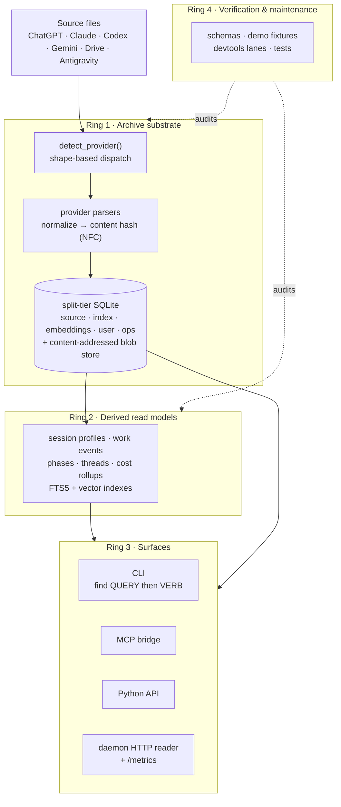

<!-- Generated by `devtools render agents`. Edit CLAUDE.md and included files instead. -->

# Polylogue

AI chat export archiver — ingests Claude, ChatGPT, Codex, Gemini exports into a SQLite archive with full-text search, session analytics, and derived products.

## Working Rules

- New semantics go into the substrate or product layer first, then surfaces
  adapt.
- Archive writes are idempotent by content hash. User metadata (tags, summaries)
  is excluded from the hash — changing it does not trigger re-import.

## Agent Workflow

Rules for AI agents working on this repository. These override default
agent behavior.

### Beads issue tracking

This repository uses `bd` (Beads) for durable project task tracking. Run
`bd prime` when task context, ready work, blockers, or durable project memory
matter. Use `bd ready --json`, `bd show <id> --json`,
`bd update <id> --claim --json`, and `bd close <id> --reason "..." --json`
for tracked work. Create linked Beads issues for discovered follow-up work
instead of leaving markdown TODO lists as the source of truth.

`bd dolt push` follows the same repo policy as `git push`: push feature
branches and PR updates proactively after verification, but do not push
directly to protected/default branches outside the PR flow.

### Issue-first for non-trivial work

Open an issue before starting work that is non-trivial, spans multiple
PRs, or introduces architectural decisions. The issue defines scope and
acceptance criteria. Reference it from the PR with neutral wording such
as `Ref #NNN`. Do not use GitHub resolver keywords in agent-authored PR
bodies or comments unless the user explicitly asks for that exact PR to
change that exact issue's GitHub state.

### Verification before push

Run `devtools verify` before creating any PR. The default baseline runs the
static/generated gates plus pytest-testmon affected tests. Seed the testmon
database explicitly on a fresh checkout or after harness/dependency changes.
The git hooks enforce format and lint on commit and `devtools verify --quick`
on push, but the default baseline must pass before the PR is opened.

Do not treat CI as the first verification pass. Anticipate failures
locally.

### Inner-loop verification — use testmon, never blanket-run

The default verification path is `devtools verify`, which uses **pytest-testmon
affected-selection** ("pymon"): it runs only the tests whose dependency graph
touches your changed files, finishing in seconds-to-minutes. This is the normal
way to check a change. For a single target while iterating, use
`devtools test <file>` or `devtools test -k <expr>`.

Anti-pattern (do NOT do this): `devtools test tests/unit/<dir>` over whole
directories, or blanket `pytest tests/unit ...`. Running broad directories is
effectively the full suite — it takes well over an hour and burns the budget to
re-confirm tests your change never touched. A behavior-preserving refactor that
is mypy-green needs only its testmon-affected set, not the whole tree.

- mypy `--strict` is the primary net for type/identifier refactors; trust it.
- `devtools verify` (testmon) is the behavioral net for the affected slice.
- Reserve a full run (`devtools verify --all`) for harness/dependency changes or
  a final pre-PR diagnostic — not the inner loop.

If `devtools verify` reports failures in files your change did not touch and
that testmon did not select for your diff, classify them as pre-existing or
flaky (re-run the exact node) before assuming they are yours.

### PR body discipline

The PR template requires sections: Summary, Problem, Solution,
Verification. Fill all of them. The PR title becomes the squash-merge
commit subject on `master` — write it as the permanent history line.

Rules for the squash-merge subject:

- Under 72 characters.
- Conventional prefix (`feat:`, `fix:`, `refactor:`, `test:`, `chore:`,
  `perf:`, `docs:`).
- Describes what changed, not what was worked on.
- Accurate — do not claim alignment, unification, or convergence unless
  the code actually achieves it.

Rules for the squash-merge body (PR description):

- Problem: why the work was necessary.
- Solution: what was done, key modules and contracts touched.
- Verification: exact commands run, not "tests pass."

### Claim verification

Before writing a commit message or PR body that claims something is
aligned, unified, converged, or complete — verify the claim against the
code. Grep for duplicated logic, check both paths, read the diff. A
claim that doesn't match the code is worse than no claim.

### Issue and PR writing quality

Issues and PR bodies are durable artifacts. Write them for a reader who
has no conversation context — they should stand alone. Include file
paths, acceptance criteria, and design references where applicable.

## Cloud lane (Claude Code Web / Codex Cloud)

Polylogue is well-suited for cloud sandboxes — pure Python, no native deps
beyond pre-built wheels, all paths overridable via `POLYLOGUE_ARCHIVE_ROOT`.

Bootstrap is handled by `.claude/setup.sh` (installs `uv`, runs
`uv sync --extra dev --frozen`, prepares `/tmp/polylogue-archive`). Default
env vars come from `.claude/settings.json`
(`POLYLOGUE_ARCHIVE_ROOT=/tmp/polylogue-archive`, `POLYLOGUE_FORCE_PLAIN=1`,
`HYPOTHESIS_PROFILE=ci`).

Safe to run in cloud:

- `uv run pytest tests/unit -q`
- `uv run pytest tests/property -q`  (`HYPOTHESIS_PROFILE=ci` enforces budgets)
- `uv run ruff check polylogue tests`
- `uv run mypy polylogue`
- `uv run devtools verify` (slow; scope with `--changed-only` if available)
- `polylogued run --no-api` against `/tmp/polylogue-archive` (synthetic fixtures only)

Do NOT in cloud:

- Upload real `~/.claude/projects/` or `~/.codex/sessions/` archives. Fixtures
  only. Real corpus testing happens on the self-hosted runner.
- Run browser-capture flows — they need interactive cookies and are slated to
  move to the ethereal companion host.
- Point at `/realm/data/...` paths; the cloud sandbox has no access to that
  data lake.

Privacy: the data-handling tier is governed by your Anthropic/OpenAI plan;
cloud-agent sandbox content inherits that tier (Pro/Max consumer = training by
default unless opted out; Business/Enterprise = no training). See
`docs/cloud-agents.md` for the full checklist.

<!-- begin include: CONTRIBUTING.md -->
# Contributing

## Development Environment

Work inside the project devshell.

```bash
cd path/to/polylogue
direnv allow   # one-time setup; afterward the devshell loads automatically on cd
```

If you are not using `direnv`, enter the same environment manually:

```bash
nix develop
```

All commands below assume you are already inside that environment. If not, use
`nix develop -c <command>`.

The devshell regenerates `AGENTS.md` from [CLAUDE.md](CLAUDE.md) on entry.
It is gitignored.

For repository maintenance, use `devtools`:

```bash
devtools --help
devtools status
devtools render all
```

## Workflow

All code changes land through feature branches and squash-merged pull requests
targeting `master`.

1. Open an issue first when the work is non-trivial, spans multiple PRs,
   or introduces architectural decisions. Skip for self-contained fixes.
2. Create a branch from `origin/master`.
3. Work on the branch. Git hooks enforce format and lint on commit, and
   run `devtools verify --quick` on push.
4. Run `devtools verify` before creating the PR. The default pytest step uses
   pytest-testmon affected-test selection; run `devtools verify --seed-testmon`
   first if the dependency database is not seeded.
5. Open a pull request. The template has required sections — fill them
   all in. The PR title becomes the squash-merge subject on `master`.
6. CI must pass. Fix failures on the branch, do not merge with red CI.
7. Squash-merge the pull request into `master`.

## Branch Naming

Use:

`feature/<category>/<description>`

Allowed categories:

- `feat`
- `fix`
- `refactor`
- `perf`
- `test`
- `docs`
- `chore`

Examples:

- `feature/feat/mcp-query-exports`
- `feature/fix/parser-null-guard`
- `feature/refactor/storage-product-splits`

## Commits

Use conventional commit subjects on branches:

- `feat:`
- `fix:`
- `refactor:`
- `perf:`
- `test:`
- `docs:`
- `chore:`

Branch commits can be iterative while you are working, but the published branch
should still tell one coherent story. Avoid noisy “final final” or context-free
messages that leave reviewers guessing.

The PR title becomes the squash-merge subject on `master` — write it as the
history line you want. Branch-local commits serve review; the PR title and body
serve history.

## Schema-Touching Changes

Polylogue uses two schema-evolution regimes.

Durable tiers (`source.db` and `user.db`) may use explicit additive
migrations. These migrations live under `polylogue/storage/sqlite/migrations/`,
advance `PRAGMA user_version` one version at a time, and require a verified
backup manifest for the affected tier before they run. Destructive durable-tier
changes require a copy-forward design and explicit operator consent; do not
hide them behind a routine migration.

Derived tiers (`index.db`, `embeddings.db`) are rebuildable products. They do
not get in-place migration chains. A PR that bumps their schema edits the
canonical DDL and provides a **rebuild/blue-green plan**:

- which user-visible archive operation triggers rebuild/re-acquisition from
  source (e.g. `polylogue ops reset --index && polylogued run` for index-tier
  schema bumps),
- which downstream products (insights, blob store, FTS) are rebuilt
  automatically vs. needing explicit recomputation,
- the expected end-user impact (rebuild time, disk usage, anything
  that requires action beyond the reset).

During development, classify schema changes before editing: metadata-only,
index-only, additive-derived, additive-durable, or semantic-reparse-required.
Batch same-tier schema changes from ready Beads before triggering a live
rebuild. Do not repeatedly reset and re-ingest the active archive for isolated
index additions that can be grouped into one schema bump, and do not call a
full reingest necessary unless the changed semantics actually require replaying
source rows.

The policy lint (`devtools lab policy schema-versioning`) rejects derived-tier
upgrade helpers while allowing numbered durable-tier SQL migrations.

## Versioning and Releases

`pyproject.toml` records the last tagged release. Development builds are
identified by git metadata, and `polylogue --version` must include the commit
hash plus the dirty marker when applicable.

Routine PRs do not touch `version = "X.Y.Z"` or `CHANGELOG.md`. Both are
maintained by [release-please](https://github.com/googleapis/release-please)
from conventional commit subjects on `master` — see
[docs/release.md](docs/release.md) for the full flow.

What this means in practice for normal PRs:

- Use conventional commit subjects (`feat:`, `fix:`, `perf:`, `refactor:`,
  `docs:`, `test:`, `chore:`, `build:`, `ci:`, `style:`). The PR title is
  what becomes the squash-merge subject on `master` and is what
  release-please reads.
- Do not edit `CHANGELOG.md` or `pyproject.toml` `version` directly. A
  user-visible change is described by its `feat:` / `fix:` / `perf:` subject
  and PR body; release-please rolls it into the changelog at release time.
- A breaking change uses `feat!:` / `fix!:` or a `BREAKING CHANGE:` footer
  in the commit body, exactly as conventional-commits specifies.

The release itself is one merge: release-please keeps an open
`chore(release): X.Y.Z` PR up to date on every push to `master`. Merging it
bumps the version, rolls `Unreleased → [X.Y.Z]`, and pushes the signed
`vX.Y.Z` tag. The downstream `release.yml` workflow handles PyPI + GHCR
publish from the tag. The manual procedure is retained in
[docs/release.md](docs/release.md#manual-fallback) as a fallback only.

## Issues

Issues are optional. Use them when they improve planning or future traceability:

- larger features or refactors
- bug reports that need a repro or acceptance record
- architectural or research questions
- follow-up chains that will span more than one PR
- durable unresolved debt discovered during implementation or verification

Skip the issue when the change is self-contained and the PR itself is enough.

When you do open an issue:

- use the provided issue templates
- write in terms of outcome, constraints, and acceptance criteria
- prefer planning issues over retroactive bookkeeping
- convert anonymous debt into tracked debt:
  - expected-failure tests that represent real bugs
  - TODO comments that would otherwise persist beyond the current PR
  - warnings or degraded behavior accepted temporarily for scope reasons
  - follow-up work called out in PR text or scratch notes
- if a test or comment carries durable debt, reference the issue from that location when practical

## Pull Requests

Pull requests should:

- use a conventional title like `feat: add X` or `fix(cli): correct Y`
- treat that title as the final squash-merge commit subject on `master`
- explain the problem, solution, verification, and any remaining risk or follow-up
- link a related issue with neutral wording such as `Ref #NNN` when one exists
- record the verification commands that were actually run
- update docs, config, and governance when behavior or workflow changes

Use `Ref #NNN` by default. Do not use GitHub resolver keywords in PR bodies
or comments unless the operator explicitly asks for that exact PR to change
that exact issue's GitHub state.

## Documentation Site Previews

The documentation site (`devtools render pages` → `.cache/site/`) is
published to GitHub Pages on every push to `master` via
`.github/workflows/pages.yml`.

PRs that touch docs, render pages helpers, or top-level Markdown files
trigger `.github/workflows/pages-preview.yml`, which rebuilds the site
and uploads it as a workflow artifact named
`docs-site-preview-pr-<NNN>`. Download the artifact from the PR's
Checks → Pages Preview run, extract, and serve locally:

```bash
unzip docs-site-preview-pr-*.zip -d /tmp/polylogue-docs
python -m http.server --directory /tmp/polylogue-docs 8000
```

Per-PR live preview URLs (`/pr/NNN/`) and versioned release trees
(`/vX.Y.Z/`, plus a `/latest/` alias) are deferred follow-ups under
#1307 — both require migrating `pages.yml` from the single-target
`actions/deploy-pages` flow to a branch-based deploy.

## Repository Settings

The repository should stay aligned with the workflow above:

- protect `master` against direct pushes
- require pull requests for normal changes
- require the `CI`, `Nix`, and `Pull Request Policy` checks before merge
- keep squash merge enabled and leave merge-commit and rebase-merge disabled
- enable automatic deletion of head branches after merge
- allow Update branch for stale PRs
- do not require an issue for every pull request

## Git Hooks

The devshell installs git hooks automatically (`core.hooksPath .githooks`):

- **pre-commit**: `ruff format --check` + `ruff check` on staged files.
  Also runs a worktree-escape detector (#1211): when committing from a
  linked worktree, the hook resolves the worktree root from its per-
  worktree git dir and aborts if the current working directory has
  drifted outside that root (a common failure mode when an agent
  `cd`s into the main checkout from inside a worktree). Set
  `POLYLOGUE_ALLOW_WORKTREE_ESCAPE=1` for legitimate cross-worktree
  commit flows.
- **pre-push**: `devtools verify --quick` (format, lint, mypy, generated
  surfaces, and fast manifest checks).

The pre-push hook is an early failure gate. The PR baseline is the
`devtools verify` workflow below.

## Type Checking

CI runs `mypy --strict` on all files under `polylogue/`, `tests/`, and
`devtools/`. Configuration is in `pyproject.toml`:

```toml
[tool.mypy]
strict = true
files = ["polylogue", "tests/**/*.py", "devtools/**/*.py"]
```

There is no exclude list. All new files are checked by default. The mypy gate
runs as part of `devtools verify` and in CI.

## Verification Baseline

Before creating a PR, run the local baseline. CI runs the same checks, while
local pytest selection is accelerated by pytest-testmon.

```bash
devtools verify            # static/generated gates + pytest-testmon affected tests
devtools verify --seed-testmon --skip-slow  # seed/update affected-test DB
devtools verify --all      # explicit full non-integration pytest diagnostic
devtools verify --quick    # format + lint + mypy + render all --check (skip tests)
devtools verify --lab      # explicit lab checks beyond the quick/default loop
```

The quick gate runs on `git push` via `.githooks/pre-push`. It's a fast check,
not a substitute for the default baseline. The default command fails fast when
`.cache/testmon/testmondata` and `.cache/testmon/seed.json` are missing; do not
rely on silent full-suite fallback.

`devtools verify` does not replay a prior verify result. It always runs the
static gates and then invokes pytest-testmon for affected-test selection from
the current source, dependency, and Python-version state. The default pytest
step combines marker filters with `--testmon-forceselect` so scale-tier
deselection does not silently expand the run back to the whole suite; affected
testmon runs are single-process by default to avoid xdist collection skew.
Polylogue does not maintain a parallel changed-file router for helper/config
paths; use `devtools verify --seed-testmon` when you intentionally want to
refresh the dependency database and `devtools verify --all` for an explicit full
diagnostic.

Add `devtools release build-package` or `nix flake check` when touching packaging or
Nix expressions. See [TESTING.md](TESTING.md) and [docs/devtools.md](docs/devtools.md)
for details.

## PR Body Discipline

The PR template requires four sections:

1. **Summary**: one paragraph describing what changed and why
2. **Problem**: evidence or observation that triggered the work. Not "user asked"
3. **Solution**: modules touched, non-obvious decisions, alternatives rejected
4. **Verification**: exact commands run and the output line that matters. Not
   "tests pass"

The PR title becomes the squash-merge subject on `master`. Rules:
- ≤72 characters, conventional prefix, imperative mood
- Describes what changed, not what was worked on
- Accurate — do not claim alignment or unification unless the diff achieves it
<!-- end include: CONTRIBUTING.md -->
<!-- begin include: TESTING.md -->
# Testing

All commands below assume you are inside the project devshell. See
[CONTRIBUTING.md](CONTRIBUTING.md) for environment setup.

## Running Tests

```bash
# Normal repository verification
devtools verify

# First run after checkout, or when you intentionally want to refresh
# pytest-testmon's dependency database
devtools verify --seed-testmon --skip-slow

# Focused inner-loop runs — prefer `devtools test` over raw pytest. It runs the
# selection through the managed harness (repo env, single-process by default,
# live output, current-node progress artifacts, stall/runtime timeouts) and
# serializes overlapping runs from the same checkout so two suites do not race.
# Any pytest arguments go after the command name.
devtools test tests/unit/storage/test_hybrid_laws.py
devtools test -k "test_name"
devtools test tests/unit/pipeline -x
POLYLOGUE_PYTEST_WORKERS=8 devtools test tests/unit/storage   # override workers

# Raw pytest still works for ad-hoc needs the wrapper does not cover:
pytest -x --ignore=tests/integration
pytest tests/unit/storage/test_hybrid_laws.py

# Explicit full non-integration pytest diagnostic
devtools verify --all

# Full Nix/CI parity
nix flake check
```

`devtools verify` uses pytest-testmon for per-test affected selection. The
seed command records `.cache/testmon/testmondata` plus
`.cache/testmon/seed.json`; those files are local generated state and are not
committed. If the seed is missing, the default command fails with setup
guidance instead of silently running the whole suite.

Plain focused `pytest` runs are single-process by default so small inner-loop
checks do not spawn a worker pool. `devtools verify` keeps pytest-testmon as
the affected-test selector and runs the selected default lane with a bounded
worker pool (`-n 4` by default, override with `POLYLOGUE_PYTEST_WORKERS`) so
a stale or genuinely broad affected set cannot spend the full timeout in one
multi-GiB Python process. Because the default gate also applies marker filters
for scale tiers, it passes `--testmon-forceselect` so pytest-testmon still
selects affected tests instead of letting pytest marker selection expand the
run. Full diagnostic and seed runs use the same worker override and also
default to `-n 4` so database-heavy workers do not multiply memory and I/O
pressure beyond the explicit broad-run lane.

Pytest temp databases default to `/realm/tmp/polylogue-pytest` so interrupted
full or xdist runs do not leave multi-GiB `/dev/shm` directories resident in
RAM. On btrfs scratch volumes, the harness best-effort marks that root with
`chattr +C` so new per-run SQLite files avoid CoW amplification. Use
`POLYLOGUE_PYTEST_TMPFS=1` only for explicit performance lanes that can afford
tmpfs pressure. `POLYLOGUE_PYTEST_BASETEMP_ROOT=/path` overrides both. Per-run
`pytest-polylogue-*` basetemps are removed at normal pytest shutdown, and
pytest startup sweeps stale per-run dirs from both the configured root and
legacy `/dev/shm`; shared `pytest-polylogue-seeded-*` caches are kept because
they are small and reused.

`devtools verify --seed-testmon` and the parallel full diagnostic may set
`POLYLOGUE_PYTEST_TMPFS=1` automatically when the host has at least 10 GiB
available memory and `/dev/shm` has at least 8 GiB free. This is deliberately
limited to broad lanes: seed/full runs and default affected runs caused by
harness/config changes are write-heavy enough that disk-backed basetemps can
dominate runtime, while focused and ordinary affected runs stay on the normal
scratch root unless the operator opts in.

The default path does not replay cached verify results. Every invocation runs
the static gates and then invokes pytest-testmon for affected-test selection.
Polylogue does not maintain a parallel changed-file router for helper/config
paths; explicit full collection is limited to `devtools verify --seed-testmon`
for dependency-database refreshes and `devtools verify --all` for diagnostics.

`devtools verify` and `devtools test` treat pytest as a bounded, supervised
child workload, not an unowned shell. Each pytest step gets a run directory
under `.cache/verify/runs/<run-id>/` with stdout/stderr, progress, selection,
summary, merged worker events, raw per-worker event files, resource samples,
and a postmortem diagnosis. The latest run is mirrored to
`.cache/verify/current-run.json`, and the latest pytest step is mirrored to:

- `.cache/verify/current-pytest-progress.json`
- `.cache/verify/current-pytest-selection.json`
- `.cache/verify/current-pytest-summary.json`
- `.cache/verify/current-pytest-events.jsonl`
- `.cache/verify/current-pytest-events/`
- `.cache/verify/current-pytest-resources.jsonl`
- `.cache/verify/current-pytest-postmortem.json`
- `.cache/verify/current-pytest-output.log`

The supervisor prints periodic heartbeat lines, drains pytest output
incrementally so real progress resets the stall clock, samples the pytest
process tree and host memory/pressure state, and terminates the whole pytest
process group if the step exceeds `POLYLOGUE_VERIFY_PYTEST_TIMEOUT_S` (default
45 minutes) or produces no output for
`POLYLOGUE_VERIFY_PYTEST_STALL_TIMEOUT_S` (default 10 minutes).
`POLYLOGUE_VERIFY_RESOURCE_INTERVAL_S` controls resource sampling cadence
(default 2 seconds). Basetemp size is a recursive filesystem walk, so it is
sampled less frequently; `POLYLOGUE_VERIFY_BASETEMP_SIZE_INTERVAL_S` controls
that cadence (default 15 seconds, `0` disables the size walk). Set timeout
variables to `0` only for an explicit diagnostic run where an unusually long
full-suite pass is expected and supervised.

Selection artifacts preserve exact selected/deselected counts but sample node
IDs by default (`POLYLOGUE_PYTEST_SELECTION_NODEID_LIMIT`, default 500) so
broad collection does not retain or write unbounded node-id lists in controller
or worker processes.

`devtools workspace tasks recent` shows the run id, diagnosis, and peak pytest
RSS when the current run metadata is available. `devtools workspace tasks stats
--resources` aggregates recorded pytest memory peaks over time.

`devtools test` uses the same pytest progress plugin and process supervisor for
focused selections. During or after a run, inspect
`.cache/verify/current-pytest-progress.json`,
`.cache/verify/current-pytest-selection.json`,
`.cache/verify/current-pytest-summary.json`,
`.cache/verify/current-pytest-events.jsonl`, and
`.cache/verify/current-pytest-output.log` to see the active/latest test node,
selected/deselected node IDs, collection duration, slowest setup/call/teardown
phases, captured output, and termination reason if a focused run stalls.

For optional lane, mutation-campaign, and benchmark inventories, see
[docs/test-quality-workflows.md](docs/test-quality-workflows.md). Those registries are
secondary navigation over executable checks; the source of truth for behavior is
pytest plus the concrete `polylogue`/`devtools` commands they invoke.

## Test Suite Layout

```text
tests/
├── conftest.py              # Root fixtures (workspace_env, tmp paths)
├── infra/                   # Shared infrastructure
│   ├── storage_records.py   # SessionBuilder, make_message, db_setup
│   ├── tables.py            # Parametrize tables
│   └── strategies/          # Hypothesis strategies (schema-driven payloads)
├── unit/                    # Fast tests (~95% of suite)
│   ├── core/                # Domain: models, filters, roles, timestamps, schema
│   ├── sources/             # Parser crashlessness, null guards, acquisition
│   ├── storage/             # FTS5, hybrid search, CRUD, scale
│   ├── pipeline/            # Stage independence, resilience
│   ├── cli/                 # Commands, terminal snapshots (syrupy)
│   ├── mcp/                 # MCP tool contracts, edge cases
│   ├── demo/                # Demo archive seed/verify workflows
│   └── security/            # Protected — never delete
├── property/                # Hypothesis property tests
├── integration/             # End-to-end (slow, protected)
├── benchmarks/              # pytest-benchmark suite
└── fuzz/                    # Atheris fuzz targets
```

## Test Patterns

**`workspace_env` fixture** (`conftest.py`): Isolated XDG paths and archive
root in `tmp_path`. Disables schema validation by default. Most tests
that touch storage or pipeline use this.

**`SessionBuilder`** (`infra/storage_records.py`): Fluent builder for
populating a test database. Chain `.title()`, `.provider()`, `.message()`, etc.
and call `.build()` to persist.

**`make_message()` / `make_session()`** (`infra/storage_records.py`):
Quick factories for creating model instances without database setup.

**`corpus_seeded_db`** (`infra/corpus_fixtures.py`): Pre-populated database
fixture using the synthetic corpus generator. For tests needing a realistic archive.

**Hypothesis strategies** (`infra/strategies/`): Schema-driven payload
generators. `schema_conformant_payload(provider)` produces payloads that match
each provider's JSON schema.

## Time and Clock

Timestamp-sensitive tests opt into the `frozen_clock` fixture so the test's
"now" and the production code's "now" coincide. Reading the host wall clock
directly creates two failure modes: flakiness at threshold edges (cursor lag
warning/error/critical bands, freshness windows, retry backoff) and snapshot
churn that hides real regressions.

`tests/infra/frozen_clock.py` exports:

- `FrozenClock` — controlled clock with explicit `advance(seconds)` and
  `set_time(epoch)` mutators. Reading the clock does not implicitly advance
  it; a single `now()` read in production code stays stable across the
  whole call.
- `freeze_clock(start=..., patch_datetime_in_modules=[...])` — context
  manager. Patches `time.time` and `time.monotonic` globally for the scope
  and replaces `datetime` in each named production module with a frozen
  subclass whose `.now()` reads the clock.
- `frozen_clock` pytest fixture — yields a `FrozenClock` and honors
  `@pytest.mark.frozen_clock_modules("polylogue.x.y", ...)` to extend the
  `datetime.now` patching list per-test.
- `fixed_now()` — returns a stable `datetime` anchor without patching
  anything (use only when production code does NOT itself read the clock).

Usage:

```python
import pytest
from datetime import timedelta
from tests.infra.frozen_clock import FrozenClock


@pytest.mark.frozen_clock_modules("polylogue.daemon.health")
def test_lag_alert(frozen_clock: FrozenClock, tmp_path):
    now = frozen_clock.now()
    seed_cursor(tmp_path, updated_at=(now - timedelta(seconds=120)).isoformat())
    alerts = _check_cursor_lag_medium()   # production reads frozen now
    assert alerts[0].severity == HealthSeverity.WARNING
```

For a single moment-in-time anchor without patching (e.g. when only
constructing an opaque metadata timestamp), use `fixed_now()` instead of
`datetime.now(UTC)`.

The `devtools verify-test-clock-hygiene` lint runs in the default verify
gate. It rejects any new direct call to `datetime.now`, `datetime.utcnow`,
`time.time`, or `time.monotonic` from a test file outside the explicit
allowlist in `docs/plans/test-clock-allowlist.yaml`. Tests that genuinely
need the host clock (timing benchmarks, fuzz harnesses, the
`frozen_clock` self-tests) add their path to the allowlist with a
one-line rationale; everything else migrates to the fixture.

## Demo and Visual Behavior Checks

The deterministic demo archive is the supported private-data-free way to run
read/search examples and reader smoke checks. The direct seed/verify commands
create a ready-to-query archive without daemon scheduling; the import path uses
the daemon and can wait for the same semantic verifier.

```bash
# Source-only demo archive, no daemon required
polylogue demo seed --root "$POLYLOGUE_ARCHIVE_ROOT" --force --with-overlays --format json
polylogue demo verify --root "$POLYLOGUE_ARCHIVE_ROOT" --require-overlays --format json
polylogue demo script --shell bash

# Daemon-backed demo path, waits for convergence before returning
polylogue import --demo --wait --timeout 30 --with-overlays

# Behavior-backed docs/visual lane
uv run devtools test tests/unit/cli/test_demo_command.py tests/unit/demo/test_demo_seed_verify.py tests/visual
```

Browser or deployment media remains local operator evidence unless the run is
backed by an explicit command artifact. The fast visual lane is browserless and
checks HTTP/DOM/API contracts rather than screenshots.

## Mutation Testing

```bash
devtools bench mutation list
devtools bench mutation run <campaign>
devtools bench mutation index
```

Policy:

- keep the committed mutmut configuration broad; narrow work happens through
  focused campaigns
- write local artifacts under `.local/mutation-campaigns/`
- rebuild the mutation index after a campaign run

## Protected Files

Never delete:

- **`tests/unit/sources/test_parsers_props.py`**, **`test_null_guard_properties.py`**:
  Hypothesis property tests ensuring parsers never crash on arbitrary input and
  handle nulls in every field position.

- **`tests/integration/`**: End-to-end pipeline tests against real archive
  shapes.
- **`tests/unit/security/`**: Security boundary tests.
<!-- end include: TESTING.md -->
<!-- begin include: docs/architecture.md -->
# Polylogue Architecture

For the target shape, guardrails, and architectural decision log, see
[Architecture Spine](architecture-spine.md). For current sequencing and active
workstreams, see [Execution Plan](execution-plan.md). For the vocabulary split
between provider-wire identity, public origin, source roots, capture mode,
parser provenance, and refs, see `docs/provider-origin-identity.md`.

Polylogue is a local archive for AI sessions. The system has four rings:

1. archive substrate
2. derived read models
3. user and machine surfaces
4. verification and maintenance



Source evidence and user-authored state (rings 1 and the `user.db` tier) are
durable; indexes, insight read models, embeddings, and daemon telemetry are
rebuildable. Surfaces (ring 3) are leaf adapters — they read through the same
archive/query substrate rather than owning their own stores.

## Rings

### 1. Archive Substrate

Owns stored meaning:

- source acquisition and provider detection
- provider parsing and normalization
- SQLite persistence and search indexes
- archive-level query and runtime operations

Primary modules:

- `polylogue/sources/`
- `polylogue/pipeline/`
- `polylogue/storage/`
- `polylogue/archive/`
- `polylogue/operations/archive.py`

### 2. Derived Read Models

Stored insights computed over the archive:

- session profiles
- work events, phases, threads
- day and week summaries
- provider-level analytics and tag rollups

Primary modules:

- `polylogue/insights/`
- `polylogue/storage/insights/session/`
- `polylogue/storage/repository/insight/`

### 3. Surfaces

These expose the archive and its insights:

- CLI: `polylogue/cli/`
- Python API: `polylogue/api/__init__.py`
- MCP server: `polylogue/mcp/` — exposes the distilled, agent-preferred
  surfaces (`get_postmortem_bundle`) alongside search/list/insight tools.
- daemon web reader: `polylogue/daemon/web_shell.py`
- dashboard and TUI: `polylogue/ui/`
- renderers: `polylogue/rendering/`

Leaf adapters over archive operations and derived insights.

### 4. Verification and Maintenance

- schema inference and verification
- synthetic corpus generation
- deterministic demo fixtures and behavior-backed archive/reader smoke checks
- optional validation lanes, mutation campaigns, and benchmark campaigns that dispatch executable commands

Primary modules:

- `polylogue/schemas/`
- `polylogue/demo/`
- `devtools/`
- `tests/`

## Data Flow

```
source files (JSON/JSONL/ZIP)
  → detect_provider()          # dispatch.py — shape-based, not filename
  → provider parser            # parsers/{chatgpt,claude,codex,drive}.py
  → content hash (NFC)         # pipeline/ids.py — SHA-256 over normalized payload
  → store (upsert-if-changed)  # storage/ — idempotent by content hash
  → session insights           # storage/insights/session/ — profiles, work events, phases, threads
  → FTS index                  # search_providers/fts5.py — unicode61 tokenizer

           CLI / MCP / Python API
                   ↑
             filter chain → query → storage
```

The daemon-owned ingest path acquires source payloads, parses provider records,
writes archive rows, and refreshes derived read models through explicit
convergence stages.

## Provider Detection

| Provider | Detected by | Parser |
|----------|-------------|--------|
| ChatGPT | `mapping` dict with message graph | `parsers/chatgpt.py` |
| Claude web | `chat_messages` list | `parsers/claude.py` |
| Claude Code | `parentUuid`/`sessionId` in record array | `parsers/claude.py` (code path) |
| Codex | Session envelope structure | `parsers/codex.py` |
| Gemini | `chunkedPrompt.chunks` structure | `parsers/drive.py` |
| Drive | Google Takeout format with OAuth | `parsers/drive.py` |
| Antigravity | Brain artifact metadata (`*.metadata.json`) or language-server Markdown export envelope | `parsers/antigravity.py` |

`detect_provider()` calls each parser's `looks_like()` in order.

## Provider and Origin Vocabulary

The codebase has origin-related vocabularies with different scopes. See
`docs/provider-origin-identity.md` for the full classification table and
feature guidance.

- **`Provider`** (`polylogue/core/enums.py`): the provider-wire enum used by
  provider-wire parsing, provider schema packages, and some internal storage
  adapters. It previously leaked into public surfaces such as the CLI
  `--provider` filter, MCP `provider` parameter, and daemon facet labels.
  Mixes lab identity (OpenAI, Anthropic, Google), product/runtime
  identity (Claude Code, Codex), and source-family identity
  (claude-code-session vs claude-ai-export) into one token. See the
  vocabulary table in `polylogue/core/provider_identity.py` for the
  detailed conflation surface.
- **`Origin`** (`polylogue/core/enums.py`): the public source-origin token
  carried by query surfaces and archive read payloads, such as
  `claude-code-session`, `claude-ai-export`, and `chatgpt-export`.
  Public filters use `origin`; internal bridges still map origins to
  canonical provider tokens where older storage/insight contracts have not
  been renamed yet.
- **`Source`** (`polylogue/core/sources.py`): the richer source-centered
  identity used for runtime roots and lab attribution. A `Source` is an
  immutable dataclass with `family`, `runtime_root`, and `originating_lab`.

The primary CLI/MCP/API/daemon read surfaces use origin vocabulary. `Provider`
remains only for raw export, schema-package, and provider-metadata boundaries.
The remaining internal provider-token adapters are cleanup targets, not an
alternate archive mode.

Cleanup sequencing:

1. Internal callers switch from provider-token filters to origin filters at
   boundaries where lab identity and runtime identity need to be distinguished
   (e.g. analytics, cost rollups, source-discovery).
2. Storage columns that still carry provider-token names are either renamed in
   the canonical DDL or kept only where their contract is provider-wire.
3. Provider-wire schemas under `schemas/providers/` are retained as
   lab/provider-scope artifacts — they describe raw export shapes and
   stay keyed by lab/product, not by source family.

Anti-goal: provider wording on source-origin public filters or payloads.
Provider remains valid only where the contract is truly provider-wire,
schema-package, provider metadata, or embedding-provider terminology.

## Antigravity Language-Server Export Path

Antigravity persists its session transcripts as opaque non-protobuf
`conversations/*.pb` and `implicit/*.pb` blobs that cannot be statically
decoded. The installed Antigravity language server binary
(`language_server_linux_x64`) exposes two endpoints over a local HTTP loopback
port that together form the supported export surface:

| Endpoint | Purpose |
|----------|---------|
| `/exa.language_server_pb.LanguageServerService/SearchConversations` | Returns cascade IDs, titles, workspace names, snippets, and `lastModifiedTime` for stored sessions. |
| `/exa.language_server_pb.LanguageServerService/ConvertTrajectoryToMarkdown` | Returns a complete Markdown export for a given cascade ID — user inputs, planner responses, tool/command events. |

The adapter lives in `polylogue/sources/parsers/antigravity.py`:

- `AntigravityLanguageServerClient` spawns the binary with
  `-standalone -persistent_mode -http_server_port=<port>` against the user's
  Antigravity data root, waits until the search endpoint answers, and tears the
  process down on close.
- `discover_language_server()` resolves the binary in this order:
  `POLYLOGUE_ANTIGRAVITY_LANGUAGE_SERVER` env var, `$PATH`, then the highest
  matching `/nix/store/*-antigravity-*` extension bundle.
- `iter_language_server_exports(root)` drives `SearchConversations` and
  `ConvertTrajectoryToMarkdown` and yields `ParsedSession` objects through
  `parse_markdown_export()`.

The ingest path is layered in `polylogue/sources/source_parsing.py`: when the
source is `antigravity` and a `conversations/` subdirectory exists, the
language-server export runs first; any `AntigravityExportError` (binary not
found, connection failure, malformed response) is logged and the source falls
back to the existing brain-artifact metadata walk. Both paths emit normalized
`Provider.ANTIGRAVITY` sessions.

## Key Abstractions

| Abstraction | Location | Role |
|-------------|----------|------|
| `Polylogue` | `api/__init__.py` | Async entry point. Wraps storage + search + pipeline. |
| `SessionRepository` | `storage/repository/__init__.py` | Mixin-composed async repository (9 mixins: archive reads/writes, action reads, insight readers for profile/timeline/thread/summary, raw, vectors). |
| `SearchProvider` protocol | `protocols.py` | FTS5 and Hybrid (RRF fusion) implementations. |
| `SessionFilter` | `archive/filter/filters.py` | Fluent filter chain used by CLI, MCP, and facade. |
| `Session Insights` | `storage/insights/session/` | Materialized read models: profiles, work events, phases, threads, aggregates. |
| `ContentHash` | `pipeline/ids.py` | SHA-256 over NFC-normalized session payload. Title, timestamps, messages, attachments are hashed. User metadata (tags, summaries) is excluded — editable metadata doesn't trigger re-import. |
| `Provider` enum | `types.py` | Legacy/provider-wire identifier used by parsers, schemas, provider metadata, and compatibility bridges. |
| `Origin` enum | `core/enums.py` | Public source-origin identity used by query/read surfaces and archive payloads. |
| `Source` dataclass | `core/sources.py` | Source-centered identity (`family`, `runtime_root`, `originating_lab`) used for runtime roots and lab attribution. |
| `TopologyEdgeRecord` | `archive/topology/edge.py` | Typed cross-session parent reference. Persisted in `topology_edges` even when the parent has not yet been ingested (#1258) so out-of-order ingest and sidechain/subagent edges are durable. Closed `TopologyEdgeType` / `TopologyEdgeStatus` enums centralize the vocabulary. |
| Logical Session ID | `session_profiles.logical_session_id` | Materialized root session for continuation/fork/subagent lineages. Rollups expose `logical_session_count` alongside physical `session_count`, and `get_logical_session()` returns the compact read-pull lineage envelope. |

## Artifact Taxonomy

Acquired files are classified by `ArtifactKind` before ingestion:

| Kind | Description |
|------|-------------|
| `session_document` | A single session (Claude Code JSONL, ChatGPT JSON) |
| `session_record_stream` | Stream of session events |
| `subagent_session_stream` | Sidechain sub-agent session |
| `agent_sidecar_meta` | Session metadata (history.jsonl, sessions-index.json) |
| `session_index` | Provider-level session index |
| `bridge_pointer` | Pointer from a parent session to a sub-agent session |
| `metadata_document` | Supplementary metadata |
| `unknown` | Unclassified artifact |

`classify_artifact()` in `sources/artifact_taxonomy/` assigns each acquired file
a kind. The daemon uses artifact classification to route files to the correct
ingestion path.

## Hook Integration

Polylogue integrates with AI coding agents via hook scripts that fire on session
lifecycle events. See [docs/hooks.md](hooks.md) for the full event catalog,
per-event use cases, sidecar layout, and recommended starter set.

- **Claude Code**: 16 hook events available (SessionStart, Setup,
  UserPromptSubmit, PreToolUse, PostToolUse, PostToolUseFailure,
  PermissionRequest, PermissionDenied, Notification, Elicitation,
  ElicitationResult, CwdChanged, FileChanged, WorktreeCreate, SubagentStart,
  Stop). See [#802](https://github.com/Sinity/polylogue/issues/802) and
  [#1213](https://github.com/Sinity/polylogue/issues/1213).
- **Codex**: 6 hook events available (SessionStart, UserPromptSubmit,
  PreToolUse, PostToolUse, PermissionRequest, Stop).

Hook scripts call `polylogue-hook` which ingests session data at event
granularity, providing 100% data coverage vs. ~79% from post-hoc JSONL
discovery. Hooks are the enabling infrastructure for real-time context injection
(SessionStart), accurate paste detection (UserPromptSubmit fires before
clipboard expansion so `[Pasted text #N]` markers are observable), tool
execution metadata that never lands in JSONL (PreToolUse/PostToolUse), and a
full permission audit trail (PermissionRequest/PermissionDenied).

## Embedding Pipeline

Vector embeddings for semantic search, powered by Voyage AI (`voyage-4`,
1024 dimensions) via SQLite-vec (`vec0` virtual table):

- **Storage**: `message_embeddings` (vec0), `message_embeddings_meta`, `embedding_status`
- **Search**: `--similar` flag triggers pure vector search; hybrid mode combines
  FTS5 + vector via Reciprocal Rank Fusion
- **Integration**: Daemon-side post-ingest and ambient catch-up embedding is
  opt-in via `embedding_enabled = true` in `polylogue.toml` with a valid
  `voyage_api_key`. When enabled, the daemon drains pending sessions in
  bounded windows and records catch-up progress; when disabled, no embedding
  provider calls are made ([#1503](https://github.com/Sinity/polylogue/issues/1503)).

### Activation flow (#1217)

The `polylogue ops embed` group is the operator-facing onboarding surface:

| Command | Purpose |
|---------|---------|
| `polylogue ops embed preflight` | Count pending messages + Voyage cost estimate without contacting the provider. |
| `polylogue ops embed enable` | Verify `sqlite-vec`, capture the Voyage key, print the cost preflight, and on confirmation persist `[embedding] enabled = true` (and the API key unless `--no-store-key`) into the user `polylogue.toml`. |
| `polylogue ops embed backfill` | Run a bounded, resumable embedding batch with per-session cost feedback; honours `embedding_max_cost_usd` as a soft cap and persists run progress. |
| `polylogue ops embed disable` | Flip `embedding.enabled = false` without dropping existing embeddings — previously-embedded messages remain queryable via `--similar`. |
| `polylogue ops embed status` | Coverage / freshness / configured model+cap / latest catch-up / next-action snapshot via `embedding_status_payload`. Use `--detail` for exact pending-message and retrieval-band accounting. |

The CLI orchestrates substrate primitives under
`polylogue.storage.embeddings` (`iter_pending_sessions`,
`embed_session_sync`, `embedding_catchup_runs`) and the cost constants
`ESTIMATED_TOKENS_PER_MESSAGE` / `VOYAGE_4_COST_PER_1M_TOKENS` from
`polylogue.storage.search_providers.sqlite_vec_support`.

### Search defaults (#1217)

Default `polylogue` searches stay lexical: `retrieval_lane=auto` resolves to
`dialogue` for ordinary FTS queries and does not probe `embeddings.db` before
returning keyword results. Vector retrieval is explicit on the root query
surface:

- `--lexical` — force `retrieval_lane=dialogue` (FTS-only).
- `--semantic` — promote the query string into `similar_text` so the
  request runs as a vector-only similarity probe (no FTS leg).
- `--retrieval-lane hybrid` — combine FTS5 and vector similarity via RRF
  when embeddings are configured and populated.

See [docs/search.md § Retrieval Lanes](search.md#retrieval-lanes) for the
full lane semantics, ranking policy, and `SearchEnvelope` contract.

`polylogue ops status` includes an `Embeddings:` line whenever any
messages are embedded, so the operator can see coverage at a glance.

## Blob Store

Content-addressed storage for large binary artifacts (message content,
attachments, exports):

- **Addressing**: SHA-256 hash over content, stored in 256 prefix-sharded
  subdirectories (`blob/ab/cdef...`)
- **Dedup**: Identical content produces identical hashes — automatic
  deduplication
- **Linking**: `artifact_observations.link_group_key` groups blobs by session
  for lifecycle management (there is no separate `blob_links` table; the name
  is a historical alias for this row-group view of `artifact_observations`)
- **Scale**: ~24K blobs, ~42 GB in production archive
- **GC**: Blob garbage collection is tracked in
  [#818](https://github.com/Sinity/polylogue/issues/818)

## Database

- Archive SQLite file set, WAL mode.
- Schema is fresh-first: version mismatches are rejected and the affected tier
  is rebuilt from source/user evidence. Tier DDL and versions live under
  `storage/sqlite/archive_tiers/`.
- FTS5 with `unicode61` tokenizer (no porter stemmer in this SQLite build).

## Placement Rules

### Substrate (archive meaning)
- `lib/` — domain types, invariants, shared primitives (no I/O, no storage)
- `storage/` — SQLite backends, repositories, FTS, search providers
- `sources/` — provider detection, parsing, acquisition
- `pipeline/` — stage execution, daemon ingestion, validation, and indexing
- `insights/` — derived read models, session insights, analytics
- `operations/` — operation specs, artifact graph, declared runtime contracts

### Surfaces (presentation only)
- `cli/` — Click commands, shared helpers, output formatting
- `mcp/` — MCP server tools
- `api/` — async library API
- `rendering/` — markdown/HTML renderers
- `ui/` — TUI, dashboard
- `daemon/` — daemon convergence, HTTP API, and web reader

### Verification (repo health)
- `devtools/` — operator tooling, lints, campaigns, rendering
- `demo/` — deterministic archive/demo workspace fixtures
- `tests/` — pytest suite, property tests, integration tests

### Cross-cutting
- `schemas/` — provider schemas, schema inference, validation
- `scenarios/` — synthetic corpus, scenario families

### Key rules
- Surfaces may not import substrate internals directly (see layering.yaml).
- New semantics go into substrate or insights first, then surfaces adapt.
<!-- end include: docs/architecture.md -->
<!-- begin include: docs/internals.md -->
# Internals Reference

Working map of the live codebase: invariants, hot files, extension points, and
debugging landmarks. For the conceptual system shape, see
[architecture.md](architecture.md).

## Key Invariants

| Invariant | Enforced in |
| --- | --- |
| Archive writes are idempotent by content hash | `pipeline/ids.py`, `pipeline/prepare_enrichment.py` |
| Content hash excludes user metadata (tags, summaries) | `pipeline/ids.py:session_content_hash()` |
| Content hash uses NFC normalization | `core/hashing.py:hash_text()` |
| Async SQLite is the primary runtime; sync SQLite exists for CLI, schema tooling, and batch-ingest write paths | `storage/sqlite/async_sqlite.py`, `storage/sqlite/connection.py`, `pipeline/services/ingest_batch.py` |
| SQLite read/write tuning is profile-driven, not backend-local | `storage/sqlite/connection_profile.py` |
| FTS tokenizer is `unicode61` (no porter stemmer) | `storage/sqlite/archive_tiers/index.py` |
| Schema bootstrap branching is shared across sync and async backends | `storage/sqlite/schema_bootstrap.py:decide_schema_bootstrap()` |

## Hot Files

### Entry Points

| File | Purpose |
| --- | --- |
| `polylogue/api/__init__.py` | Async library API |
| `polylogue/config.py` | Runtime configuration and XDG resolution |
| `polylogue/cli/click_app.py` | Root query-first CLI dispatch |
| `polylogue/cli/command_inventory.py` | CLI command inventory |
| `polylogue/operations/archive.py` | High-level archive operations |

### Storage

| File | Purpose |
| --- | --- |
| `storage/sqlite/archive_tiers/` | Current split archive DDL and tier versions |
| `storage/sqlite/schema.py` | Shared sync/async fresh-init, version guard, and extension application |
| `storage/sqlite/schema_bootstrap.py` | Shared schema snapshot, bootstrap branching, and extension planning |
| `storage/sqlite/connection_profile.py` | Canonical read/write SQLite timeouts, cache, mmap, and PRAGMA profiles |
| `storage/repository/__init__.py` | Repository facade (9-mixin composition: archive reads/writes, action reads, four insight readers, raw, vectors) |
| `storage/search_providers/fts5.py` | Lexical search |
| `storage/search_providers/hybrid.py` | Hybrid retrieval (RRF fusion) |

### Sources and Pipeline

| File | Purpose |
| --- | --- |
| `sources/dispatch.py` | Provider detection and parser routing |
| `sources/parsers/*.py` | Per-provider parsing |
| `pipeline/ingest_support.py` | Ingest stage definitions and source selection helpers |
| `pipeline/ids.py` | Content hashing and ID generation |
| `pipeline/services/ingest_batch.py` | Batch ingest (largest pipeline file) |

## Extension Points

**Adding a provider**: Start at `sources/dispatch.py:detect_provider()`. Add a
`looks_like()` function in a new parser under `sources/parsers/`. Add a
`Provider` enum variant in `types.py`. Add a provider schema bundle under
`schemas/providers/`. Dispatch is generally strict-before-loose for record-path
and Pydantic-validated checks, but `sources/dispatch.py` runs some structural
sequence detectors before loose code/dict probes. Insert the new check at the
tightness level it deserves or an earlier parser will claim its records first.

**Adding a filter**: Filter chain: `archive/filter/filters.py`. If the filter
needs a stats-table join, update `_needs_stats_join()` in
`storage/sqlite/connection.py`. Add the corresponding CLI flag in
`cli/query.py` and MCP parameter in `mcp/`.

**Adding a CLI command**: Register in `cli/command_inventory.py`. Implementation
goes in `cli/commands/`. The CLI shows fast daemon status on bare invocation
and falls back to archive summary when the daemon is not running.

**Adding a session insight**: Define the insight model in `insights/`. Add
storage in `storage/insights/session/`. Wire rebuild logic and register in
`insights/registry.py`.

**Adding a devtools command**: Add a `CommandSpec` to
`devtools/command_catalog.py`. Implementation goes in `devtools/<name>.py`.
Run `devtools render all` to update the generated catalog in
`docs/devtools.md`.

**Adding any new module/file under `polylogue/`**: regenerate the topology
projection or `verify topology` and `render all --check` will fail on the new
path. Run `devtools render topology-projection && devtools render topology-status`
and commit the updated `docs/plans/topology-target.yaml` and
`docs/topology-status.md` alongside the code.

## Schema Versioning Model

Polylogue has two schema-evolution regimes, keyed by tier durability.

- Tier version constants under `storage/sqlite/archive_tiers/` are the
  authority. The canonical fresh schema is described directly by each tier DDL.
- **Durable tiers** (`source.db`, `user.db`) may use explicit additive
  migrations. Migration SQL lives under
  `storage/sqlite/migrations/{source,user}/NNN_name.sql`, advances
  `PRAGMA user_version` one step at a time, and requires a verified backup
  manifest containing the affected tier before it runs. Additive means
  `CREATE TABLE`, `CREATE INDEX`, `ADD COLUMN`, and bounded backfills.
  Destructive durable-tier changes require a copy-forward design and explicit
  operator consent.
- **Derived tiers** (`index.db`, `embeddings.db`) do not have in-place migration
  chains. They are rebuildable products over durable source/user evidence:
  schema mismatches are handled by rebuilding or blue-green replacing the
  affected derived tier from source, preserving durable tiers.
- **Disposable tiers** (`ops.db`) may keep narrow bootstrap-time `ALTER TABLE`
  helpers for daemon telemetry because the tier is disposable.
- On startup the on-disk `PRAGMA user_version` is compared against the tier
  constant:
  - **Empty file** (`user_version == 0`): bootstrap fresh.
  - **Version match**: open as-is.
  - **Older durable tier**: refuse ordinary open and require explicit migration
    with a backup manifest.
  - **Derived mismatch or newer durable tier**: reject and require rebuild or a
    newer runtime as appropriate.
- During development, schema changes are triaged before reset/reingest:
  metadata-only, index-only, additive-derived, additive-durable, or
  semantic-reparse-required. Same-tier schema changes from ready Beads should be
  batched before a live rebuild so the active archive is not reset repeatedly.
- `devtools lab policy schema-versioning` enforces the boundary: durable SQL
  migrations are allowed only under the numbered migration resource roots, while
  derived-tier upgrade helpers remain forbidden.

- User schema version 4 adds `user_settings`, a durable key/value table for
  workspace/settings state that is not an epistemic assertion. Existing v3
  user tiers migrate additively after a verified backup manifest; fresh user
  tiers create the table directly.
- Index schema version 24 admits `capture_gap` rows in `session_events`. These
  are narrow lifecycle evidence events emitted when ingest rejects a lower-
  precedence DOM browser-capture fallback because a richer source row already
  owns the session. Existing index tiers must be rebuilt from source evidence
  (`polylogue ops reset --index && polylogued run`).
- Index schema version 23 adds `idx_blocks_search_text_populated`, a partial
  index over text-bearing `blocks` rows, and makes `fts_freshness_state` part of
  the canonical fresh index tier. Message search readiness compares that source
  set with `messages_fts_docsize` and consults the durable freshness marker
  before running user FTS queries; without the partial index and ledger, large
  archives can spend the query budget scanning `blocks` merely to decide whether
  `polylogue find hermes` is allowed to run. Existing index tiers must be
  rebuilt from source evidence (`polylogue ops reset --index && polylogued
  run`).
- Index schema version 22 adds `idx_blocks_tool_result_outcome`, a partial
  index over structured `tool_result` outcome fields. Claim-vs-evidence and
  action-outcome reads anchor on provider-reported `is_error` / non-zero
  `exit_code` rather than assistant prose; without an outcome-leading index,
  large archives must scan the whole tool-result block set before pairing
  actions. Existing index tiers must be rebuilt from source evidence
  (`polylogue ops reset --index && polylogued run`).
- Index schema version 21 adds `idx_messages_embedding_prose`, a partial
  covering index for authored prose messages eligible for paid embeddings:
  standard `message` rows from `user`/`assistant` roles, with
  `human_authored`/`assistant_authored` material origin and positive word
  count. Embedding preflight, status detail, and archive-session embedding
  reads use this index when present so cost windows do not scan unrelated tool,
  protocol, context-pack, or runtime rows in large archives. Existing index
  tiers must be rebuilt from source evidence
  (`polylogue ops reset --index && polylogued run`).
- Index schema version 20 adds `idx_blocks_type_tool`, an expression index on
  `(block_type, COALESCE(NULLIF(LOWER(tool_name), ''), 'unknown'))`, so tool
  family rollups can resolve exact tool names and MCP-server prefixes without
  scanning every `tool_use` block in large archives. The `analyze tools`
  lowerers use range predicates for MCP prefixes to match the index expression.
  Existing index tiers must be rebuilt from source evidence
  (`polylogue ops reset --index && polylogued run`).
- Index schema version 19 adds expression indexes for materialized
  `session_observed_events` tool outcome payload fields. The terminal query DSL
  can now ask questions such as
  `observed-events where kind:tool_finished | group by handler | count`; on
  large archives the v18 shape filtered by `kind` and then built temporary
  B-trees over JSON-extracted `tool_name`, `handler_kind`, or `status` values.
  The v19 indexes key `(kind, COALESCE(NULLIF(json_extract(payload_json,
  '$.<field>'), ''), 'unknown'))` for `tool_name`, `handler_kind`, and
  `status`, matching the SQL lowerer's group expressions. Existing index tiers
  must be rebuilt from source evidence (`polylogue ops reset --index &&
  polylogued run`).
- Index schema version 16 captures structured tool-result outcomes (the
  "keystone"). `blocks` gains `tool_result_is_error` (0/1, nullable) and
  `tool_result_exit_code` (nullable INTEGER); the `actions` view exposes them
  as `is_error` / `exit_code` alongside the paired tool_use row. Previously the
  source's own outcome fields (Claude `is_error` on tool_result content, Codex
  `function_call_output.metadata.exit_code`) were dropped at parse, forcing
  in-session outcomes ("tests passed", "command failed") to be regex-guessed
  from result text. Now they are read from structure: NULL means unknown
  (default), never a fabricated positive. This is additive — existing rows
  read NULL until rebuilt. Rebuild from source evidence
  (`polylogue ops reset --index && polylogued run`).
- Index schema version 15 makes `idx_messages_session_sortkey` an expression
  index — `(session_id, (occurred_at_ms IS NULL), occurred_at_ms, message_id)`
  (#2475 perf audit). The keyset/paginated message reads order by
  `(occurred_at_ms IS NULL), occurred_at_ms, message_id` so NULL-timestamp rows
  sort last; the v14 plain `(session_id, occurred_at_ms, message_id)` index could
  not satisfy that leading `IS NULL` expression, so the planner fell back to
  `USE TEMP B-TREE FOR ORDER BY` and sorted the whole session per chunk
  (expensive on multi-thousand-message sessions). The expression index matches
  the ORDER BY exactly and plans as a covering-index scan with no temp sort
  (verified via EXPLAIN QUERY PLAN). Rebuild from source evidence
  (`polylogue ops reset --index && polylogued run`).
- Index schema version 14 hardens lineage normalization (#2467 audit).
  `session_links.branch_point_message_id` is no longer a FK with `ON DELETE SET
  NULL`: a parent's full-replace re-ingest (`DELETE FROM messages` then re-INSERT)
  would otherwise null the child's branch point during the DELETE step and
  permanently break the child's composition. `message_id` is deterministic, so the
  plain-TEXT reference survives the re-create; reads bail to the child's own tail
  if a branch point ever dangles. Also adds `idx_messages_session_sortkey` so the
  keyset/paginated message reads stop doing a temp B-tree sort per chunk. Rebuild
  from source evidence.
- Index schema version 13 makes attachment bytes honest (#2468). `attachments.blob_hash`
  is now nullable and holds the **true SHA-256 of the stored bytes** when acquired
  (previously a synthetic hash of the attachment id was written with no blob ever
  stored — 0 blobs for 8,425 rows). A new `acquisition_status`
  (`acquired` / `unavailable` / `unfetched`) records whether the bytes were
  fetched. Inline export bytes (e.g. Gemini base64) are written to the
  content-addressed blob store at ingest; other sources stay `unfetched` with the
  source ref preserved for later re-acquisition. Rebuild from source evidence.
- Index schema version 12 normalizes prefix-sharing lineage (#2467). A fork,
  resume, spawned subagent, or auto-compaction copy physically replays the
  parent's leading context; the writer now drops that inherited prefix and keeps
  only the child's divergent tail, recording the relationship on `session_links`
  via two new columns: `branch_point_message_id` (the last inherited parent
  message) and `inheritance` (`prefix-sharing` vs `spawned-fresh`). Reads
  (`get_messages`, `read_archive_session_envelope`) compose the parent transcript
  up to the branch point + the child's own tail, so each real message is stored
  once while the full logical transcript is still served. Existing index tiers
  must be rebuilt from source evidence (`polylogue ops reset --index &&
  polylogued run`); `source.db` is untouched, so this is a derived-index rebuild
  with no user-data impact. (The matching parser detection of Codex
  `forked_from_id`/`thread_spawn` and Claude `agent-acompact-*` shipped
  alongside.)
- Index schema version 11 materializes the run projection into three derived
  read-model tables — `session_runs`, `session_observed_events`, and
  `session_context_snapshots` — recomputed by the session-insight materializer
  (`compile_session_digest(...).run_projection`) exactly like `session_profiles`.
  They are derived/rebuildable enrichments, not the only query substrate:
  terminal `run` / `observed-event` / `context-snapshot` queries also synthesize
  cheap local rows directly from `sessions` and `blocks` (main runs,
  `session_started`, tool-finished outcomes, and session-start context
  snapshots). The durable evidence stays `session_events` + `messages` +
  `topology_edges`, and materialized rows are retained only where they encode
  richer non-local projections that are not cheap to lower directly. Existing
  index tiers must be rebuilt from source evidence (`polylogue ops reset --index
  && polylogued run`).
- Index schema version 10 adds a role-leading `idx_messages_role` index so
  daemon `/api/facets` can compute global role counts without scanning the
  session-role compound index and spilling to a temp B-tree. Existing index
  tiers must be rebuilt from source evidence or explicitly operator-patched by
  adding the index to a backed-up archive before moving that archive to version
  10 with the matching deployed package.
- Index schema version 9 adds typed `sessions.session_kind` for standard vs
  temporary sessions. Existing index tiers must be rebuilt from source evidence
  or explicitly operator-patched so temporary ChatGPT/Claude/browser-capture
  sessions become schema state instead of only parser auto-tags.
- Index schema version 8 added `web_content_constructs` for provider-native
  web/export constructs such as citations, source references, canvas/artifact
  revisions, asset pointers, token-budget rows, and task/search records.
- Index schema version 7 added JSON-object checks for `blocks.tool_input`
  and `session_provider_usage_events.payload_json`. Existing index tiers must
  be rebuilt from source evidence so the canonical read model is recreated with
  the stricter JSON contract.
- Provider usage accounting is audited as a source-derived read model: exact
  event rows (`session_provider_usage_events`), text-only estimates, unsupported
  origins, source rows acquired but not materialized, and stale
  `session_model_usage` rollups are distinct diagnostic states. Cache read/write
  token lanes remain labelled and are not merged into generic input/output.
- Index schema version 6 added `session_provider_usage_events` for
  provider-reported token usage events and single-model rollup repair from
  those events. Existing index tiers must be rebuilt from source evidence so
  Codex `token_count` records materialize into durable provider usage rows
  instead of disappearing after parse.
- Index schema version 5 added `messages.material_origin` plus authored-user
  aggregate columns on `sessions`. Existing index tiers must be rebuilt from
  source evidence so Claude Code `role=user` protocol/context/generated-pack
  rows move out of authored-user accounting while provider-role counts remain
  available.
- Provider schemas (the parsing/validation surface, distinct from the
  storage schema) are still regenerated fresh via
  `devtools lab schema generate` and promoted via `devtools lab schema promote`.

This design intentionally rejects in-place upgrade-chain complexity (no
Alembic, no forward/reverse upgrade scripts, no partially-applied upgrade
states, no `_apply_version_upgrade_plan` rollback windows). If the configured
archive path is not the current schema, the operator moves it aside and
re-ingests from source. Files that are not configured archive paths are not
classified or handled by the archive runtime.

The only compatibility carve-out is `ops.db`: `archive_tiers/bootstrap.py` may
use narrowly scoped `ALTER TABLE ... ADD COLUMN` helpers for disposable daemon
telemetry, such as ingest-cursor runtime fields and cursor-lag rollups. That
exception is not a migration pattern for `source.db`, `index.db`,
`embeddings.db`, or `user.db`; durable tier changes still require a version
bump and rebuild/reset path.

## Archive Activation

The archive file set is split by durability class:

- `source.db` stores raw acquisition rows and source evidence that
  rebuildable projections depend on.
- `index.db` stores the parsed session/message/block tree, FTS/search
  indexes, graph/topology rows, and derived insight read models.
- `embeddings.db` stores vector rows, embedding status, and embedding
  catch-up metadata; it is rebuildable, but expensive.
- `user.db` stores irreplaceable human input as assertion rows: marks,
  annotations, corrections, user tags, metadata keys, saved views,
  recall packs, workspaces, blackboard notes, candidates, and judgments.
- `ops.db` stores disposable daemon telemetry such as ingest cursors,
  attempts, convergence debt, stage events, embedding catch-up runs,
  and OTLP spans.

The operator flow is explicit:

```bash
polylogue ops maintenance archive-plan
polylogue ops maintenance archive-init --yes
polylogued run
polylogue ops maintenance archive-read --limit 20
```

`archive-init` bootstraps the archive file set. The daemon and explicit
ingest paths populate `source.db` and `index.db` directly from source
artifacts. Root query commands use the active `index.db`.

## Topology Edges (#1258)

`topology_edges` persists every parent reference asserted by a parser as a
typed row, including references whose parent has not yet been ingested
(out-of-order ingestion) or has been hard-deleted. The pre-existing fast
path (`sessions.parent_session_id` set when the parent is in the
prepare cache) is unchanged; the topology table is an additional durable
record that always carries the original provider-native parent id.

- **Identity:** `(src_session_id, dst_provider_native_id, edge_type)`
  with `UNIQUE`. Re-ingesting the same child is idempotent.
- **Closed enums:** `polylogue/archive/topology/edge.py` defines
  `TopologyEdgeType` (continuation / sidechain / subagent / branch / fork /
  resume / repaired) and `TopologyEdgeStatus` (unresolved / resolved /
  repaired). Slice A emits `unresolved` and `resolved` only.
- **Resolve:** every session save runs
  `resolve_topology_edges_for_session` so that an out-of-order child's
  edge flips to `resolved` the moment its parent's native id appears in
  `sessions`.
- **Hash boundary:** topology edges are derived per ingest and are NOT part
  of `sessions.content_hash` — mirrors the same boundary as
  `user_corrections` (#1131) and the blob lease tables.

## Logical Session Identity (#866)

`session_profiles.logical_session_id` materializes the resolved root of a
session's parent chain. For a root session it equals
`session_id`; for continuations, forks, sidechains, and subagents it points
at the root session that represents the logical work session.

Day summaries and tag rollups retain `session_count` as the physical
session count and add `logical_session_count` plus
`logical_session_ids_json` so weekly and cross-provider reducers can count
logical sessions without re-walking parent pointers. The Python API exposes
`get_logical_session(session_id)` as the compact read-pull envelope for
agents and MCP callers; `get_session_topology` remains the full graph view.

## Learning Corrections (Feedback Loop)

User corrections are stored in `user_corrections` and live outside the
content-hash boundary by construction (#1131):

- Keyed by `(session_id, insight_kind)` — at most one correction of
  each kind per session, so deterministic rebuilds always produce the
  same merged insight output.
- Recognized kinds (closed `CorrectionKind` enum):
  `tag_reject`, `tag_accept`, `summary_override`. New kinds are an
  explicit code change.
- Recording or removing a correction never touches
  `sessions.content_hash`. The hash invariant is asserted by
  `tests/unit/insights/test_feedback.py`.
- Insight materialization paths consult corrections after computing
  heuristic suggestions. Auto-tag and summary merge helpers live in
  `polylogue/insights/feedback.py`.
- Surfaces:
  - MCP: `record_correction`, `list_corrections`, `clear_corrections`.
  - Library: `Polylogue.record_correction(...)`,
    `Polylogue.list_corrections(...)`,
    `Polylogue.delete_correction(...)`, `Polylogue.clear_corrections(...)`.
- Storage backed by `polylogue/storage/sqlite/archive_tiers/archive.py`
  (`ArchiveStore.record_correction` / `list_corrections` /
  `delete_correction` / `clear_corrections`) and
  `polylogue/storage/insights/feedback/` (async SQL helpers).

## Text Handling Contracts

Polylogue exposes several text-processing boundaries. Each declares one of
three contracts per edge case; the matrix in
`tests/property/test_encoding_boundary_matrix.py` (#1305) is the executable
record of which contract applies where.

| Boundary | Module | Contract for edge cases |
| --- | --- | --- |
| JSON byte decoding | `polylogue/sources/decoder_json.py:decode_json_bytes` | UTF-8 BOM and BOM-bearing UTF-16 are decoded and the BOM is stripped; raw UTF-16 without a BOM is unsupported by design. |
| Content hash | `polylogue/core/hashing.py:hash_text`, `polylogue/pipeline/ids.py` | NFC normalization is applied to text fields (title, message text) before hashing, so NFC and NFD inputs produce identical `content_hash`. Lone surrogates raise `UnicodeEncodeError` (typed rejection — not silent corruption). |
| FTS5 indexing | `polylogue/storage/sqlite/archive_tiers/index.py` (`messages_fts`, unicode61) | Block search text is stored and indexed unchanged. RTL scripts (Arabic, Hebrew) and Latin-with-diacritics are word-tokenized; CJK runs index as a single token (substring queries against CJK are not supported). Zero-width and bidi characters pass through without crashing indexing. |
| FTS5 query escaping | `polylogue/storage/search/query_support.py:escape_fts5_query` | Every edge-case input produces a `MATCH`-safe query — bidi, zero-width, RTL, CJK, surrogate-pair emoji never raise `OperationalError`. |
| Terminal output | UTF-8 `TextIOWrapper` | All matrix strings pass through unchanged; lone surrogates raise `UnicodeEncodeError`. |

Edge cases covered: UTF-8/UTF-16 BOM, NFC/NFD equivalence, combining marks,
RTL (Arabic, Hebrew), bidi overrides, zero-width joiners and ZWNJ/ZWSP,
non-BMP characters (CJK extension B), ZWJ emoji sequences with skin-tone
modifiers, and unpaired surrogates.

## WAL Management

SQLite WAL behavior for the archive database (see also
`polylogue/storage/sqlite/connection_profile.py`):

- **Journal mode**: WAL on the write profile. Set once per database
  the first time a writer opens it; persists in the file header.
- **Connection cache profiles**: high-throughput ingest writes use the
  full write profile (`128 MiB` SQLite cache, `1 GiB` mmap allowance).
  Long-running daemon/ops writes use the daemon write profile (`16 MiB`
  cache, `64 MiB` mmap allowance) so small telemetry, cursor, heartbeat,
  OTLP, and maintenance writes do not keep batch-sized SQLite page-cache
  pressure charged to `polylogued.service`. Read-only daemon probes use
  the read profile (`query_only=ON`) instead of opening write connections.
- **Autocheckpoint threshold**: `WAL_AUTOCHECKPOINT_PAGES = 10000` =
  40 MiB. When the WAL crosses this, SQLite runs a PASSIVE checkpoint
  inline with the next commit.
- **Size cap** (#1614): `WAL_JOURNAL_SIZE_LIMIT_BYTES = 160 MiB` (4x
  the autocheckpoint threshold). Set via `PRAGMA journal_size_limit`
  on the write profile. When a TRUNCATE checkpoint succeeds (no
  readers blocking), SQLite truncates the WAL file down to the cap.
  A reader-blocked WAL still grows past the cap during the blocked
  window; the first successful TRUNCATE after the reader closes
  shrinks it back.
- **Read profile** (#1614): the canonical read profile sets
  `PRAGMA query_only = ON`. Read connections opened via
  `open_readonly_connection` already use the `mode=ro` URI flag for
  file-level read-only enforcement; the pragma additionally rejects
  accidental writes at SQL parse time instead of contending for the
  write lock and timing out.

### Relationship to #1602 (autocheckpoint revert)

A previous PR (3c5cc1a0) lowered the autocheckpoint threshold to 4 MB
to shrink the symptom of unbounded WAL growth under reader-blocked
TRUNCATE checkpoints. That tightening was reverted in #1602 once the
real fix landed: the autocheckpoint threshold is back to 40 MB
(`WAL_AUTOCHECKPOINT_PAGES = 10000`), and the new
`journal_size_limit` cap from #1614 is what bounds WAL growth
without paying the per-commit cost of a tighter autocheckpoint
threshold. The two work together — autocheckpoint is the routine
trim, journal_size_limit is the post-blocked-window shrink.

### Daemon-side periodic checkpoint

The daemon runs `maybe_checkpoint_wal()` every 5 minutes via the
periodic loop. This explicit TRUNCATE pass is the primary mechanism
that exercises the `journal_size_limit` cap in production — once the
reader contention clears, the next periodic pass shrinks the WAL.

## Content Hash Model

Archive writes are idempotent by content hash:

- SHA-256 over NFC-normalized (Unicode Normalization Form C) session
  payload
- Hashed fields: title, timestamps, messages, attachments, content blocks
- Excluded from hash: user metadata (tags, summaries, notes) — editing these
  does not trigger re-import
- Hash is computed in `pipeline/ids.py:session_content_hash()` and stored
  as `content_hash` on sessions
- On re-ingest, if the content hash matches, the session is skipped
  (idempotency). If it differs, the session is updated and dependent
  insights are rebuilt.

## FTS5 Model

Full-text search uses SQLite FTS5:

- **Tokenizer**: `unicode61` (no porter stemmer — this SQLite build doesn't
  include it). Case-insensitive for ASCII. Unicode-aware tokenization.
- **Content sync**: FTS5 indexes use `content='messages'` to stay in sync with
  the source table. Triggers handle INSERT/UPDATE/DELETE.
- **Trigger suspension (atomic, #1242)**: During bulk operations the writer
  drops the FTS triggers, bulk-writes, then re-creates the triggers and rebuilds
  the index (`INSERT INTO messages_fts(messages_fts) VALUES('rebuild')`) — all
  inside the single ingest transaction (`commit_archive_write_effects`). SQLite
  DDL is transactional, so the drop/restore is atomic with the commit: the
  committed state always has triggers, and a SIGKILL mid-batch rolls back to
  the triggers-present state on the next connection. The dropped-trigger state
  is therefore only ever observable by the writer's own connection mid-batch and
  never lands as committed drift. There is no separate FTS-trigger-drift health
  check or auto-restore loop — that machinery guarded a state nothing can
  commit (removed; the readiness/freshness check below is the real FTS net).
- **Query syntax**: FTS5 boolean operators (AND/OR/NOT), phrase search
  (`"exact phrase"`), prefix search (`prefix*`). Column filters are not
  directly exposed; use CLI/MCP filters instead.

## Blob Store Model

Content-addressed blob storage for large binary data:

- **Content addressing**: SHA-256 hash over raw bytes. The hash IS the address.
  Identical content → identical hash → automatic deduplication.
- **Prefix sharding**: 256 subdirectories (`blob/00/` through `blob/ff/`),
  each containing blobs keyed by the remaining 62 hex characters of the hash.
- **Linking**: `artifact_observations.link_group_key` groups related blobs
  (e.g., all blobs belonging to one session). The blob store itself
  (`polylogue/storage/blob_store.py`) is a pure content-addressed store with
  no notion of grouping; session-to-blob association is recorded as
  rows in `artifact_observations` keyed by `raw_id` with a shared
  `link_group_key`. (There is no separate `blob_links` table; the name is a
  historical alias for this row-group view of `artifact_observations`.)
- **Operations**: Blobs are write-once, read-many. No in-place modification.
  GC identifies unreferenced blobs via link counting.

### GC concurrency model — leases plus snapshot reference check

`run_blob_gc` deletes orphan blob files using two independent safety
invariants combined:

1. **DB reference check** — `_still_referenced` queries
   `raw_sessions` for the blob's `raw_id`. If a raw record points at
   the blob, GC skips it. This is the snapshot/mark-and-sweep view of
   "this blob is in active use right now."
2. **Pending lease check** — `_has_active_lease` queries
   `pending_blob_refs` for an in-flight operation that has *announced*
   it intends to reference the blob but hasn't committed yet. If a write
   path acquired a lease but its transaction hasn't yet inserted the
   `raw_sessions` row, the snapshot check alone would
   misclassify the blob as orphan and delete it.

The lease tables (`pending_blob_refs`, `gc_generations`) are therefore
load-bearing — they exist specifically to bridge the
acquire-blob → write-DB-row commit window. Removing them would
re-open the exact race the lease design was added to close: a GC pass
running between blob materialization and the corresponding archive
write would delete blobs the write was about to reference.

The write path that exercises the leases is
`polylogue/archive/write_effects.py:commit_archive_write_effects` —
calls `acquire_blob_leases(db_path, blob_hashes, operation_id)` on a
separate immediate-commit connection so the lease is visible to a
concurrent GC before the main transaction commits, then calls
`release_operation_leases(conn, operation_id)` after the commit so
the blob is now durably referenced by `raw_sessions` and the
lease can drop.

The acquire/release pair is wrapped in `try/finally` keyed by
`operation_id` (#1746). The lease is committed on its own connection,
so rolling back the main transaction on failure does NOT undo it — if
FTS repair or the commit raises, the `finally` opens a fresh
immediate-commit connection and releases the lease anyway. Without this
the lease row would leak into `pending_blob_refs` permanently and the
blob it named could never be GC'd.

The durable backstop is `sweep_orphaned_blob_leases`, run at daemon
startup (`polylogue/daemon/cli.py:_sweep_orphaned_blob_leases`,
mirroring `CursorStore._mark_interrupted_attempts` for
`live_ingest_attempt`). A writer SIGKILLed between acquire and release
cannot run its `finally`; the sweep deletes any `pending_blob_refs`
row older than `ORPHAN_LEASE_MAX_AGE_S` (3600 s), a bound generous
enough that a slow-but-live ingest is never swept out from under
itself.

`gc_generations` tracks the high-water mark of completed GC runs. The
"defense-in-depth" age gate is enforced in `run_blob_gc` (#1746): a
candidate blob must be older than `max(MIN_AGE_S, now -
prev_generation.completed_at)`. The generation term means a blob
created during the same window as the previous GC pass is never
reclaimed before its eventual reference can land. With no prior
generation recorded, the static `MIN_AGE_S` floor applies on its own.

- **Known issues**: GC has bugs with orphan detection and integrity
  verification ([#818](https://github.com/Sinity/polylogue/issues/818))
  — independent of the lease design audited above.

## Daemon Convergence Evidence

`polylogue ops diagnostics workload` produces a stable, JSON-serializable
snapshot of daemon-relevant state read directly from the archive SQLite
database. The probe is read-only and does not talk to the running daemon.

Raw acquisition, index materialization, and FTS readiness are treated as one
auditable convergence contract. A `source.db.raw_sessions` row that is not
explicitly skipped and has no matching `index.db.sessions` row is
`raw-materialization` archive debt; daemon status exposes it through
`component_readiness.raw_materialization` and
`raw_materialization_readiness` instead of reporting the archive as simply
healthy. FTS readiness is likewise a freshness invariant, not a best-effort
cache: stale or untrusted recorded counts make search readiness non-ready until
the index is demonstrably current.

For #845-style before/after convergence evidence snapshots:

```bash
polylogue ops diagnostics workload --json > before.json
# ...run convergence work (e.g. polylogued runs, ingest, debt drain)...
polylogue ops diagnostics workload --json > after.json
polylogue ops diagnostics workload --compare before.json after.json
polylogue ops diagnostics workload --compare before.json after.json --json > diff.json
```

The report has a stable top-level shape carrying its `report_version`,
`captured_at`, and structured sections that compare diffs arithmetically:

- `attempt_counts` — total/running/completed/failed `live_ingest_attempt`
  rows plus `stale_cursor_writes` and overlapping running source paths.
- `recent_attempts` — most recent attempts with read amplification,
  parse/convergence timings, and source-path bundles.
- `convergence_stage_timings` — min/max/sum/mean parse/convergence/read-
  amplification stats over completed attempts.
- `boundary_table_counts` — cheap planner-estimated counts for the
  daemon-relevant tables by default
  (`raw_sessions`, `sessions`, `messages`, `blocks`,
  `artifact_observations`, `messages_fts_docsize`, `actions`,
  `message_embeddings`, `session_profile`,
  `live_ingest_attempt`, `live_convergence_debt`, `pending_blob_refs`).
  Missing tables surface as `-1` and tables without SQLite planner
  statistics surface as `-2` rather than crashing the probe. Pass
  `--exact-table-counts` when a before/after evidence run needs exact
  arithmetic and the archive can afford the scans.
- `archive_tiers` — archive inventory for `source.db`,
  `index.db`, `embeddings.db`, `user.db`, and `ops.db`: file presence,
  durability/backup policy, `PRAGMA user_version`, missing backup-required
  tiers, and cheap planner-estimated table counts per tier. It does not run SQLite
  `PRAGMA quick_check` by default because that is a full-file integrity scan
  on large archives; pass `--integrity-check` when the workload snapshot should
  include that expensive evidence. It also avoids exact generated-text
  reconciliation by default; pass `--exact-derived-counts` when diagnosing
  FTS/source-row drift and the archive can afford the scan.
- `blob_lease_state` — pending lease count, distinct lease operations,
  oldest `acquired_at`. See the lease/GC concurrency model above.
- `blob_reference_debt` — skipped by default so routine workload snapshots do
  not stat every referenced blob path on large archives. Pass
  `--blob-reference-debt` when diagnosing backup/integrity incidents; the
  section then reports the exact missing referenced-blob count, bounded hash
  sample, reference-source counts, and source/index DB path used.
  For recovery planning, run
  `polylogue ops maintenance blob-reference-debt --output-format json`; that
  read-only classifier groups missing blob refs by table, ref type, origin,
  raw-row joinability, validation/parse state, and source-path availability.
  The paired `polylogue ops maintenance blob-reference-restore-direct`
  command only restores direct-file source paths after exact SHA-256
  verification; archive-member paths remain source re-acquisition work.
- `gc_state` — high-water `gc_generations` row, `last_completed_at`,
  total generation count.
- `fts_trigger_state` — the three expected FTS sync triggers
  (`messages_fts_a{i,d,u}`) with
  `present`, `missing`, and `all_present` fields. A missing trigger means
  FTS index drift risk (suspended during bulk operations and not
  restored, for example).
- `daemon_resource_signal` — RSS / cgroup memory / worker-progress fields
  pulled from the most recent `live_ingest_attempt` row (these are the
  only daemon-RSS signals readable without IPC).
- `source_path_churn`, `convergence_debt`, `query_plans` — source-path
  churn/read amplification, debt-by-stage, and hot-query EXPLAIN evidence.
  On archives, churn is read across `source.db.raw_sessions`
  and `index.db.sessions` so full-vs-append raw rows and unmaterialized raw
  payloads stay visible without requiring `raw_sessions` in `index.db`.

The compare mode refuses incompatible `report_version` inputs loudly and
requires both inputs to be `ok: True`.  Numeric fields produce
`{before, after, delta}` triples; the FTS trigger section reports
`regressed` (newly missing) and `restored` separately so trigger drift is
attributable to a specific convergence cycle.

## Daemon Metrics Endpoint (#1321)

`GET /metrics` returns the Prometheus text exposition format
(`text/plain; version=0.0.4`). Implementation lives in
`polylogue/daemon/metrics.py`; the route is wired in
`polylogue/daemon/http.py` alongside `/healthz/*` so all three scrape
surfaces share the same unauthenticated posture (Prometheus and
kubernetes/docker healthchecks cannot supply credentials, and the
daemon binds to loopback by default).

Series are derived from existing daemon state tables via
`open_readonly_connection` — `live_ingest_attempt` (totals by status,
in-flight gauge, recent-attempt duration min/mean/max), unresolved
`live_convergence_debt` grouped by stage, `pending_blob_refs` (pending
count, distinct operations), and the expected FTS sync triggers
from `active_fts_triggers_sync`. The same scrape also exposes embedding
backlog counts and the latest `embedding_catchup_runs` progress row so
semantic-search catch-up is visible in normal daemon dashboards without
running an operator CLI command. Missing tables degrade to zero samples
rather than 5xx-ing, so a fresh archive still emits the discovery
skeleton.

Archive layout observability is emitted on the same scrape. The
`polylogue_archive_storage_layout` gauge mirrors `polylogue config paths`
with bounded labels for `archive_missing`, `archive_partial`, and
`archive_complete`; `polylogue_archive_tier_count` and
`polylogue_archive_blocker_count` provide compact alerting
totals; the per-tier, per-blocker, and `active_tier_role` gauges give
the drilldown needed to tell whether the daemon is anchored on the
normal `index.db` path and which split-file tier is missing or stale.

Polylogue does not depend on `prometheus_client`; the exposition format
is hand-rolled. The OTLP HTTP receiver from #1224's ambitious-move
section is intentionally deferred and tracked under the same issue.

## Debugging Landmarks

Cross-check adjacent surfaces after changes:

- query: `cli/query*.py` ↔ `archive/filter/filters.py` ↔ `storage/search*.py`
- pipeline: `daemon/` ↔ `pipeline/` ↔ `storage/` ↔ `insights/`
- maintenance: `cli/commands/check.py` ↔ `storage/repair.py` ↔ `health.py`
- publication: `rendering/` ↔ `site/` ↔ `devtools/`
- schema: `schemas/` ↔ `sources/providers/` ↔ `pipeline/services/validation_*`

Drift check:

```bash
devtools render all --check
devtools test tests/unit/cli/test_demo_command.py tests/unit/demo/test_demo_seed_verify.py tests/visual
```

## Local State

- `.cache/`: disposable caches (hypothesis, pytest, mypy, ruff)
- `.local/`: untracked outputs (campaigns, demo artifacts, build artifacts)
- `.local/result`: out-link for `devtools release build-package`
<!-- end include: docs/internals.md -->
<!-- begin include: docs/devtools.md -->
# Developer Tools

Use `devtools` for routine repository maintenance. Call individual
`devtools/*.py` modules directly only when you are editing these tools.

It exposes both human and JSON discovery/status forms. Use the JSON forms for
scripts and agents.

## Command Ownership Policy

`devtools` is the repository control plane. It owns orchestration around local
repo readiness: generated-surface rendering, baseline verification, validation
lane dispatch, package/build checks, and branch/PR readiness gates.

Domain validation semantics belong in lab, schema, scenario, or insight
modules first. A `devtools` command may expose them only as a thin operator
entrypoint that delegates to the owning executable check implementation.

Routine command placement:

- keep repo state, rendering, packaging, and PR-readiness orchestration in
  `devtools`;
- keep archive/insight workflows in `polylogue` CLI/API surfaces;
- keep evidence/scenario behavior in lab modules with executable command entrypoints;
- prefer validation lanes and `devtools verify --lab` to compose executable
  lab checks rather than duplicating domain checks inside `devtools verify`.

<!-- BEGIN GENERATED: devtools-command-catalog -->
## Command Catalog

Use these discovery commands before scripting or dispatching subcommands:

```bash
devtools --help
devtools --list-commands
devtools --list-commands --json
devtools status
devtools status --json
```

## Executable Lab Checks

These commands are thin wrappers around concrete schema, provider, pipeline, smoke, and lane checks.
They are not a proof ledger or end-user archive workflow.

| Command | Role |
| --- | --- |
| `devtools lab graph` | Inspect the authored runtime graph and see which scenarios currently cover declared artifacts and operations. |
| `devtools lab lanes` | List, dry-run, or execute authored validation lanes from the executable lane registry. |
| `devtools lab policy schema-versioning` | Enforce the policy boundary documented in docs/internals.md § 'Schema Versioning Model'. Durable tiers use explicit additive migrations with a backup gate; derived tiers are rebuilt or blue-green replaced from source evidence. |
| `devtools lab provider completeness` | Inspect detector, parser, fixture, schema, docs, ImportExplain, and caveat coverage before claiming a provider/importer mode is product-ready. |
| `devtools lab probe capture-regression` | Turn a live or probe failure JSON summary into a replayable local regression artifact. |
| `devtools lab probe cost-reconciliation` | Validate archive token accounting against optional local Codex state_5.sqlite and Claude stats-cache.json before publishing cost or usage-analysis claims. |
| `devtools lab probe pipeline` | Run real pipeline stages and optionally capture emitted summaries as regression cases. |
| `devtools lab probe turso` | Collect executable evidence before changing production storage backends: Python binding availability, generated-column support, FTS compatibility, MVCC, CDC, vector functions, ATTACH, and WAL pragma behavior. |
| `devtools lab projections` | Inspect the unified projection inventory that feeds runtime coverage, generated docs, and control-plane maps. |
| `devtools lab smoke` | Run direct archive and reader smoke sets outside the archive CLI. |
| `devtools lab schema audit` | Check committed schema package quality gates without presenting them as normal archive usage. |
| `devtools lab schema compare` | Review schema package drift between committed versions in the lab surface. |
| `devtools lab schema explain` | Inspect schema package annotations, semantic roles, and review evidence from the lab surface. |
| `devtools lab schema generate` | Refresh provider schema package artifacts from archive observations outside the archive CLI. |
| `devtools lab schema list` | Inspect committed provider schema package catalogs without presenting them as normal archive usage. |
| `devtools lab schema promote` | Turn reviewed schema evidence clusters into committed provider schema packages. |
| `devtools lab schema roundtrip` | Close the schema inference-validation loop: package manifests must roundtrip through typed models, and every supported element schema must be reachable from the runtime registry. |
| `devtools lab snapshot read-surface` | Freeze archive read-surface behavior before archive work, then compare candidate archives against the captured envelope baseline. |

## Core Loop

These are the commands worth remembering during normal repo work:

- `devtools status`: Check repo state, generated-surface drift, and the next default verification steps.
  Common forms: `devtools status`, `devtools status --json`, `devtools status --verify-generated`.
- `devtools render all`: Refresh or verify every generated repo surface together after changing docs, CLI help, or agent memory.
  Common forms: `devtools render all`, `devtools render all --check`.
- `devtools verify`: Run format, lint, mypy, render all, and test checks locally before pushing.
  Common forms: `devtools verify`, `devtools verify --quick`, `devtools verify --lab`.
- `devtools test`: Run a specific test file, directory, or -k/-m selection in the inner loop without invoking raw pytest.
  Common forms: `devtools test tests/unit/pipeline`, `devtools test -k hybrid`, `devtools test tests/unit/storage -x`.
- `devtools bench mutation`: Run or inspect focused mutation-testing work without shrinking the committed mutmut scope.
  Common forms: `devtools bench mutation list`, `devtools bench mutation run filters`.
- `devtools bench campaign`: Record durable benchmark artifacts or compare a candidate run against a baseline artifact.
  Common forms: `devtools bench campaign list`, `devtools bench campaign run search-filters`, `devtools bench campaign compare baseline.json candidate.json`.

### Core

| Command | Description |
| --- | --- |
| `devtools status` | Render the devshell status view. |

### Generated Surfaces

| Command | Description |
| --- | --- |
| `devtools render agents` | Render AGENTS.md from CLAUDE.md and its included files. |
| `devtools render all` | Refresh or verify generated docs and agent files. |
| `devtools render cli-output-schemas` | Render JSON Schema artifacts for stable CLI output payloads under docs/schemas/cli-output/. |
| `devtools render cli-reference` | Render docs/cli-reference.md from live CLI help. |
| `devtools render devtools-reference` | Render the command catalog inside docs/devtools.md. |
| `devtools render docs-surface` | Render docs/README.md and the README documentation table. |
| `devtools render openapi` | Render docs/openapi/search.yaml from typed daemon query payload models. |
| `devtools render pages` | Build the GitHub Pages documentation site into .cache/site/. |
| `devtools render product-workflows` | Render docs/product/workflows.md from executable query-action workflow registries. |
| `devtools render quality-reference` | Render docs/test-quality-workflows.md from executable lane, mutation, and benchmark registries. |
| `devtools render topology-projection` | Generate docs/plans/topology-target.yaml from the current tree using placement rules. |
| `devtools render topology-status` | Render docs/topology-status.md from the topology projection and realized tree. |
| `devtools render visual-tapes` | Write VHS tape files and optionally capture GIFs for the default visual evidence specs. |

### Release

| Command | Description |
| --- | --- |
| `devtools release build-package` | Build the default Nix package with the out-link under .local/result. |
| `devtools release readiness` | Validate the externally-presentable release gate definition. |
| `devtools release verify-distribution` | Verify wheel/sdist installed artifacts expose only supported runtime entrypoints. |

### Lab Checks

| Command | Description |
| --- | --- |
| `devtools lab graph` | Render the runtime artifact, operation, and scenario-coverage map. |
| `devtools lab lanes` | Run named validation lanes. |
| `devtools lab policy schema-versioning` | Verify durable-tier migration and derived-tier rebuild boundaries. |
| `devtools lab probe capture-regression` | Capture pipeline-probe summaries as durable local regression cases. |
| `devtools lab probe cost-reconciliation` | Reconcile Polylogue token accounting against private provider stores. |
| `devtools lab probe pipeline` | Run typed pipeline probes against synthetic, staged, or archive-subset inputs. |
| `devtools lab probe turso` | Probe Turso Database compatibility against Polylogue storage assumptions. |
| `devtools lab projections` | Render the authored scenario-bearing verification projections. |
| `devtools lab provider completeness` | Report provider/importer package completeness by origin and capture mode. |
| `devtools lab schema audit` | Run committed provider schema package quality checks. |
| `devtools lab schema compare` | Compare two committed schema package versions for a provider. |
| `devtools lab schema explain` | Explain a committed package element schema with evidence and annotations. |
| `devtools lab schema generate` | Generate provider schema packages and optional evidence clusters. |
| `devtools lab schema list` | List committed schema packages, versions, and evidence manifests. |
| `devtools lab schema promote` | Promote a schema evidence cluster into a registered package version. |
| `devtools lab schema roundtrip` | Verify committed provider schema packages reload and roundtrip cleanly. |
| `devtools lab smoke` | Run direct archive and reader smoke sets. |
| `devtools lab snapshot read-surface` | Capture and compare archive read-surface snapshots. |

### Verification

| Command | Description |
| --- | --- |
| `devtools test` | Run a focused pytest selection through the managed harness. |
| `devtools verify` | Run the local verification baseline before pushing or creating a PR. |
| `devtools verify ci-workflows` | Verify CI workflow files reference locally-known devtools commands and existing paths. |
| `devtools verify closure-matrix` | Verify docs/plans/test-closure-matrix.yaml stays grounded in the realized tree. |
| `devtools verify coverage` | Run pytest with the repository coverage floor from pyproject.toml. |
| `devtools verify doc-commands` | Verify README/docs command examples resolve to live polylogue, polylogued, and devtools commands. |
| `devtools verify evidence` | Render the pytest-first evidence dashboard or a changed-path trace. |
| `devtools verify layering` | Check inter-package imports against declared layering rules from docs/plans/layering.yaml. |
| `devtools verify manifests` | Verify internal consistency across all docs/plans/*.yaml manifest files. |
| `devtools verify test-clock-hygiene` | Verify test files use the frozen_clock fixture instead of reading the host wall clock (#1300). |
| `devtools verify test-infra-currency` | Verify tests/infra/ helpers reference only tables that exist in the current SCHEMA_VERSION. |
| `devtools verify topology` | Verify the realized polylogue tree against the topology projection. |

### Benchmarking

| Command | Description |
| --- | --- |
| `devtools bench campaign` | Run or compare benchmark campaigns. |
| `devtools bench ingest-amplification` | Measure deterministic per-tier ingest write amplification on a synthetic fixture (#1851). |
| `devtools bench ingest-throughput` | Measure ingest wall-clock throughput on a synthetic fixture. |
| `devtools bench memory` | Measure query-memory envelopes on generated fixtures. |
| `devtools bench mutation` | Run focused mutation campaigns and maintain their local index. |
| `devtools bench slo` | Check read-surface latency budgets in docs/plans/slo-catalog.yaml against benchmark measurements. |
| `devtools bench synthetic` | Run synthetic benchmark campaigns over generated archives. |

### Workspace

| Command | Description |
| --- | --- |
| `devtools workspace affordance-usage` | Analyze agent affordance/tool usage from archive tool-use rows. |
| `devtools workspace claim-vs-evidence` | Build a structured failure follow-up claim-vs-evidence demo. |
| `devtools workspace cli-surface-audit` | Capture a current-curated CLI surface audit demo. |
| `devtools workspace demo-shelf` | Refresh or verify current demo shelf indexes. |
| `devtools workspace deployment-smoke` | Probe deployed Polylogue binaries, daemon/web routes, and browser-capture archive flow. |
| `devtools workspace dev-loop` | Preflight branch-local daemon, web-shell, and browser-capture development loops. |
| `devtools workspace failure-context` | Join testmon, git history, and fixtures for a pytest failure ID into a JSON envelope. |
| `devtools workspace read-package` | Render a declarative package of Polylogue read artifacts. |
| `devtools workspace tasks` | Record and query local agent task execution history. |
| `devtools workspace temporal-archive-aggregates` | Build run-projection aggregate artifacts from the active archive. |
| `devtools workspace temporal-devloop` | Compose git and operating-log events into a temporal evidence window. |
| `devtools workspace temporal-read-profile` | Measure read --view temporal phase timings on the active archive. |
| `devtools workspace worktree-gc` | Safe worktree garbage collection — list and remove merged, squash-equivalent, or abandoned git worktrees. |

<!-- END GENERATED: devtools-command-catalog -->

## Validation and Evidence

When changing semantics, validation, or surfaces:

```bash
devtools lab lanes --list
devtools lab lanes --lane frontier-local
devtools lab smoke run archive-smoke --tier 0
devtools lab smoke run reader-visual-smoke
devtools bench memory --max-rss-mb 1536 -- polylogue --plain analyze
```

Campaign outputs live under `.local/`, not in tracked docs trees.

## Local State Layout

- `.cache/`: disposable cache state.
- `.local/`: untracked local outputs such as campaigns, demo artifacts, and reports.
- `.venv/` and `.direnv/`: kept at the repo root because their tooling expects those locations.
- `.local/result`: preferred repo-local out-link for `devtools release build-package`; a top-level `result` symlink is just Nix's default ad-hoc out-link.

Keep new repo-local outputs in `.cache/` or `.local/` instead of adding new
top-level output roots.
<!-- end include: docs/devtools.md -->
<!-- begin include: docs/cloud-agents.md -->
# Cloud-Agent Setup (Claude Code Web / Codex Cloud)

Polylogue is one of the easier projects to run inside a managed cloud-agent
sandbox: it is pure Python, depends only on pre-built wheels, has no native
secrets requirement, and all on-disk paths are overridable via
`POLYLOGUE_ARCHIVE_ROOT`.

This page is the operator checklist. The repo-side wiring lives in:

- [`.claude/settings.json`](../.claude/settings.json) — env + Bash allowlist
- [`.claude/setup.sh`](../.claude/setup.sh) — sandbox bootstrap
- [`CLAUDE.md`](../CLAUDE.md) — "Cloud lane" section (agent-facing rules,
  rendered into `AGENTS.md` by `devtools render agents`)

See also: `2026-05-27_Build_Plan.md` §D (Cloud agent enablement).

## Command surface

| Command                                       | In cloud? | Notes                                                       |
| --------------------------------------------- | --------- | ----------------------------------------------------------- |
| `uv run pytest tests/unit -q`                 | yes       | Fast smoke; no `/realm` access needed.                      |
| `uv run pytest tests/property -q`             | yes       | `HYPOTHESIS_PROFILE=ci` keeps budgets bounded.              |
| `uv run ruff check polylogue tests`           | yes       | Linter.                                                     |
| `uv run ruff format --check polylogue tests`  | yes       | Format gate (matches CI `lint` job).                        |
| `uv run mypy polylogue`                       | yes       | Type check.                                                 |
| `uv run devtools verify`                      | yes       | Slow. Prefer scoped invocations during iteration.           |
| `uv run devtools render all --check`          | yes       | Generated-file drift check (also runs in CI).               |
| `polylogued run --no-api --no-watch --no-browser-capture` | yes\*     | \*Only against synthetic fixtures in `/tmp/polylogue-archive`. `--no-api` alone is insufficient; you must also disable live watch and browser capture for a truly inert sandbox. |
| Real archive imports (`~/.claude/projects/…`) | NO        | Never upload personal corpus into a managed sandbox.        |
| Browser-capture live/copied-profile proof     | NO        | `dev-loop --browser-live-proof` is explicit local workstation evidence only; deterministic smokes are the cloud-safe substitute. |
| Any `/realm/data/...` path                    | NO        | Not mounted in cloud sandboxes; would resolve to nothing.   |

## Privacy and plan tier

Cloud-agent sandbox content inherits the data-handling tier of the account
under which the agent runs. The repo cannot enforce this — it is an operator
responsibility. Confirm tier **before** enabling cloud-agent lanes on
sensitive repos.

**Claude Code Web (Anthropic):**

1. Open <https://console.anthropic.com/settings/privacy>.
2. Confirm "Help improve Claude" is **off** for the account used for Claude
   Code Web. Pro/Max consumer tier defaults to opt-IN — flip explicitly.
3. ZDR (Zero Data Retention) disables Claude Code Web entirely. Do not enable
   on a ZDR-only account.

**Codex Cloud (OpenAI):**

1. ChatGPT → Settings → Data Controls → "Improve the model for everyone" → off.
2. On a Team/Enterprise workspace, Codex Cloud inherits the workspace data
   controls — verify the workspace setting too.
3. Business/Enterprise plans: data is excluded from training by default.

Document which account/tier is in use somewhere durable (issue, ops notebook)
so future setup work does not accidentally regress.

## Codex Cloud environment hints

Codex Cloud reads `AGENTS.md` for repo-scoped guidance, but its sandbox env
vars are configured outside the repo, in the Codex Cloud environment-settings
panel. Mirror the values from `.claude/settings.json` there:

| Variable                    | Value                     | Why                                               |
| --------------------------- | ------------------------- | ------------------------------------------------- |
| `POLYLOGUE_ARCHIVE_ROOT`    | `/tmp/polylogue-archive`  | Keeps writes inside the sandbox tmpfs.            |
| `POLYLOGUE_FORCE_PLAIN`     | `1`                       | Disables Rich pretty-printers (matches CI).       |
| `HYPOTHESIS_PROFILE`        | `ci`                      | Bounded property-test budget.                     |

If Codex Cloud supports a per-environment bootstrap script, point it at
`.claude/setup.sh` (or paste its contents) so `uv` is installed and dev deps
are synced before the first command runs.

## What to do if the sandbox is broken

1. Re-run `bash .claude/setup.sh` (idempotent).
2. Check `uv --version` is on `PATH` — sandbox restarts sometimes drop
   `~/.local/bin` from `PATH`; the setup script re-prepends it.
3. If `uv sync --frozen` fails, the lockfile is out of sync with
   `pyproject.toml` — fix locally and push, not from the sandbox.
4. If anything tries to read `/realm/data/...`, that is a bug — surface it; the
   cloud lane must not depend on the data lake.
<!-- end include: docs/cloud-agents.md -->
