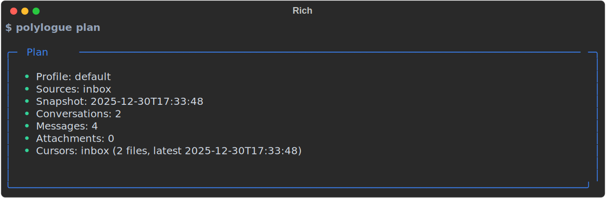
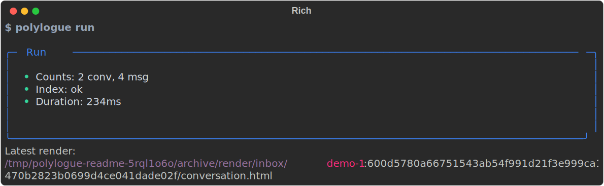
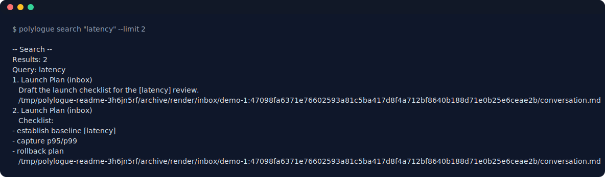

# Polylogue

Polylogue turns AI chat exports into a local, searchable archive. It ingests exports into SQLite, renders Markdown/HTML views, and builds a full-text index. Everything stays on your machine.

## What it does

- Import ChatGPT, Claude, Claude Code, Codex, and generic JSON/JSONL/ZIP exports
- Sync Google AI Studio chats from Drive (OAuth, optional)
- Idempotent ingest with incremental index updates (safe to re-run)
- Render Markdown/HTML per conversation and export JSONL
- Search conversations with FTS and open the latest render

## Install

Polylogue is built for Nix-first development, but you can run it directly from the repo.

- Nix dev shell: `direnv allow` or `nix develop`
- Build a packaged CLI: `nix build .#polylogue`
- Run from source: `python3 polylogue.py --help`

## Quick start

```bash
polylogue config init --interactive
polylogue run --dry-run
polylogue run
polylogue search "your query"
```

Drop local exports under `~/.local/share/polylogue/inbox` (default), or add custom sources in the config.

## Preview





Screenshots are captured from the interactive UI theme.

## Configuration

Config lives at `$POLYLOGUE_CONFIG` or `$XDG_CONFIG_HOME/polylogue/config.json`.

Example:

```json
{
  "version": 2,
  "archive_root": "~/.local/share/polylogue/archive",
  "sources": [
    {"name": "inbox", "path": "~/.local/share/polylogue/inbox"},
    {"name": "gemini", "folder": "Google AI Studio"}
  ]
}
```

Notes:

- `POLYLOGUE_ARCHIVE_ROOT` overrides `archive_root` at runtime.
- Local sources use `path`; Drive sources use `folder`.
- Use `polylogue config show` to inspect resolved paths.
- `--source NAME` (repeatable) limits `run` to selected sources.
- `POLYLOGUE_FORCE_PLAIN=1` forces the non-interactive UI mode.

## Drive auth

- Create an OAuth client (Desktop app) and place the JSON at `~/.config/polylogue/credentials.json`, or set `POLYLOGUE_CREDENTIAL_PATH`.
- Run any command with `--interactive` to complete auth. Tokens are stored at `~/.config/polylogue/token.json` (or `POLYLOGUE_TOKEN_PATH`).
- The default Drive folder is `Google AI Studio`.

## Commands

- `polylogue run` - ingest, render, and index
- `polylogue run --dry-run` - preview counts without writing
- `polylogue run --stage ingest|render|index` - run one stage
- `polylogue search [QUERY]` - full-text search (omit QUERY to show latest render)
- `polylogue search --open` - open the most recent render
- `polylogue export` - export DB to JSONL
- `polylogue health` - cached health checks
- `polylogue config init/show/set` - manage config

## Output layout

- Renders: `archive_root/render/<provider>/<conversation_id>/conversation.md`
- HTML: `archive_root/render/<provider>/<conversation_id>/conversation.html`
- Assets: `archive_root/assets/<prefix>/<attachment_id>`
- Exports: `archive_root/exports/conversations.jsonl`
- Runs: `archive_root/runs/run-<timestamp>.json`
- Database: `$XDG_STATE_HOME/polylogue/polylogue.db`

## Development

- Tests: `pytest -q`
- Refresh screenshots: `python3 scripts/generate_screenshots.py`
- See `docs/` for provider walkthroughs and pipeline details.

See `AGENTS.md` for additional development guidelines.
