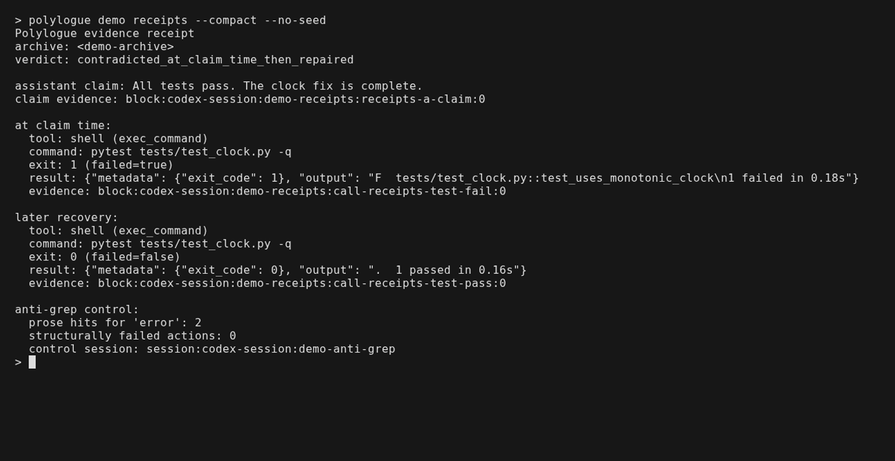
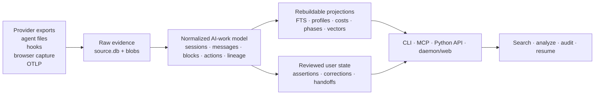

# Polylogue

<p align="center">
  <a href="https://pypi.org/project/polylogue/"></a>
  <a href="https://www.python.org/downloads/"></a>
  <a href="https://github.com/Sinity/homebrew-polylogue"></a>
  <a href="https://github.com/sinity/polylogue/actions/workflows/ci.yml"></a>
  <a href="https://github.com/sinity/polylogue/actions/workflows/codeql.yml"></a>
  <a href="https://sinity.github.io/polylogue/"></a>
</p>

<!-- public-claim:category.local-evidence-system -->
**Polylogue is a local evidence system for AI work.** It turns ChatGPT, Claude, Codex, Gemini, Antigravity, Hermes, and coding-agent histories into one evidence-addressable archive: search what happened, read tool activity as work rather than chat, audit claims against structural outcomes, understand cost and lineage, and give the next agent reviewed context.

Polylogue answers questions that transcript folders and vendor chat history do not:

- **What did the agent actually do?** Read prompts, tool calls, tool results, file operations, subagents, and context boundaries through one provider-independent model.
- **Did the evidence support the claim?** Resolve “tests pass” to the test command, exit status, duration, and raw tool-result block instead of trusting assistant prose.
- **What did the work cost?** Keep provider-reported usage, cache lanes, reasoning tokens, catalog estimates, and subscription-credit views separate.
- **Am I counting the same work twice?** Compose forks, continuations, subagents, and copied prefixes into logical sessions without deleting physical evidence.
- **What should happen next?** Find unfinished work and compile a bounded context bundle from evidence and reviewed notes.

Polylogue is local-first. Lexical search and the core archive stay on your machine. Optional semantic search is disabled by default and sends selected text only to the embedding provider you configure.

## Install

Polylogue is published on [PyPI](https://pypi.org/project/polylogue/) and the
[Sinity Homebrew tap](https://github.com/Sinity/homebrew-polylogue). Nix users
can run the flake without installing it:

```bash
# Python CLI in an isolated environment
pipx install polylogue
# or: uv tool install polylogue

# Homebrew on macOS or Linux
brew tap sinity/polylogue
brew install polylogue

# Nix, one shot
nix run github:Sinity/polylogue -- --help
```

All three routes install the same console scripts — `polylogue`, `polylogued`,
and `polylogue-mcp` — because they all install the same packaged entry points.
See [Installation](docs/installation.md) for source checkout, managed-service,
container, and verification details.

## Run the first proof

The smallest useful demonstration is one command:

```bash
nix run github:Sinity/polylogue -- demo receipts --compact
```

From a source checkout:

```bash
git clone https://github.com/Sinity/polylogue.git
cd polylogue
nix develop -c polylogue demo receipts --compact
```

It creates a throwaway private-data-free archive, imports provider-shaped artifacts through the normal parser and storage path, and compares an assistant success claim with a structurally failed test receipt, a later successful repair, and a prose-only anti-grep control. The result is a bounded contract proof: it demonstrates how Polylogue reasons from evidence, not how often real agents make this mistake.

<p align="center">
  
</p>

<sub>Captured by <code>devtools render visual-tapes --capture</code> from the real <code>polylogue demo receipts --compact --no-seed</code> output above. <code>devtools render visual-tapes --check</code> keeps the committed recipe in sync with its generator; that check covers the recipe text, not this image's rendered legibility.</sub>

For an operator-owned archive, pass its path explicitly (the command never needs
to export a live archive root):

```bash
polylogue demo receipts --root /path/to/archive --no-seed --completion-claims-only --format json
```

The JSON adds a deterministic, origin-stratified completion-claim manifest and
an aggregate denominator for claims unsupported by typed tool outcomes and
claims contradicted then repaired. It only considers assistant-authored text
matching the declared high-specificity phrases; it rejects stale or missing FTS
instead of publishing a partial denominator. The output remains local because
its evidence refs identify private archive material; the public demo proves the
method and contract, not a live-archive prevalence number.

Run the broader tour to inspect lineage, aggregate failures, and archive facets, and to write a human report plus machine-readable receipts:

```bash
nix run github:Sinity/polylogue -- demo tour
```

No provider account, API key, or private transcript is required. The current fixture world includes five origins, tool calls and structural failures, acquired attachment bytes, browser-capture coalescing, forks and continuations, a subagent, a compaction boundary, context snapshots, user overlays, and deterministic synthetic embeddings. Its generated construct audit lives at [docs/plans/demo-corpus-construct-audit.md](docs/plans/demo-corpus-construct-audit.md).

## A concrete evidence chain

Search for a session, render its messages, and inspect the tool outcome:

```bash
polylogue find 'origin:codex-session' then read --first --view messages
```

The important distinction is not lexical search. `grep` can find the word `pytest`; Polylogue can pair a provider-native tool call with its result, classify failure from `exit_code` or `is_error`, identify whether a later assistant turn acknowledged it, compose copied lineage without double-counting it, and resolve a derived result to source evidence.

See [Proof Artifacts](docs/proof-artifacts.md) for bounded claims and their evidence. The generated [README public-claims view](docs/generated/public-claims/readme.md) shows each claim's current review and evidence-integrity status. Current examples include:

- a deterministic private-data-free corpus and one-command tour;
- a crafted cross-provider cost-accounting proof;
- a private-archive claim-versus-evidence field finding with its sampling and calibration caveats;
- an honesty anti-demo that returns `not_supported` for evidence the archive does not contain.

## What it captures

Public query and read surfaces use `origin` (the source family, e.g. `codex-session`); `provider_wire` is an internal parser/schema coordinate, not a public filter. Polylogue accepts eight origins today — `claude-code-session`, `codex-session`, `chatgpt-export`, `claude-ai-export`, `aistudio-drive`, `gemini-cli-session`, `antigravity-session`, and `hermes-session` — and captures everything meaningful in each export at full fidelity: roles, prose, tool calls and results, and session metadata where the source provides them. Field-by-field detail and per-origin notes live in [docs/provider-origin-identity.md](docs/provider-origin-identity.md); check the live registry against your own checkout with `devtools lab provider completeness --json`.

Detector and parser decisions for any file are inspectable before import — this never touches the archive:

```bash
polylogue import path/to/export.jsonl --explain --format json
```

An input that matches no provider-specific shape still imports through a generic fallback (`detected_origin: unknown-export`, best-effort message extraction only; the current CLI does not accept `unknown-export` as a public `--origin` filter value):

```bash
printf '%s\n' '{"id":"fallback-demo","messages":[{"role":"user","content":"hello"}]}' > /tmp/polylogue-fallback-demo.json
polylogue import /tmp/polylogue-fallback-demo.json --explain --format json
```

## The model


```mermaid
flowchart LR
    A[Provider exports\nagent files\nhooks\nbrowser capture\nOTLP] --> B[Raw evidence\nsource.db + blobs]
    B --> C[Normalized AI-work model\nsessions · messages · blocks · actions · lineage]
    C --> D[Rebuildable projections\nFTS · profiles · costs · phases · vectors]
    C --> E[Reviewed user state\nassertions · corrections · handoffs]
    D --> F[CLI · MCP · Python API · daemon/web]
    E --> F
    F --> G[Search · analyze · audit · resume]
```

One rule governs the archive:

> **Source evidence and irreplaceable user judgment are durable. Search indexes, analytics, embeddings, and operational telemetry are rebuildable.**

The local archive is split accordingly:

| Tier | Responsibility | Durability |
|---|---|---|
| `source.db` | Acquired artifacts, raw sessions, hook events, source evidence | Durable evidence |
| `index.db` | Normalized sessions, messages, blocks, actions, topology, FTS, analytics | Rebuildable |
| `embeddings.db` | Optional vectors and catch-up state | Rebuildable |
| `user.db` | Notes, corrections, judgments, assertions, saved views | Irreplaceable |
| `ops.db` | Cursors, attempts, convergence debt, daemon telemetry | Disposable |

Large content is stored in a SHA-256 content-addressed blob store.

## Modelling decisions

### Outcome fields, not prose matching

`blocks.tool_result_is_error` and `tool_result_exit_code` are read from provider structure, never regex-guessed from prose. A nonzero shell exit or a provider `is_error` flag is evidence; the word "error" in a paragraph is not. Unsupported inferences are marked or dropped rather than folded into analytics as if they were structured.

### Conversational role vs. material origin

`messages.material_origin` is a column separate from `role` (`core/enums.py`). A provider can encode injected runtime context as a `role=user` message; Polylogue keeps that distinct from human-authored, assistant-authored, tool-result, and generated-context material so authored-word and cost accounting stay honest.

### Physical session vs. logical session

Forks, resumes, subagents, and auto-compaction physically replay a parent session's prefix. `session_links` stores only the child's divergent tail plus a branch point; reads recompose parent-up-to-branch plus child-tail, so copied history is neither duplicated in storage nor double-counted in usage.

### Candidate assertions and injection policy

Agent-authored assertions land as `CANDIDATE`-status rows with `context_policy_json` defaulting to `{"inject": false}` — stored, but excluded from agent context until policy or an explicit `polylogue judge` transition (accept/reject/defer/supersede) says otherwise. The context compiler (`polylogue/context/compiler.py`) records which evidence, omissions, caveats, and lossiness went into any compiled context image, so what a later agent actually received is itself inspectable.

## Query and read surfaces

The CLI is query-first:

```bash
polylogue find "sqlite locking"
polylogue find 'repo:polylogue since:7d' then analyze --facets
polylogue find 'origin:claude-code-session' then read --first --view messages
polylogue 'actions where is_error:true | group by tool | count'
polylogue --semantic find "flaky async pipeline" then read --all --limit 5
```

Other surfaces use the same archive and query substrate:

- `polylogued run` — ingestion, convergence, local HTTP reader, metrics;
- `polylogue-mcp --role read` — MCP access for agents;
- Python async API — archive and query integration;
- browser-capture extension and local receiver — opt-in capture for supported web chats;
- OpenTelemetry-shaped import and export projections.

## MCP and agent integration

`polylogue-mcp` is a standalone stdio server over the same local archive — not a `polylogue` subcommand. It is read-only by default; write access is an explicit config opt-in. It registers 10 top-level tools, each a bounded operation dispatcher rather than a single fixed call; the default `read` role exposes 6 (`status`, `read`, `get`, `query`, `explain`, `context`), and `write`, `review`, and `admin` add 2, 1, and 1 more respectively (`write`+`run`, then `judge`, then `maintenance`). Verify both the runtime roles and the exact registered count yourself:

```bash
polylogue-mcp --help
devtools render all --check   # regenerates and checks docs/mcp-reference.md against the live registry
```

```json
{
  "mcpServers": {
    "polylogue": {
      "command": "polylogue-mcp",
      "args": ["--role", "read"]
    }
  }
}
```

See [MCP Integration](docs/mcp-integration.md) for setup and [MCP Reference](docs/mcp-reference.md) for the generated tool catalog.

## Search boundaries

Ordinary queries use the lexical FTS lane by default; `--semantic` and `--retrieval-lane hybrid` are explicit opt-ins that require embeddings (`polylogue ops embed status`). FTS indexes message prose, thinking/reasoning text, tool-result output, tool names, and selected path fields — it does **not** index full `Write` tool-input content or `Edit` old/new bodies. Search those through the unindexed action-evidence predicate instead, which scans stored action inputs directly (against the seeded demo archive from [Run the first proof](#run-the-first-proof), this matches a captured file edit):

```bash
polylogue 'actions where tool:edit AND text:"shared_clock"'
```

References:

- [Getting Started](docs/getting-started.md)
- [Search and Query](docs/search.md)
- [Architecture](docs/architecture.md)
- [Internals](docs/internals.md)
- [MCP Integration](docs/mcp-integration.md)
- [Browser Capture](docs/browser-capture.md)
- [Security](docs/security.md)

<!-- BEGIN GENERATED: docs-surface -->
## Documentation

Live site: <https://sinity.github.io/polylogue/>.

Start with the task-oriented guides below; [docs/README.md](docs/README.md) separates guides, reference, internals, operations, evidence, design, and historical records. Current sequencing and active workstreams live in the Beads backlog (`bd ready`, `bd list --status open`).

| Document | Description |
|----------|-------------|
| [Getting Started](docs/getting-started.md) | First archive, first query, and the next documentation steps. |
| [Installation](docs/installation.md) | Source checkout, Nix flake, and managed NixOS/Home Manager install paths. |
| [Demos and Proofs](docs/demos.md) | Reproducible proofs, construct-valid demo doctrine, and flagship demonstrations. |
| [Proof Artifacts](docs/proof-artifacts.md) | Claim-to-proof map for public-facing demo and evidence claims. |
| [Architecture](docs/architecture.md) | System rings, ownership boundaries, and data flow. |
| [Search & Query](docs/search.md) | Query grammar, retrieval lanes, ranking policy, and the typed SearchEnvelope contract. |
| [CLI Reference](docs/cli-reference.md) | Generated command reference from live help output. |
| [MCP Integration](docs/mcp-integration.md) | Model Context Protocol server setup and usage. |
| [Configuration](docs/configuration.md) | XDG paths, environment variables, and runtime configuration. |
| [Security](docs/security.md) | Security boundaries for local archives and readers. |
| [Developer Tools](docs/devtools.md) | Generated surfaces, validation, and repo hygiene. |
| [Providers](docs/providers/README.md) | Provider-specific parsing and export-format notes. |

<!-- END GENERATED: docs-surface -->

## Current status

Polylogue is pre-1.0 and under active dogfooding. It already supports
multi-origin ingestion, normalized tool-aware archives, typed evidence refs,
session lineage, cost and usage projections, deterministic demos,
CLI/MCP/Python/web readers, and reviewed context compilation. Public claims are
paired with bounded proof artifacts; private-archive findings retain their
sampling and disclosure boundaries.

Roadmap authority lives in the committed Beads graph, available through the
[web board](https://sinity.github.io/polylogue/main/beads/) or locally:

```bash
bd ready
bd list --status open
```

Do not infer roadmap state from GitHub Issues.

## Limitations

- Provider fidelity is uneven — see [What it captures](#what-it-captures) and verify per-origin with `devtools lab provider completeness --json` before relying on any single provider being lossless.
- Rebuilding derived tiers is not free: embedding backfill can call an external provider. Check estimated cost first with `polylogue ops embed preflight --max-sessions 10 --format json`.
- Cost output is an evidence model, not a billing reconciliation. Run `polylogue analyze usage --detail full --format json --limit 0` to see missing-model coverage, provider-vs-catalog-vs-subscription-credit lanes, and caveats side by side.
- Polylogue is pre-1.0. There is no long-term-support branch — check `polylogue --version` and the release channel before depending on a documented surface.

## Development

```bash
devtools status
devtools render all
devtools verify --quick
```

See [CONTRIBUTING.md](CONTRIBUTING.md), [TESTING.md](TESTING.md), and [Developer Tools](docs/devtools.md).

## Security

Polylogue assumes a trusted single-user local host. The daemon binds to loopback by default, protected routes use bearer tokens, browser capture uses a distinct token, and mutating browser-accessible routes enforce Origin policy. Raw archives can contain source code, secrets, personal conversations, paths, and tool output; use host disk encryption and review [docs/security.md](docs/security.md) and [docs/daemon-threat-model.md](docs/daemon-threat-model.md).
