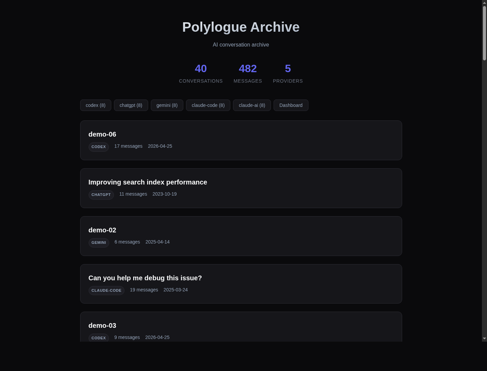

# Polylogue

<p align="center">
  <a href="https://www.python.org/downloads/"></a>
  <a href="LICENSE"></a>
  <a href="https://github.com/sinity/polylogue/actions/workflows/ci.yml"></a>
</p>

Polylogue is a local archive and analysis layer for AI conversations. It turns
ChatGPT, Claude, Claude Code, Codex, and Gemini exports or captures into one
SQLite archive with search, materialized session products, cost estimates,
static publication output, MCP access, and verification tooling.



The screenshot above is generated from the committed synthetic corpus workflow,
not from a private archive.

## What It Does

- Imports provider exports and local session logs into a normalized archive.
- Captures ChatGPT and Claude.ai browser sessions through a local receiver and
  extension path.
- Tails source sessions such as Claude Code at query time, so recent work can be
  inspected before the durable import catches up.
- Searches conversations with provider, date, tag, attachment, and semantic
  filters from the CLI, Python API, and MCP server.
- Builds durable products: session profiles, work events, phases, threads, day
  summaries, tag rollups, and cost estimates.
- Renders a static HTML archive for local browsing or controlled publication.
- Maintains synthetic corpora, proof obligations, semantic evidence runners,
  validation lanes, mutation campaigns, and benchmark campaigns for repo
  verification.

## Privacy Posture

Polylogue is local-first. The default archive database, inbox, rendered
Markdown, and generated site live under your XDG data directory unless you point
the runtime elsewhere. README media and examples use synthetic data. When you
publish a rendered site or screenshot, treat it like publishing the underlying
conversation text and review it accordingly.

## Quickstart

### From Source

```bash
git clone https://github.com/sinity/polylogue
cd polylogue
direnv allow   # or: nix develop
```

### Try It With Synthetic Data

```bash
eval "$(devtools lab-corpus seed --count 8 --env-only)"

polylogue "error handling" list --limit 5
polylogue products profiles --limit 5
polylogue run site -o ./site-preview
```

Demo data is isolated from your normal archive.

### Ingest Real Exports

Polylogue follows the XDG layout by default:

- `~/.local/share/polylogue/polylogue.db` for the archive database
- `~/.local/share/polylogue/inbox/` for dropped exports
- `~/.local/share/polylogue/render/` for rendered outputs
- `~/.local/share/polylogue/site/` for generated publication sites

Typical flow:

```bash
cp ~/Downloads/conversations.json ~/.local/share/polylogue/inbox/
polylogue run acquire parse materialize render index
polylogue -p chatgpt --latest open
```

Use `polylogue run site` when you explicitly want the static HTML site. Keeping
site generation separate is useful for unattended catch-up services where import
freshness matters more than rebuilding publication output every run.

## CLI Shape

The root command is query-first:

```bash
polylogue "error handling" list --limit 10
polylogue --provider claude-ai --since "last week" stats --by provider
polylogue --tail --provider claude-code list --limit 10
polylogue --latest open
polylogue "urgent" --tag review delete --dry-run
```

Text searches that render result lists include match evidence alongside the
conversation identity: rank, retrieval lane, matched surface, message id, and a
snippet when the FTS index can provide one. Drive/Gemini attachment identities
are also queryable through the same surfaces: provider attachment ids plus
stored `provider_id`, `id`, `fileId`, and `driveId` metadata return hits with
`match_surface=attachment`.

The pipeline and archive-maintenance surfaces are explicit verbs:

```bash
polylogue run acquire parse materialize render index
polylogue browser-capture serve --host 127.0.0.1 --port 8765
polylogue doctor --repair --preview
polylogue audit --only exercises --tier 0
polylogue mcp
```

See [docs/cli-reference.md](docs/cli-reference.md) for the generated command
reference from live help output.

### Shell Completion

For zsh:

```bash
mkdir -p ~/.zfunc
polylogue completions --shell zsh > ~/.zfunc/_polylogue
fpath=(~/.zfunc $fpath)
autoload -Uz compinit && compinit
```

The completion surface includes command descriptions plus live archive-backed
values for recent conversation IDs, tags, tools, and configured sources.

## Core Surfaces

### Archive and Query

- provider detection from file content
- full-text search with composable filters
- optional vector search for semantic similarity
- query-time tail overlays for source sessions that are newer than the archive

### Durable Products

```bash
polylogue products profiles --limit 10
polylogue products phases --limit 10
polylogue products threads --limit 10
polylogue products costs --limit 10
polylogue products cost-rollups
```

Products are materialized from the archive and updated incrementally. Cost
products use provider/model usage when available and mark estimates explicitly
when exact billing data is not present.

### Browser Capture and Catch-Up

```bash
polylogue browser-capture serve --host 127.0.0.1 --port 8765
polylogue browser-capture status
```

The browser receiver accepts local extension envelopes for ChatGPT and Claude.ai
and writes them into the same archive pipeline as exported files. The unpacked
extension source lives in `browser-extension/polylogue-browser-capture/`.
Scheduled `polylogue run ...` jobs are durable catch-up and materialization.
They are not the realtime mechanism; fresh-source inspection is handled by
capture and query-time tailing.

### Publication and MCP

```bash
polylogue run site -o ./site-preview
polylogue mcp
```

- static HTML archive with search
- archive queries for AI assistants via MCP

### Verification Lab

```bash
devtools render-verification-catalog --check
devtools affected-obligations --path polylogue/cli/query.py
devtools verify --lab
```

The verification lab records proof-obligation subjects, claim runners, semantic
evidence, and changed-file routing so agents can choose focused checks before
escalating to the full repository baseline.

### Library API

```python
from polylogue import Polylogue

async with Polylogue() as archive:
    stats = await archive.stats()
    convs = await (
        archive.filter()
        .provider("claude-ai")
        .contains("error handling")
        .limit(10)
        .list()
    )
```

The Python API is async-first.

## Developer Tools

Repository maintenance work is centralized under `devtools`:

```bash
devtools --help
devtools --list-commands --json
devtools status
devtools render-all
devtools run-validation-lanes --lane frontier-local
```

See [docs/devtools.md](docs/devtools.md) for the full command catalog.

<!-- BEGIN GENERATED: docs-surface -->
## Documentation

For the full docs map, see [docs/README.md](docs/README.md).

| Document | Description |
|----------|-------------|
| [CLI Reference](docs/cli-reference.md) | Generated command reference from live help output. |
| [Configuration](docs/configuration.md) | XDG paths, environment variables, and runtime configuration. |
| [Library API](docs/library-api.md) | Async archive API, filters, and query patterns. |
| [Browser Capture](docs/browser-capture.md) | Local browser extension capture for ChatGPT and Claude.ai sessions. |
| [MCP Integration](docs/mcp-integration.md) | Model Context Protocol server setup and usage. |
| [Developer Tools](docs/devtools.md) | `devtools` guide for generated surfaces, validation, and repo hygiene. |
| [Verification Catalog](docs/verification-catalog.md) | Generated proof-obligation subjects, claims, runners, and catalog self-checks. |
| [Verification Lab](docs/verification-lab.md) | Accepted command-surface decision for proof catalog, routing, and evidence operators. |
| [Architecture](docs/architecture.md) | System rings, ownership boundaries, and data flow. |
| [Providers](docs/providers/README.md) | Provider-specific parsing and export-format notes. |

## Contributor Guides

| Document | Description |
|----------|-------------|
| [Contributing](CONTRIBUTING.md) | Branching, issues, PRs, squash-merge history, and repo policy. |
| [Testing](TESTING.md) | Baseline test matrix, protected surfaces, and QA entrypoints. |
| [Agent Guide](CLAUDE.md) | Agent memory and working rules. |

<!-- END GENERATED: docs-surface -->

## Development

See [CONTRIBUTING.md](CONTRIBUTING.md), [TESTING.md](TESTING.md), and
[docs/internals.md](docs/internals.md).

## License

[MIT](LICENSE)
