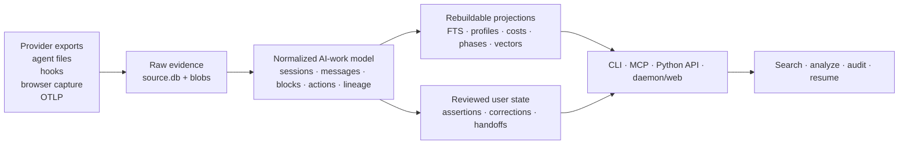

# Polylogue

<p align="center">
  <a href="https://www.python.org/downloads/"></a>
  <a href="LICENSE"></a>
  <a href="https://github.com/sinity/polylogue/actions/workflows/ci.yml"></a>
</p>

**Polylogue is a local evidence system for AI work.** It turns ChatGPT, Claude, Codex, Gemini, Antigravity, Hermes, and coding-agent histories into one evidence-addressable archive: search what happened, read tool activity as work rather than chat, audit claims against structural outcomes, understand cost and lineage, and give the next agent reviewed context.

<p align="center">
  
</p>

Polylogue answers questions that transcript folders and vendor chat history do not:

- **What did the agent actually do?** Read prompts, tool calls, tool results, file operations, subagents, and context boundaries through one provider-independent model.
- **Did the evidence support the claim?** Resolve “tests pass” to the test command, exit status, duration, and raw tool-result block instead of trusting assistant prose.
- **What did the work cost?** Keep provider-reported usage, cache lanes, reasoning tokens, catalog estimates, and subscription-credit views separate.
- **Am I counting the same work twice?** Compose forks, continuations, subagents, and copied prefixes into logical sessions without deleting physical evidence.
- **What should happen next?** Find unfinished work and compile a bounded context bundle from evidence and reviewed notes.

Polylogue is local-first. Lexical search and the core archive stay on your machine. Optional semantic search is disabled by default and sends selected text only to the embedding provider you configure.

## Run the first proof

The smallest useful demonstration is one command:

```bash
nix run github:Sinity/polylogue -- demo receipts
```

From a source checkout:

```bash
git clone https://github.com/Sinity/polylogue.git
cd polylogue
nix develop -c polylogue demo receipts
```

It creates a throwaway private-data-free archive, imports provider-shaped artifacts through the normal parser and storage path, and compares an assistant success claim with a structurally failed test receipt, a later successful repair, and a prose-only anti-grep control. The result is a bounded contract proof: it demonstrates how Polylogue reasons from evidence, not how often real agents make this mistake.

Run the broader tour to inspect lineage, aggregate failures, and archive facets, and to write a human report plus machine-readable receipts:

```bash
nix run github:Sinity/polylogue -- demo tour
```

No provider account, API key, or private transcript is required. The current fixture world includes five origins, tool calls and structural failures, acquired attachment bytes, browser-capture coalescing, forks and continuations, a subagent, a compaction boundary, context snapshots, user overlays, and deterministic synthetic embeddings. Its generated construct audit lives at [docs/plans/demo-corpus-construct-audit.md](docs/plans/demo-corpus-construct-audit.md).

## A concrete evidence chain

Search for a session, render its messages, and inspect the tool outcome:

```bash
polylogue find 'origin:codex-session' then read --first --view messages
```

The important distinction is not lexical search. `grep` can find the word `pytest`; Polylogue can pair a provider-native tool call with its result, classify failure from `exit_code` or `is_error`, identify whether a later assistant turn acknowledged it, compose copied lineage without double-counting it, and resolve a derived result to source evidence.

See [Proof Artifacts](docs/proof-artifacts.md) for bounded claims and their evidence. Current examples include:

- a deterministic private-data-free corpus and one-command tour;
- a crafted cross-provider cost-accounting proof;
- a private-archive claim-versus-evidence field finding with its sampling and calibration caveats;
- an honesty anti-demo that returns `not_supported` for evidence the archive does not contain.

## The model


```mermaid
flowchart LR
    A[Provider exports\nagent files\nhooks\nbrowser capture\nOTLP] --> B[Raw evidence\nsource.db + blobs]
    B --> C[Normalized AI-work model\nsessions · messages · blocks · actions · lineage]
    C --> D[Rebuildable projections\nFTS · profiles · costs · phases · vectors]
    C --> E[Reviewed user state\nassertions · corrections · handoffs]
    D --> F[CLI · MCP · Python API · daemon/web]
    E --> F
    F --> G[Search · analyze · audit · resume]
```

One rule governs the archive:

> **Source evidence and irreplaceable user judgment are durable. Search indexes, analytics, embeddings, and operational telemetry are rebuildable.**

The local archive is split accordingly:

| Tier | Responsibility | Durability |
|---|---|---|
| `source.db` | Acquired artifacts, raw sessions, hook events, source evidence | Durable evidence |
| `index.db` | Normalized sessions, messages, blocks, actions, topology, FTS, analytics | Rebuildable |
| `embeddings.db` | Optional vectors and catch-up state | Rebuildable |
| `user.db` | Notes, corrections, judgments, assertions, saved views | Irreplaceable |
| `ops.db` | Cursors, attempts, convergence debt, daemon telemetry | Disposable |

Large content is stored in a SHA-256 content-addressed blob store.

## Why the evidence model matters

### Structured outcomes beat plausible prose

A nonzero shell exit, provider `is_error` flag, or typed tool result is evidence. The word “error” in a paragraph is not. Polylogue deliberately removes or marks unsupported inferences rather than turning them into authoritative analytics.

### Role is not authoredness

A provider may encode injected runtime context as a `user` message. Polylogue records conversational role separately from whether material was human-authored, assistant-authored, runtime protocol, tool output, or generated context.

### Physical sessions are not logical work

Provider forks and resumptions can copy large transcript prefixes. Polylogue retains the physical artifacts while materializing logical lineage so copied history can be stored, read, and accounted for without pretending it was new work.

### Memory requires judgment

Agent-authored observations enter as candidates with context injection disabled. Human or declared-policy judgment can accept, reject, defer, or supersede them. The context compiler records selected evidence, omissions, caveats, lossiness, and the exact context delivered to a later agent.

## Query and read surfaces

The CLI is query-first:

```bash
polylogue find "sqlite locking"
polylogue find 'repo:polylogue since:7d' then analyze --facets
polylogue find 'origin:claude-code-session' then read --first --view messages
polylogue 'actions where is_error:true | group by tool | count'
polylogue --semantic find "flaky async pipeline" then read --all --limit 5
```

Other surfaces use the same archive and query substrate:

- `polylogued run` — ingestion, convergence, local HTTP reader, metrics;
- `polylogue-mcp --role read` — MCP access for agents;
- Python async API — archive and query integration;
- browser-capture extension and local receiver — opt-in capture for supported web chats;
- OpenTelemetry-shaped import and export projections.

References:

- [Getting Started](docs/getting-started.md)
- [Search and Query](docs/search.md)
- [Architecture](docs/architecture.md)
- [Internals](docs/internals.md)
- [MCP Integration](docs/mcp-integration.md)
- [Browser Capture](docs/browser-capture.md)
- [Security](docs/security.md)

<!-- BEGIN GENERATED: docs-surface -->
## Documentation

Live site: <https://sinity.github.io/polylogue/> (auto-published on every merge to `master`).

Start with the task-oriented guides below; [docs/README.md](docs/README.md) separates guides, reference, internals, operations, evidence, design, and historical records. Current sequencing and active workstreams live in the Beads backlog (`bd ready`, `bd list --status open`).

| Document | Description |
|----------|-------------|
| [Getting Started](docs/getting-started.md) | First archive, first query, and the next documentation steps. |
| [Installation](docs/installation.md) | Source checkout, Nix flake, and managed NixOS/Home Manager install paths. |
| [Demos and Proofs](docs/demos.md) | Reproducible proofs, construct-valid demo doctrine, and flagship demonstrations. |
| [Proof Artifacts](docs/proof-artifacts.md) | Claim-to-proof map for public-facing demo and evidence claims. |
| [Architecture](docs/architecture.md) | System rings, ownership boundaries, and data flow. |
| [Search & Query](docs/search.md) | Query grammar, retrieval lanes, ranking policy, and the typed SearchEnvelope contract. |
| [CLI Reference](docs/cli-reference.md) | Generated command reference from live help output. |
| [MCP Integration](docs/mcp-integration.md) | Model Context Protocol server setup and usage. |
| [Configuration](docs/configuration.md) | XDG paths, environment variables, and runtime configuration. |
| [Security](docs/security.md) | Security boundaries for local archives and readers. |
| [Developer Tools](docs/devtools.md) | Generated surfaces, validation, and repo hygiene. |
| [Providers](docs/providers/README.md) | Provider-specific parsing and export-format notes. |

<!-- END GENERATED: docs-surface -->

## Current status

Polylogue is pre-1.0 and under active dogfooding. The codebase already supports multi-origin ingestion, normalized tool-aware archives, typed refs, lineage, cost and usage projections, deterministic demos, CLI/MCP/Python/web surfaces, and reviewed context compilation. The active Beads backlog is currently hardening the trust floor and public product experience, particularly:

- disjoint cross-provider token and cost accounting;
- loud degraded-mode and readiness signals;
- semantic transcript rendering shared by CLI and web;
- public claims and findings with resolvable evidence;
- install and release-channel verification;
- memory and resumption experiments;
- the long-term Sinex-backed evidence architecture.

Roadmap authority lives in Beads:

```bash
bd ready
bd list --status open
```

Do not infer roadmap state from GitHub Issues.

## Installation

Supported current paths are source checkout and Nix. PyPI, Homebrew, OCI images, and browser-store distribution remain release-channel targets until the release matrix proves them.

```bash
# One-shot CLI
nix run github:Sinity/polylogue -- --help

# Development checkout
git clone https://github.com/Sinity/polylogue.git
cd polylogue
nix develop

polylogue --help
polylogued run
polylogue-mcp --help
```

See [Installation](docs/installation.md) and [Release Readiness](docs/plans/release-readiness-gate.md).

## Development

```bash
devtools status
devtools render all
devtools verify --quick
```

See [CONTRIBUTING.md](CONTRIBUTING.md), [TESTING.md](TESTING.md), and [Developer Tools](docs/devtools.md).

## Security

Polylogue assumes a trusted single-user local host. The daemon binds to loopback by default, protected routes use bearer tokens, browser capture uses a distinct token, and mutating browser-accessible routes enforce Origin policy. Raw archives can contain source code, secrets, personal conversations, paths, and tool output; use host disk encryption and review [docs/security.md](docs/security.md) and [docs/daemon-threat-model.md](docs/daemon-threat-model.md).

## License

MIT.
