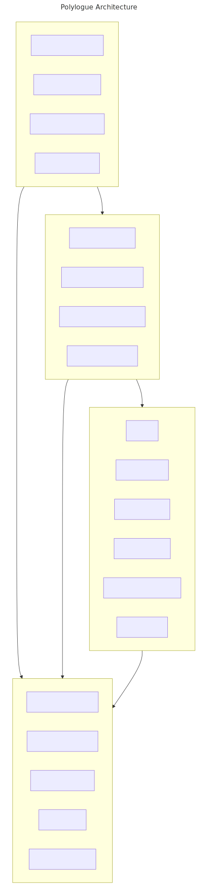

# Polylogue

<p align="center">
  <a href="https://www.python.org/downloads/"></a>
  <a href="LICENSE"></a>
  <a href="https://github.com/sinity/polylogue/actions/workflows/ci.yml"></a>
</p>

**Polylogue is a local archive and cockpit for your AI sessions and agent
work.**

It ingests the session files that ChatGPT, Claude (web and Claude Code),
Codex, Gemini, Google Drive exports, and Antigravity already leave on disk,
normalizes them into a content-addressed SQLite archive, and gives you
full-text and semantic search, materialized session insights, cost rollups,
git-correlation, a daemon HTTP reader, and an MCP bridge — all running on your
machine, against your data.

- **Local-first.** The archive lives under your XDG data directory. No cloud,
  no upload, and no API key unless you opt into semantic embeddings.
- **Source-agnostic.** Providers are detected by file shape, not filename or
  vendor SDK. The same archive holds web exports, IDE agents, and CLI agents
  side by side.
- **Idempotent.** Re-ingesting the same data is a no-op; content hashes
  prevent duplication, and editable metadata (tags, summaries) does not
  trigger re-import.

## 30-second tour

```bash
pip install polylogue                 # also installs polylogued, polylogue-mcp
polylogue init                        # detect chat sources, write polylogue.toml
polylogued run                        # ingest daemon: convergence + insights + HTTP reader
polylogue "rate limiter"              # search every origin at once
polylogue --latest read               # render the most recent session
polylogue --latest read --to browser  # open it in the local reader instead
```

`polylogue init` detects known session sources and writes a starter
`polylogue.toml`; the daemon takes it from there. For the narrated first run,
see [docs/getting-started.md](docs/getting-started.md) and
[docs/onboarding.md](docs/onboarding.md). Other install channels (Nix, Homebrew,
container) are in [docs/installation.md](docs/installation.md).

## Why this exists

AI sessions are scattered across one JSON dump per vendor, one JSONL stream
per agent, and one half-broken export per browser plugin. The transcripts are
valuable — running notes, debugging history, design rationale — but they only
become a corpus when something pulls them into a single, queryable substrate.

Polylogue is that substrate, and a cockpit over it:

- **Search across origins.** One query covers every captured session, with
  composable filters for origin, repo, date, tag, tool use, thinking blocks,
  paste detection, and semantic actions. FTS5 lexical search is always on;
  Voyage embeddings and hybrid (RRF) retrieval are opt-in.
- **Read agent work, not just chats.** `read` routes a matched session to a
  view: `summary`, `transcript`, `messages`, `raw`, `context`, `neighbors`
  (sessions around it in time), or `correlation` (the git commits a session
  produced).
- **Insights computed once, read many.** Session profiles, work events,
  phases, threads, tag rollups, and cost rollups are materialized into the
  archive so the CLI, the HTTP reader, the MCP bridge, and the Python API all
  see the same numbers.
- **Built to be inspected.** Schema is fresh-first (no in-place upgrade chain
  to guess at), blob storage is content-addressed, and the daemon exposes
  health checks and Prometheus metrics.

## Architecture at a glance

Four rings, each with a single responsibility. The substrate owns stored
meaning; everything else either derives from it, exposes it, or verifies
it.



```
source files (JSON/JSONL/ZIP)
  → detect_provider()          shape-based, not filename
  → provider parser            parsers/{chatgpt,claude,codex,drive,…}.py
  → content hash (NFC)         SHA-256 over normalized payload
  → store (upsert-if-changed)  idempotent by content hash
  → session insights           profiles, work events, phases, threads
  → FTS index                  unicode61 tokenizer

           CLI / MCP / HTTP Reader / Python API
                       ↑
                 filter chain → query → storage
```

The archive is a split-tier SQLite file set, each tier carrying a different
durability class: `source.db` (raw acquisition evidence), `index.db` (parsed
sessions, messages, FTS and search indexes, derived insights), `embeddings.db`
(opt-in vector rows), `user.db` (irreplaceable human input — tags, marks,
annotations, notes), and `ops.db` (disposable daemon telemetry). Large binary
content lives in a content-addressed blob store keyed by SHA-256.

See [docs/architecture.md](docs/architecture.md) for the ring boundaries and
[docs/internals.md](docs/internals.md) for hot files and extension points.
Diagrams are regenerated by `devtools render-readme-media` from Mermaid
sources under [docs/media/](docs/media/) — committed terminal screenshots
and VHS tapes are deliberately not part of this repository (see the
[media policy](docs/media/README.md)).

## Privacy and local-first

Everything Polylogue stores stays under your XDG data directory. Nothing is
uploaded, and no provider API key is needed unless you opt into semantic
embeddings (Voyage AI), which is off by default. The only network calls the
core makes are the ones you explicitly enable: Google Drive OAuth for Gemini
export ingestion, the optional embedding backfill, and the optional GitHub
cross-reference in `read --view correlation`.

If you run Polylogue inside a managed cloud-agent sandbox (Claude Code Web,
Codex Cloud), the data-handling tier follows the account you run under — the
repo cannot enforce it. The operator checklist, including which commands are
safe in a sandbox and which must never touch your real corpus, is in
[docs/cloud-agents.md](docs/cloud-agents.md).

## CLI shape

The root command is **query-first** — any positional token that is not a
registered subcommand is treated as a search query against your archive:

```bash
polylogue "error handling"                       # search across all origins
polylogue --origin claude-code-session --since "last week" list
polylogue --has-tool-use --typed-only list       # precomputed analytics
polylogue --action file_edit --tool bash list    # semantic action filters
polylogue --similar "sqlite locking" --limit 5   # vector-similar (opt-in)
polylogue --latest read                          # render the most recent session
polylogue stats --by origin                      # aggregates
```

You can also bind a query to an explicit verb with `find QUERY then VERB`. The
verbs that act on a matched set are `list`, `read`, `count`, `stats`,
`analyze`, `mark`, and `delete`:

```bash
polylogue find id:abc then read --view messages
polylogue find 'repo:polylogue since:7d' then analyze --facets
polylogue find 'repo:polylogue' then read --view correlation --since-hours 4
polylogue find 'repo:polylogue since:7d' then delete --dry-run
```

`analyze` folds the statistics and facet surfaces over the matched result set
(`--by <dimension>`, `--facets`). `read --view correlation` cross-references a
session against the git commits it produced; `read --view neighbors` shows the
sessions around it in time.

Pipeline and maintenance verbs are explicit:

```bash
polylogue init                       # first-run setup (writes polylogue.toml)
polylogue import ~/.claude/projects  # ingest sessions from a source path
polylogue doctor                     # FTS coverage, blob store, daemon liveness
polylogue status                     # daemon + archive status
polylogue paths                      # canonical archive paths
polylogued run                       # daemon: convergence + insights + HTTP reader
polylogued watch                     # watch source dirs and ingest live
polylogue-mcp --role read            # MCP stdio bridge for AI assistants
```

See [docs/cli-reference.md](docs/cli-reference.md) for the full generated
command reference and [docs/search.md](docs/search.md) for the query grammar,
retrieval lanes, and ranking policy.

## Surfaces

### CLI

`polylogue` (aliases `plg`, `plog`) is the primary surface — query-first
search plus the verbs and maintenance commands above.

### Daemon HTTP reader

`polylogued run` starts the ingest daemon and an HTTP reader on `127.0.0.1`
that serves live archive search, session rendering, and insight views. It
uses the same query layer as the CLI, plus health checks
(`polylogued health`) and a Prometheus `/metrics` endpoint. See
[docs/daemon.md](docs/daemon.md).

### MCP bridge

`polylogue-mcp --role read` exposes the archive as a Model Context Protocol
server so AI assistants can search, list, and retrieve sessions, insights, and
context packs from their own sessions. See
[docs/mcp-integration.md](docs/mcp-integration.md).

### Browser capture

For ChatGPT and Claude.ai web sessions that have no on-disk export,
`polylogued browser-capture serve` runs a local receiver (`browser-capture
status` reports its state). The unpacked extension
lives in [`browser-extension/`](browser-extension/) and POSTs captured
sessions to the receiver as you browse. See
[docs/browser-capture.md](docs/browser-capture.md).

### Python API

Polylogue is library-first; the CLI wraps the Python API. The `Polylogue`
context manager owns the archive connection and exposes its repository's
async query methods:

```python
from polylogue import Polylogue

async with Polylogue.open() as archive:
    summaries = await archive.repository.list_summaries(
        title_contains="error handling",
        has_tool_use=True,
        limit=10,
    )
    for session in summaries:
        print(session.id, session.display_title)
```

See [docs/library-api.md](docs/library-api.md) for the full query surface.

## Installing from source

For development or to track `master`:

```bash
git clone https://github.com/sinity/polylogue
cd polylogue
direnv allow   # or: nix develop
```

The devshell installs git hooks, regenerates `AGENTS.md` from `CLAUDE.md`,
and provides the full toolchain (Python 3.13, mypy, ruff, pytest, mmdc).

To try the CLI without committing to an install:

```bash
nix run github:Sinity/polylogue -- --help
```

### Synthetic demo data

To explore features without importing real exports, use an isolated archive
root and schedule the approved deterministic demo fixture world:

```bash
export POLYLOGUE_DEMO_HOME="$(mktemp -d)"
export POLYLOGUE_ARCHIVE_ROOT="$POLYLOGUE_DEMO_HOME/archive"
export XDG_CONFIG_HOME="$POLYLOGUE_DEMO_HOME/config"

polylogue init
polylogued run
```

In a second terminal with the same environment:

```bash
polylogue import --demo
polylogue status
polylogue stats
polylogue "pytest" list --limit 5
polylogue find "pytest" then read --view messages
```

`polylogue import --demo` writes only approved synthetic source files and asks
the running daemon to ingest them. The command is asynchronous: `status` shows
daemon/archive health, while `stats` and search/read commands are meaningful
after daemon convergence. The current deterministic archive evidence is the
in-process fixture evidence in [docs/generate.md](docs/generate.md), including
the expected `pytest` search hit and user-tier overlay evidence for the
`pytest-triage` tag, mark, note, saved query, and typed assertions.

## Developer tools

Repository maintenance, generated-surface rendering, validation lanes, and
verification all live behind `devtools`:

```bash
devtools --help
devtools status                  # repo health, generated-surface drift
devtools render-all              # regenerate all generated docs and surfaces
devtools verify                  # local baseline before pushing a PR
devtools render-readme-media     # re-render the diagrams above
```

See [docs/devtools.md](docs/devtools.md) for the full command catalog and
[CONTRIBUTING.md](CONTRIBUTING.md) for the contribution workflow.

## Verification lab

Operators choose focused checks via the verification baseline:

```bash
devtools verify --quick
devtools lab-scenario verify-baselines
```

<!-- BEGIN GENERATED: docs-surface -->
## Documentation

Live site: <https://sinity.github.io/polylogue/> (auto-published on every merge to `master`).

Start with the generated command and architecture references; use [docs/README.md](docs/README.md) for the complete map.

| Document | Description |
|----------|-------------|
| [Architecture](docs/architecture.md) | System rings, ownership boundaries, and data flow. |
| [Architecture Spine](docs/architecture-spine.md) | Target shape, guardrails, and major decisions with rejected alternatives. |
| [Execution Plan](docs/execution-plan.md) | Living sequencing plan — landed, in flight, queued, and frozen subsystems. |
| [Design Direction](docs/design/README.md) | Canonical MK3 archive-workbench design pack and historical design handoffs. |
| [CLI Reference](docs/cli-reference.md) | Generated command reference from live help output. |
| [Search & Query](docs/search.md) | Query grammar, retrieval lanes, ranking policy, and the typed SearchEnvelope contract. |
| [Browser Capture](docs/browser-capture.md) | Local browser extension capture for ChatGPT and Claude.ai sessions. |
| [Library API](docs/library-api.md) | Async archive API, filters, and query patterns. |
| [MCP Integration](docs/mcp-integration.md) | Model Context Protocol server setup and usage. |
| [Configuration](docs/configuration.md) | XDG paths, environment variables, and runtime configuration. |
| [Archive Backup](docs/archive-backup.md) | Archive-tier backup profiles, restore boundaries, and blob-GC safety rules. |
| [Developer Tools](docs/devtools.md) | `devtools` guide for generated surfaces, validation, and repo hygiene. |
| [Providers](docs/providers/README.md) | Provider-specific parsing and export-format notes. |

<!-- END GENERATED: docs-surface -->
