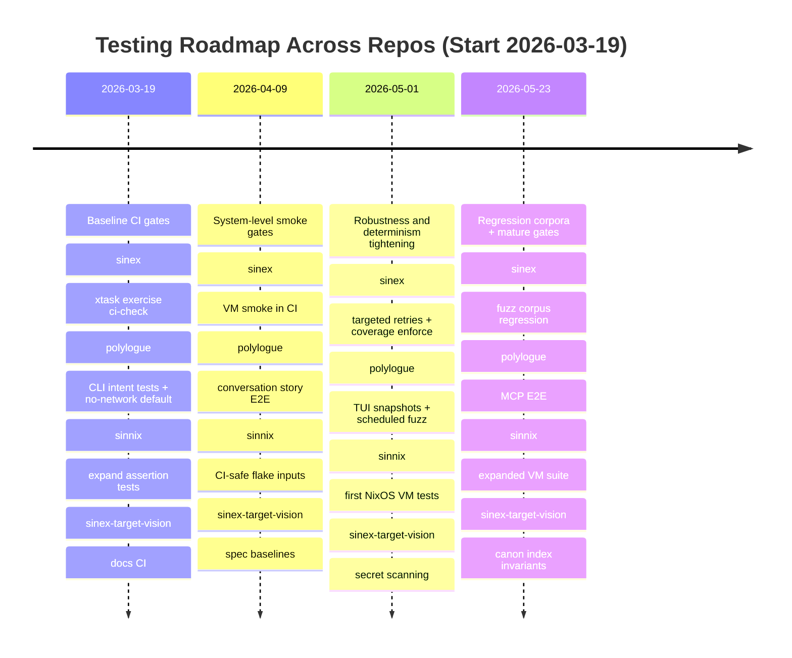

# Testing Deep Research for Sinity Repos

Status: analysis input, not the live execution queue
Role: cross-repo testing research reference with a partial Polylogue section

Current planning entrypoint:

- `planning-and-analysis-map-2026-03-21.md`
- `testing-reliability-expansion-program-2026-03-14.md`

## Executive summary

Across the four allowed repositories, testing maturity is uneven but trending strong in the two “product” codebases.

In **sinex**, there is an unusually comprehensive multi-layer test strategy already present: Rust unit/property tests (with `proptest`, `rstest`, `insta`, `trybuild`, etc.) are wired into a `cargo nextest` configuration, there is a dedicated Rust E2E crate, and there is a full NixOS VM integration/performance suite with a named scenario catalog. fileciteturn13file0L1-L1 fileciteturn14file0L1-L1 fileciteturn15file0L1-L1 fileciteturn11file0L1-L1
The largest **practical risk** is not lack of tests, but **gating coverage**: the VM suite is explicitly positioned as the NixOS compatibility enforcement mechanism in code, while the VM README simultaneously states CI only runs a thin subset for fast gating and the rest are manual/optional. That mismatch is a change-risk multiplier. fileciteturn11file0L1-L1 fileciteturn12file0L1-L1
Secondary risks: doc drift in test/CI docs vs active configuration (notably around nextest retries and perf verification command surfaces), and a set of inherently nondeterministic surfaces (distributed messaging, wall-clock time, concurrency) that need stronger “determinism budgets” and regression harnesses. fileciteturn56file0L1-L1 fileciteturn14file0L1-L1 fileciteturn17file0L1-L1 fileciteturn65file0L1-L1

In **polylogue**, CI is modern and strict: linting (`ruff`), typechecking (strict `mypy`), and tests run across Python 3.10/3.12/3.13 with a **hard ≥90% coverage gate**, plus reproducibility knobs (`HYPOTHESIS_PROFILE=ci`, `POLYLOGUE_FORCE_PLAIN=1`). fileciteturn48file0L1-L1 fileciteturn51file0L1-L1
The biggest gaps are in **true end-to-end UX flows** (Textual TUI, interactive query-first behavior, MCP server protocol flows), **adversarial ingestion** (path traversal, malformed provider exports, Unicode edge cases), and **external API boundaries** (Google Drive/OAuth) where tests should be hermetic by default. fileciteturn59file0L1-L1 fileciteturn51file0L1-L1

In **sinnix**, testing is unusually strong for a NixOS config repo: flake checks include a substantial custom “assertion test DSL” for feature/service/bundle invariants, plus at least one runtime harness that validates terminal capture scripts in a controlled environment with deterministic time injection. CI runs formatting + `nix flake check`. fileciteturn41file0L1-L1 fileciteturn44file0L1-L1
The gap is largely **system-level behavior** that cannot be validated by evaluation-only tests (boot/service orchestration, GUI/Wayland capture flows) and “vision-style” pipelines (e.g., screenshot correctness under HDR), which need either VM tests or synthetic artifact tests.

In **sinex-target-vision**, the repository appears documentation/analysis-centric (canon + analysis trees) and does not present an obvious CI/test harness. The primary opportunity is to treat it as a **spec repository** and add automated consistency checks (link checking, schema validation of front matter, “canon invariants”). fileciteturn25file0L1-L1 fileciteturn24file5L1-L1

The attached chatlog contains many good testing ideas; the most valuable pattern to standardize across repos is **deterministic, artifacted QA**: baselines/manifests for “exercise-style” command suites, hermetic fixture generation, test history storage, and CI that elevates regressions into actionable diffs. This is partially implemented already in `sinex`’s `xtask exercise` (seeded ephemeral history DB + baseline diffing), and can be extended to VM/E2E gates and to `polylogue`’s CLI/TUI demos. fileciteturn21file0L1-L1 fileciteturn49file0L1-L1

## Evidence base and current-state inventory

This report is grounded primarily in repository contents discovered via the connected entity["company","GitHub","code hosting platform"] connector, plus a small set of primary/official web sources for tooling and ML reproducibility.

### Repository test and CI artifacts catalog

#### sinex

**CI workflows**
- `.github/workflows/ci.yml` (main CI workflow). fileciteturn7file0L1-L1
- `.github/workflows/db-checks.yml` (schema-focused pipeline gated by `paths-filter`). fileciteturn18file0L1-L1
- `.github/workflows/fuzz.yml` (nightly + dispatch fuzzing with `cargo-fuzz`, corpus cache, artifact upload, and failure-on-crash summary). fileciteturn16file0L1-L1
- `.github/workflows/verify-perf.yml` (scheduled perf verification producing artifacts + history DB). fileciteturn17file0L1-L1

**Core test runners and configs**
- `.config/nextest.toml` (nextest profiles, timeouts, overrides; retries currently set to 0). fileciteturn14file0L1-L1
- `xtask` command suite includes:
  - VM test orchestration and a named VM test catalog (`smoke`, `integration`, `performance`, `chaos`). fileciteturn11file0L1-L1
  - Code coverage via `cargo llvm-cov` with HTML/LCOV/threshold enforcement subcommands. fileciteturn63file0L1-L1
  - “Exercise” harness for command-surface validation, with ephemeral seeded history DB and baseline regression gating support (`--ci-check`, `--audit-file`, baseline path). fileciteturn21file0L1-L1

**E2E and integration**
- `tests/e2e/README.md` (Rust E2E crate spanning multiple runtime crates; requires NATS + Postgres + Python for a CLI smoke check). fileciteturn15file0L1-L1
- `tests/e2e/nixos-vm/README.md` (NixOS VM suite runner instructions + scope; mentions CI currently runs only a subset). fileciteturn12file0L1-L1
- TLS fixtures committed for mTLS integration testing under `tests/e2e/nixos-vm/test-scenarios/tls-fixtures/` including an expired client cert for negative tests. fileciteturn57file0L1-L1

**Deterministic data/fixtures**
- `xtask/src/sandbox/dataset_seeds.rs` provides structured dataset seeding with a clock for predictable timestamp ordering, and predefined datasets with expected counts for analytics/query tests. fileciteturn58file0L1-L1
- `xtask/docs/sandbox/timing_patterns.md` documents stable synchronization patterns (avoid sleeps; use adaptive polling, barriers, signals; discusses optional DB mode). fileciteturn65file0L1-L1

#### sinex-target-vision

This repo appears to be predominantly canonical and analytical documentation, with a `canon/vision.md` and extensive analysis domain files (e.g., privacy/security domain). fileciteturn25file0L1-L1 fileciteturn24file5L1-L1
A code search did not surface obvious test frameworks or workflow patterns (e.g., no clear `.github/workflows` hits in the returned results), implying CI may be absent or minimal.

#### sinnix

**CI workflows**
- `.github/workflows/ci.yml` runs Nix install, formatting checks, and `nix flake check`. fileciteturn41file0L1-L1

**Test architecture (flake checks)**
- `flake/tests.nix` defines “config assertion tests” (evaluation-only; no VM boot) via a custom DSL along with at least two runtime checks that execute terminal capture scripts under controlled env (including deterministic time injection via `EPOCHREALTIME`). fileciteturn44file0L1-L1
- `flake.nix` wires `./flake/tests.nix` into flake-part outputs. fileciteturn43file0L1-L1

**Risk-relevant configuration**
- Hyprland bindings include screenshot capture via `grimblast` writing timestamped files into a captures directory. fileciteturn34file0L1-L1
- Repository describes itself as modular NixOS config with flake-parts + devenv, and documents `nix flake check` as core validation. fileciteturn29file0L1-L1

#### polylogue

**CI workflows**
- `.github/workflows/ci.yml`: lint (ruff), pytest across 3 Python versions with coverage fail-under 90, mypy strict, plus a “showcase verify” step. fileciteturn48file0L1-L1
- `.github/workflows/nix.yml`: builds `.#polylogue` and runs `nix flake check`. fileciteturn50file0L1-L1
- `.github/workflows/demos.yml`: generates demo artifacts by seeding a demo environment and recording VHS tapes, then commits updated GIF/assets. fileciteturn49file0L1-L1

**Testing dependencies and configuration**
- `pyproject.toml` defines dev dependencies including pytest, coverage, Hypothesis + hypothesis-jsonschema, snapshot testing (`syrupy`), terminal emulation (`pyte`), mutation testing (`mutmut`), fuzzing (`atheris`), and order/flakiness detection (`pytest-randomly`). fileciteturn51file0L1-L1
- Pytest defaults: `-n auto` (xdist), benchmark disabled by default, integration marker exists. fileciteturn51file0L1-L1

**Representative tests (illustrative)**
- UI surface contract tests for prompt stubs + plain/rich facade behavior: `tests/unit/ui/test_ui.py`. fileciteturn52file0L1-L1
- CLI-driven pipeline integration tests using an isolated workspace and real SQLite validation: `tests/integration/test_chronology_extremes.py`. fileciteturn53file0L1-L1
- Architecture describes Polylogue as a local-first multi-provider chat archive into SQLite with FTS5 and sqlite-vec, including Drive ingestion and an MCP server surface—key drivers of nondeterminism and test boundary design. fileciteturn59file0L1-L1

### Cross-repo comparison table

| Repo | Primary tech | Current frameworks / runners | Unit tests | Integration tests | E2E / system tests | Fuzz / robustness | Perf / budgets | Coverage gating | CI status |
|---|---|---|---|---|---|---|---|---|---|
| `sinex` | Rust + Nix | `cargo nextest` config; `xtask` orchestration; NixOS VM suite; `cargo llvm-cov` via xtask | Yes (workspace; crates) fileciteturn13file0L1-L1 | Yes (`tests/e2e` spans multiple crates; needs NATS/Postgres) fileciteturn15file0L1-L1 | Yes (NixOS VM scenarios; named catalog) fileciteturn11file0L1-L1 fileciteturn12file0L1-L1 | Yes (cargo-fuzz workflow) fileciteturn16file0L1-L1 | Yes (scheduled perf verification workflow; xtask perf contracts referenced) fileciteturn17file0L1-L1 fileciteturn55file0L1-L1 | Not clearly enforced in CI; tooling exists (`xtask coverage enforce`) fileciteturn63file0L1-L1 | Multiple workflows present fileciteturn7file0L1-L1 |
| `sinex-target-vision` | Docs/spec | No clear runner surfaced; doc corpus | N/A | N/A | N/A | N/A | N/A | None | Not evident from surfaced artifacts (likely minimal/none) |
| `sinnix` | NixOS config | `nix flake check`; custom assertion DSL; runtime script checks | Yes (Nix evaluation assertions) fileciteturn44file0L1-L1 | Limited (runCommand-style runtime checks; not full system orchestration) fileciteturn44file0L1-L1 | Not in evidence (no VM boot tests indicated in tests.nix header) fileciteturn44file0L1-L1 | Mostly via config invariants; low runtime fuzz | Not a focus | N/A | CI runs fmt + flake check fileciteturn41file0L1-L1 |
| `polylogue` | Python + Nix | pytest + xdist + Hypothesis; ruff; mypy; VHS demos | Yes (tests/unit/*) fileciteturn52file0L1-L1 | Yes (tests/integration with real CLI + SQLite) fileciteturn53file0L1-L1 | Partial (CLI E2E exists; TUI/MCP E2E not clearly evidenced) fileciteturn53file0L1-L1 fileciteturn59file0L1-L1 | Tooling present (Hypothesis, atheris, pytest-randomly) fileciteturn51file0L1-L1 | Bench infra present but not gated by default; demo pipeline exists fileciteturn49file0L1-L1 | Enforced: `--cov-fail-under=90` in CI fileciteturn48file0L1-L1 | Multiple workflows present fileciteturn48file0L1-L1 |

## Testing gaps and risk analysis

### sinex gaps and risks

The most important risk is **deployment-path regression escaping CI**. VM tests are described in code as “the NixOS compatibility enforcement mechanism” importing real modules and exercising deployment paths. fileciteturn11file0L1-L1
Yet the VM suite documentation says CI currently runs only a narrow slice (“basic smoke” + “preflight”) for fast gating, and lists other scenarios as manual/optional. fileciteturn12file0L1-L1
This combination creates a classic “it exists but isn’t gating” failure mode: NixOS module + systemd hardening + mTLS enforcement changes can pass Rust-level CI while silently breaking real deployments.

Key nondeterministic surfaces already acknowledged by design:
- **Timing/races**: explicit anti-sleep guidance and adaptive polling/synchronization utilities are documented. fileciteturn65file0L1-L1
- **Distributed/event ordering**: tests rely on monotonic ordering and “wait for condition” patterns rather than fixed sleeps. fileciteturn65file0L1-L1
- **Replay/determinism philosophy** is implied by the presence of dataset seeding utilities and deterministic timestamp clocks. fileciteturn58file0L1-L1

However, two concrete risk amplifiers show up in test operations:
- **Nextest retry policy is zero** (`retries = 0`), meaning any flaky test fails hard; that’s fine if the suite is truly stable, but it also means “rare CI” failures are costly. A measured middle-ground is to allow retries for a small tagged subset and treat those as **flaky regressions** rather than silent passes (nextest supports this, and marks flaky tests when retries are enabled). fileciteturn14file0L1-L1 citeturn0search6
- **Documentation drift**: CI docs mention “retries enabled” and a `xtask verify` surface that does not cleanly match other referenced workflows and configs. Drift is not merely cosmetic: it causes developers to run the wrong pre-merge gates locally. fileciteturn56file0L1-L1 fileciteturn14file0L1-L1 fileciteturn55file0L1-L1 fileciteturn17file0L1-L1

Security/privacy concerns worth explicitly testing:
- **Committed test TLS keys** are clearly labeled “testing only” but still present; guards should ensure they cannot be accidentally packaged or reused outside tests (e.g., by checking they are only referenced from test scenarios). fileciteturn57file0L1-L1
- **Privacy engine** is important enough to fuzz (there is a `fuzz_privacy_engine` target in CI fuzz workflow), implying security-sensitive parsing/classification logic that should also have deterministic regression corpora and property invariants. fileciteturn16file0L1-L1

### polylogue gaps and risks

Polylogue already has strong unit/integration coverage gates and modern CI practices (multi-version testing, strict mypy, coverage fail-under 90). fileciteturn48file0L1-L1
The main gaps are **coverage of user-facing interaction flows** and **boundary hardening**:

- **Interactive flows**: unit tests cover UI facade contracts (prompt stubs, plain/rich rendering) but do not necessarily validate end-to-end Textual screen flows, keyboard navigation, or the query-first command routing semantics under a terminal emulator. fileciteturn52file0L1-L1 fileciteturn59file0L1-L1
- **Protocol surfaces**: the architecture includes a Drive ingestion flow (OAuth + API), and an MCP server command surface. These are the kinds of components that become flaky if tests talk to real external APIs. Tests should be hermetic by default and explicitly marked for “live” runs if needed. fileciteturn59file0L1-L1 fileciteturn51file0L1-L1
- **Adversarial content**: as a chat archive, polylogue is exposed to untrusted content—including extremely large messages, weird Unicode normalization, attempted terminal markup injection, and path-like attachment names. This should be explicitly tested (and in some cases fuzzed), especially because the tool produces rendered outputs and uses rich terminal output. fileciteturn59file0L1-L1 fileciteturn52file0L1-L1

### sinnix gaps and risks

Sinnix’s test suite is strong for invariants that can be evaluated at Nix-expression level, and it already includes runtime checks for terminal capture script behavior in a deterministic environment (`EPOCHREALTIME`, controlled path poisoning). fileciteturn44file0L1-L1
The key gap is that evaluation tests cannot validate:
- **Service orchestration correctness under boot** (systemd ordering, timer behavior, long-running daemons actually starting).
- **GUI/Wayland behaviors**, including screenshot capture correctness and file output semantics, which are referenced in configuration. fileciteturn34file0L1-L1

Additionally, sinnix flake inputs reference local paths (e.g., `/realm/project/polylogue`, `/realm/project/sinex`), which are correct for local workflows but difficult to validate in CI without a strategy (stubbing inputs, conditional evaluation, or dedicated CI-only flake inputs). fileciteturn43file0L1-L1

### sinex-target-vision gaps and risks

As a doc-centric repository, its primary risks are:
- **Spec drift** (canon contradicting analysis) and **broken cross-references**.
- **Security/privacy guidance** in docs becoming stale (especially if treated as operational doctrine elsewhere). fileciteturn24file5L1-L1

## Repo-specific prioritized test plans

The tables below are designed to be directly actionable. “Effort” is relative for a single experienced maintainer with repo context; “Priority” is about risk-reduction per unit effort.

### sinex test plan

| Priority | Effort | Test type | Concrete deliverable | Fixture / mocking strategy | Reproducibility + metrics | CI pipeline change |
|---|---|---|---|---|---|---|
| P0 | Medium | System gate | Make VM smoke scenarios an actual CI gate (not only local). Use the existing VM catalog as the source of truth for “compatibility gate” semantics. fileciteturn11file0L1-L1 | Reuse existing scenarios; keep scope to “basic/basic-flow + preflight” initially as documented. fileciteturn12file0L1-L1 | Track pass/fail and runtime; store logs as artifacts; create “VM gate budget” (e.g., <15 min). | Add a job in `.github/workflows/ci.yml` calling `xtask infra vm test --category smoke` (or `nix build .#sinex-vm-basic` style). |
| P0 | Low | Regression harness | Add `xtask exercise --tier 1 --seed --ci-check` as part of CI. This is explicitly designed to produce deterministic manifests and fail on regressions vs baseline. fileciteturn21file0L1-L1 | Commit `config/verify/exercise-baseline.json` and update via an explicit workflow or maintainer command. fileciteturn21file0L1-L1 | Manifest becomes the metric. Only behavior changes should move it. | Extend CI workflow to run exercise check and upload “summary.json” outputs as artifacts. |
| P0 | Medium | Coverage gate | Turn on coverage enforcement for selected critical crates (e.g., primitives + schema + db), using existing `xtask coverage enforce`. fileciteturn63file0L1-L1 | Exclude `sinex-test-utils` and `xtask` already supported by tooling. fileciteturn63file0L1-L1 | Coverage threshold per package (start 70–80%, ratchet upward); track deltas in PR. | Add CI job that runs `cargo llvm-cov` via `xtask coverage enforce --threshold … --package …`. |
| P1 | Medium | Flaky detection | Introduce targeted nextest retries for explicitly-tagged tests only; treat “pass after retry” as a regression signal rather than a silent pass. Nextest supports retries and marks flaky tests. fileciteturn14file0L1-L1 citeturn0search6 | Use nextest overrides by test name/package; keep global retries 0. | Metric: count of flaky tests per week should trend to 0; store junit outputs already configured. fileciteturn14file0L1-L1 | CI job parses junit for flaky markers and fails if flakiness increases beyond an allowance. |
| P1 | Medium | Security/privacy regression corpora | Convert fuzz crashers/interesting inputs into a curated regression corpus committed under a “testdata” area and replayed in unit/property tests. Fuzz workflow already caches corpora and uploads artifacts. fileciteturn16file0L1-L1 | Maintain per-target corpus directories; add a small “golden set” as fixtures; keep large corpora in artifact storage. | Metric: “no new crashes across N seconds nightly”; “curated corpus always passes.” | Add a CI step to run fuzz targets for a short bounded time on PRs, and nightly longer as already scheduled. fileciteturn16file0L1-L1 |
| P2 | Low | Doc/test alignment | Make test docs generated/verified from code/config (e.g., extract nextest retries/overrides, perf commands) to avoid drift seen in current docs. fileciteturn56file0L1-L1 fileciteturn14file0L1-L1 | Add a doc generator as an xtask command that fails CI if generated output differs. | Metric: “docs match config” (diff is empty). | Add CI check that runs generator and `git diff --exit-code`. |

#### Specific sinex test ideas to implement next

These are “concrete tests,” not vague categories; many can be added incrementally using existing sandbox utilities.

- **mTLS negative-path assertions in the VM suite**: validate that the expired client cert fixture is rejected (and that error reporting is stable). Fixture presence and intent are documented. fileciteturn57file0L1-L1
- **Deterministic time contracts** for any component that currently uses `Timestamp::now()` during tests: adopt the `SeedClock::from_base()` pattern for seeded datasets so tests do not become time-of-day dependent. fileciteturn58file0L1-L1
- **Race-free background task tests**: enforce “no fixed sleeps” by refactoring tests to use `wait_for_condition`/barriers/synchronizers as documented. fileciteturn65file0L1-L1

### polylogue test plan

| Priority | Effort | Test type | Concrete deliverable | Fixture / mocking strategy | Reproducibility + metrics | CI pipeline change |
|---|---|---|---|---|---|---|
| P0 | Medium | Conversational E2E | Add a deterministic “conversation story” suite: ingest a synthetic corpus, run representative queries, validate outputs and DB invariants. Integration harness already runs CLI pipeline with isolated workspace + SQLite assertions. fileciteturn53file0L1-L1 | Use (and expand) synthetic generators (already implied by demo seeding + synthetic schema path triggers). fileciteturn49file0L1-L1 | Metrics: stable record counts, stable ordering, stable rendered output hashes. | Add a nightly “full story suite” and a PR-gated subset. |
| P0 | Medium | Intent/slot tests | Formalize CLI “intent parsing” and “slot fill” tests for query-first routing: ensure `polylogue "terms"` routes to query, and subcommands route correctly under ambiguous flags. Architecture explicitly references a query-first Click group. fileciteturn59file0L1-L1 | Use Click `CliRunner`; freeze time/date parsing; disable network by default. | Metric: golden “intent routing matrix” stays stable. | Add a CI job that runs only intent suite under `PYTHONHASHSEED=0` and randomized order (already uses pytest-randomly). fileciteturn51file0L1-L1 |
| P0 | Low | Hermetic network boundary | Add a default “no network” test mode (block sockets) and explicitly mark live tests. Polylogue has httpx + Google auth deps. fileciteturn51file0L1-L1 | Use httpx mocking (respx or equivalent) + recorded fixtures for Drive payloads; keep OAuth tests offline. | Metric: core test suite makes zero outbound connections. | CI enforces no-network by default; separate scheduled job for live integration if desired. |
| P1 | Medium | TUI flow tests | Add Textual screen-flow tests under a terminal emulator and snapshot stable output (pyte + syrupy already in dev deps). fileciteturn51file0L1-L1 | Define deterministic prompt stub files (pattern exists in UI tests) and run scripted key sequences; snapshot output. fileciteturn52file0L1-L1 | Metric: snapshot diffs are explicit/intentional. | Add a CI job for “tui snapshots” with `POLYLOGUE_FORCE_PLAIN=1` where needed to reduce variability. fileciteturn48file0L1-L1 |
| P1 | Medium | Adversarial ingestion | Expand Hypothesis/hypothesis-jsonschema tests to generate malformed provider exports and confirm safe failure modes and no file writes outside render root. fileciteturn51file0L1-L1 | Strategy: schema-derived generation + mutation of real fixtures; enforce path normalization and Unicode normalization invariants. | Metrics: “never writes outside sandbox”; “never raises unexpected exception types”; “parsing errors are classified.” | Add CI job running adversarial tests with higher example counts under Hypothesis profile. fileciteturn48file0L1-L1 |
| P2 | Medium | Fuzzing gate | Add an `atheris` fuzz target for provider detection + parsing. Atheris is already an optional dependency. fileciteturn51file0L1-L1 | Seed corpus from fixtures; integrate with coverage reporting if desired. | Measure: coverage increase + crash-free runs. Atheris supports coverage-guided fuzzing and corpus-based runs. citeturn1search0 | Add scheduled workflow for fuzzing; keep PR job bounded. |

#### “Conversational” and robustness tests tailored to Polylogue

Even though Polylogue is an archive tool, “conversational testing” can be made concrete by treating a conversation as an executable artifact:

- **Conversation invariants**: message role ordering constraints, timestamp monotonicity constraints, “thinking/tool-use vs substantive” classification invariants. (Start as unit tests; escalate to integration using real ingestion.) fileciteturn59file0L1-L1
- **Adversarial prompts and terminal markup**: ensure that rich markup strings do not inject unintended terminal sequences in plain mode; plain console tests already strip some markup and validate behavior. fileciteturn52file0L1-L1
- **OAuth/token safety**: verify that token files are written only into intended XDG state paths, never into render outputs, and are never emitted in logs.

### sinnix test plan

| Priority | Effort | Test type | Concrete deliverable | Fixture / mocking strategy | Reproducibility + metrics | CI pipeline change |
|---|---|---|---|---|---|---|
| P0 | Low | Assertive invariants | Expand the existing assertion DSL tests to include “vision/capture” invariants for screenshot directory existence, naming conventions, and tool availability, mirroring how terminal capture runtime is validated. fileciteturn44file0L1-L1 fileciteturn34file0L1-L1 | Use `runCommand` checks that validate wrapper scripts and expected PATH tooling; avoid GUI. | Metric: deterministic evaluation success across nixpkgs updates. | Keep in `nix flake check` (already run in CI). fileciteturn41file0L1-L1 |
| P1 | High | VM/system tests | Add a small NixOS VM test suite for critical services (non-GUI first): ensure systemd services/timers start, directories exist, permissions correct. fileciteturn29file0L1-L1 | Use NixOS test framework (QEMU) with minimal host; avoid Hyprland initially. entity["organization","NixOS","linux distribution"] documentation covers NixOS testing practices. citeturn0search2 | Metric: “boot + service readiness + basic functional commands” within time budget. | Add a CI job variant with extended timeout; split fast vs slow tests. |
| P1 | Medium | Local-path input strategy | Introduce CI-safe stubs for `/realm/project/*` flake inputs so CI can evaluate without local filesystem. fileciteturn43file0L1-L1 | Use conditional inputs (flake lock indirection) or CI-only overrides. | Metric: CI evaluates same invariants as local. | Add a “CI mode” flake app that pins inputs appropriately. |
| P2 | Medium | Security/privacy checks | Add checks that secrets never appear in derivation outputs, and that secret paths are referenced only via agenix paths as already asserted for passwords. fileciteturn44file0L1-L1 | Static assertions + grep-based checks over built artifacts metadata. | Metric: zero secret strings in store paths. | Add CI step that searches build logs/artifacts for suspicious patterns. |

### sinex-target-vision test plan

| Priority | Effort | Test type | Concrete deliverable | Fixture / mocking strategy | Reproducibility + metrics | CI pipeline change |
|---|---|---|---|---|---|---|
| P0 | Low | Doc correctness | Add link checking + markdown linting + “canon invariants” checks (e.g., all canon docs referenced by an index; no broken references). Repo contains canon + domain analysis docs. fileciteturn25file0L1-L1 fileciteturn24file5L1-L1 | No special fixtures; treat repo content as corpus. | Metric: zero dead links, zero lint violations. | Add `.github/workflows/docs.yml` running link + lint. |
| P1 | Medium | Spec regression | Create a machine-readable “spec baseline” (hash of key canon sections, or a JSON export) so PRs show meaningful diffs rather than silent drift. | Baseline is committed; generator is deterministic. | Metric: baseline diff is the review artifact. | CI fails if baseline not updated intentionally. |
| P2 | Medium | Privacy/security doc enforcement | Add a scanner that detects accidental credential patterns in docs and prevents them from landing. | Use standard secret scanners; allowlist known safe patterns. | Metric: zero detected secrets. | CI gate before merge. |

## ML and vision evaluation strategy for sinex-target-vision and sinnix

Even though these repos do not currently present a full ML training stack in the surfaced code, you explicitly requested an ML/vision testing strategy. The following is designed to be implementable the moment a model or deterministic vision pipeline lands, and to be compatible with “artifact-first” repository practices.

### Evaluation datasets and versioning

A pragmatic approach is to maintain **three tiers of datasets**:

- **Tier A: tiny deterministic regression set** (tens to hundreds of images) committed or stored in a small artifact store; used on every PR.
- **Tier B: medium validation set** (thousands) used nightly/weekly; stored outside git using data versioning.
- **Tier C: large-scale benchmark(s)** aligned with external reference datasets for credibility and drift detection.

For Tier C, common object detection/segmentation baselines often reference **COCO** (Common Objects in Context) as a standard dataset and paper baseline. entity["company","Microsoft","technology company"] COCO describes large-scale annotated images for object recognition in context. citeturn0search0 citeturn0search1

For storage/versioning, use a data versioning tool rather than committing large corpora directly. **DVC** is explicitly designed to version data/models with Git linkage while storing bulk data externally. citeturn1search1 citeturn1search3

### Deterministic seeding and reproducibility controls

If any vision component uses GPU ML frameworks, define (and test) a “determinism profile”:

- Explicitly seed RNGs, and pin framework versions for reproducible runs.
- Enforce deterministic algorithms when possible, with awareness of performance costs.

The entity["organization","PyTorch","machine learning framework"] reproducibility notes explicitly state full reproducibility is not guaranteed across versions/platforms, but describe steps to reduce nondeterminism and configure deterministic algorithms, plus worker seeding patterns for data loaders. citeturn1search2

Concrete policy that can be tested:
- “PR gate runs inference-only regression set on CPU with deterministic mode.”
- “Nightly runs include GPU if available; results are compared within tolerances and flagged on drift.”

### Model regression tests

For a vision model (or any learned component), define regression tests at three levels:

- **Output invariants**: shape/type constraints, non-empty outputs, bounded confidence, monotonic ranking.
- **Metric regression**: mAP for detection, precision/recall at fixed thresholds, calibration metrics (ECE) where meaningful.
- **Distribution drift**: summary stats on embeddings/logits, or feature distributions.

When strict equality is impossible:
- Use tolerance bands and alert on statistically significant drift rather than single-score differencing.
- Store “golden outputs” for Tier A dataset and compare with tolerances.

### Synthetic data generation

Synthetic data is valuable for:
- Rare edge cases (motion blur, occlusions, glare/HDR washout).
- Privacy-safe test corpora (no real user images).
- Stressing pre-processing pipelines (resizing, color transforms).

Recommended structure:
- Generate synthetic samples with fixed seeds and deterministic transforms.
- Store generation parameters (not just outputs) so the dataset is regenerable.

### Metrics to standardize

Suggested minimum metrics set:
- **Classification**: accuracy + macro F1.
- **Detection**: precision/recall curves, AP at fixed IoU thresholds.
- **Calibration**: ECE, reliability curves (especially if confidence is used to trigger actions).
- **Robustness**: performance under a small set of corruptions (blur/noise/brightness/contrast).
- **Operational**: latency p50/p95, memory footprint, determinism drift checksums.

## Tooling recommendations and sample snippets

### Cross-cutting tools

- **Flaky-test detection**
  - Rust: `cargo nextest` supports retries and can mark tests as flaky when they pass after retry; this enables “detect and fix” instead of “rerun until green.” citeturn0search6
  - Python: `pytest-randomly` is already in polylogue dev deps, which helps detect order-dependent tests. fileciteturn51file0L1-L1

- **Fuzzing**
  - Rust: sinex already uses `cargo-fuzz` in CI, with corpus caching and artifact upload. fileciteturn16file0L1-L1
  - Python: Atheris is a coverage-guided fuzzer designed for Python and native extensions; it’s already an optional polylogue dependency. fileciteturn51file0L1-L1 citeturn1search0

- **Data versioning**
  - Use DVC for dataset/model versioning and reproducible ML pipelines. citeturn1search1

- **System tests**
  - NixOS VM tests are a standard approach to validate system-level behavior; NixOS documentation discusses testing practices (including the NixOS test driver). citeturn0search2
  - sinex has its own VM scenario harness and catalog, which should be used to define the “true” system behavior. fileciteturn11file0L1-L1

### Sample snippets

#### sinex: “no sleeps” pattern for async stability

This mirrors the documented timing patterns: prefer adaptive polling and synchronization helpers over fixed sleeps. fileciteturn65file0L1-L1

```rust
// Pseudocode sketch matching the documented pattern.
// Goal: verify an async pipeline processes N events without fixed sleeps.

#[sinex_test]
async fn pipeline_processes_events_without_flakes(ctx: TestContext) -> TestResult<()> {
    let ctx = ctx.with_nats().shared().await?;

    // Publish events (seeded/deterministic payloads recommended).
    for i in 0..100 {
        ctx.publish_event("source", "test.event", json!({"i": i})).await?;
    }

    // Adaptive polling: complete as soon as condition met, fail with diagnostic on timeout.
    ctx.timing().wait_for_event_count(100).await?;

    // Assertions that depend on the final stable state.
    let events = ctx.pool.events().count().await?;
    assert_eq!(events, 100);
    Ok(())
}
```

#### polylogue: Hypothesis state machine for ingestion idempotency

Polylogue already uses Hypothesis; stateful testing is specifically designed to find sequences of operations that break invariants (e.g., “ingest same file twice should not duplicate”). Hypothesis stateful APIs describe `RuleBasedStateMachine`, `@rule`, and invariants. citeturn2search2

```python
from hypothesis.stateful import RuleBasedStateMachine, rule, invariant
from hypothesis import settings

class IngestIdempotencyMachine(RuleBasedStateMachine):
    def __init__(self):
        super().__init__()
        self.files = []
        self.ingested = set()

    @rule()
    def generate_file(self):
        # Generate or select a synthetic conversation export.
        f = make_synthetic_export(seed=len(self.files))
        self.files.append(f)

    @rule()
    def ingest_random_file(self):
        if not self.files:
            return
        f = choice(self.files)
        run_polylogue_ingest(f)  # should be hermetic / isolated workspace
        self.ingested.add(f.content_hash)

    @invariant()
    def no_duplicate_conversations(self):
        # Query DB: count unique content hashes equals record count expectation.
        assert db_unique_conversation_hashes() == db_conversation_count()

TestCase = IngestIdempotencyMachine.TestCase
TestCase.settings = settings(max_examples=50, stateful_step_count=200)
```

#### polylogue: Atheris fuzz harness skeleton for provider detection

Atheris usage is straightforward: instrument imports and fuzz a parser/detector entrypoint. citeturn1search0

```python
import sys
import atheris

with atheris.instrument_imports():
    from polylogue.sources.source import detect_provider
    from polylogue.sources.parsers import parse_any  # hypothetical entrypoint

def TestOneInput(data: bytes) -> None:
    # Focus on "never crash" and "error classification" properties.
    try:
        provider = detect_provider(data)
        if provider:
            parse_any(provider, data)
    except ExpectedParseError:
        return

def main():
    atheris.Setup(sys.argv, TestOneInput)
    atheris.Fuzz()

if __name__ == "__main__":
    main()
```

## Risk-benefit summary and roadmap

### Risk-benefit view

- **Highest benefit / fastest risk reduction**
  - sinex: make VM smoke tests and `xtask exercise --ci-check` real CI gates; these align with the repo’s own stated compatibility philosophy. fileciteturn11file0L1-L1 fileciteturn21file0L1-L1
  - polylogue: formalize CLI intent routing tests and add hermetic “no network by default” enforcement; protects against flaky external dependencies. fileciteturn59file0L1-L1 fileciteturn51file0L1-L1

- **Highest benefit / higher effort**
  - sinnix: NixOS VM boot/service tests for systemd/service correctness.
  - polylogue: true TUI and MCP E2E harnesses.

- **Avoidable costs**
  - Over-broad coverage gates on volatile code surfaces; instead, start with critical cores and ratchet.
  - Long-running VM suites on every PR; instead, split PR-gated “smoke” vs nightly “full.”

### Roadmap table

Assuming start date is **2026-03-19**, in Europe/Warsaw.

| Milestone window | sinex | polylogue | sinnix | sinex-target-vision | Deliverable signal |
|---|---|---|---|---|---|
| Weeks 1–2 | Add `xtask exercise --tier 1 --seed --ci-check` gate; upload artifacts fileciteturn21file0L1-L1 | Add CLI intent routing matrix tests; enforce “no network by default” | Add a few more assertion tests around capture/screenshot invariants | Add docs CI (lint + link check) | CI becomes stricter without major runtime cost |
| Weeks 3–6 | Add VM smoke gate in CI; store logs as artifacts; fix first failures fileciteturn11file0L1-L1 fileciteturn12file0L1-L1 | Add conversation story E2E suite; expand adversarial ingestion tests | CI-safe stubbing strategy for local-path flake inputs | Add spec baseline generation and enforcement | “Deployment-path regressions” start getting caught pre-merge |
| Weeks 7–10 | Introduce targeted nextest retries for flaky-labeled tests; add coverage enforce for core crates fileciteturn63file0L1-L1 citeturn0search6 | Add TUI screen-flow snapshots; add scheduled Atheris fuzzing citeturn1search0 | Add first NixOS VM boot/service tests | Add secret-scanning policy for docs | Reduced flakiness cost + measurable robustness gains |
| Weeks 11–14 | Add curated regression corpus from fuzz artifacts; unify perf/doc surfaces | Add MCP E2E harness (protocol-level) | Expand VM suite; add service ordering assertions | Tie canon invariants into a machine-readable index | “Regression corpora” and “golden manifests” become standard practice |

### Suggested visualizations

#### Mermaid timeline for roadmap



#### Mermaid flowchart for CI test flow

```mermaid
flowchart TD
  A[PR opened / push] --> B[Lint / format]
  B --> C[Typecheck]
  B --> D[Unit tests]
  D --> E[Integration tests]
  E --> F[System/E2E smoke]
  D --> G[Fuzz (scheduled or bounded)]
  E --> H[Coverage gate]
  F --> I[Artifacts: logs, junit, coverage, repro bundles]
  G --> I
  H --> I
  I --> J[Merge decision]
```

#### Coverage and test-gap chart concept

A simple “presence score” chart can be maintained as a lightweight governance mechanism (not a substitute for real coverage numbers). Example structure:

```mermaid
xychart-beta
  title "Test Surface Coverage (Presence: 0-5)"
  x-axis ["sinex","sinex-target-vision","sinnix","polylogue"]
  y-axis "presence score" 0 --> 5
  bar "unit" [5,0,3,5]
  bar "integration" [4,0,2,4]
  bar "e2e/system" [4,0,1,3]
  bar "fuzz" [4,0,0,2]
  bar "coverage gate" [2,0,0,5]
```



The score values should be periodically recalibrated from repo evidence (CI configs, test folders, and gated workflows), and the chart should be updated intentionally as milestones land.
