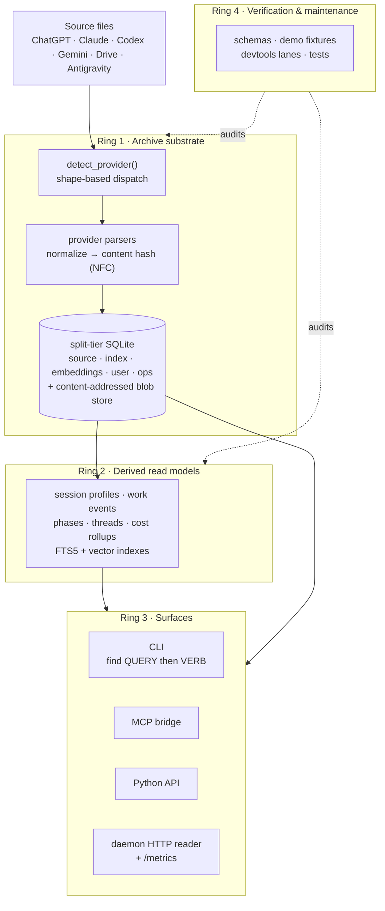

# Polylogue Architecture

For the target shape, guardrails, and architectural decision log, see
[Architecture Spine](architecture-spine.md). Current sequencing and active
workstreams live in the Beads backlog (`bd ready`, `bd list --status open`) —
the durable directive substrate; the former `docs/execution-plan.md` is
superseded (its GitHub-issue map was re-encoded as Beads issues) and slated for
retirement (Ref polylogue-3tl.13). For the vocabulary split between
provider-wire identity, public origin, source roots, capture mode, parser
provenance, and refs, see `docs/provider-origin-identity.md`.

Polylogue is a local archive for AI sessions. The system has four rings:

1. archive substrate
2. derived read models
3. user and machine surfaces
4. verification and maintenance



Source evidence and user-authored state (rings 1 and the `user.db` tier) are
durable; indexes, insight read models, embeddings, and daemon telemetry are
rebuildable. Surfaces (ring 3) are leaf adapters — they read through the same
archive/query substrate rather than owning their own stores.

## Rings

### 1. Archive Substrate

Owns stored meaning:

- source acquisition and provider detection
- provider parsing and normalization
- SQLite persistence and search indexes
- archive-level query and runtime operations

Primary modules:

- `polylogue/sources/`
- `polylogue/pipeline/`
- `polylogue/storage/`
- `polylogue/archive/`
- `polylogue/operations/archive.py`

### 2. Derived Read Models

Stored insights computed over the archive:

- session profiles
- work events, phases, threads
- day and week summaries
- provider-level analytics and tag rollups

Primary modules:

- `polylogue/insights/`
- `polylogue/storage/insights/session/`
- `polylogue/storage/repository/insight/`

### 3. Surfaces

These expose the archive and its insights:

- CLI: `polylogue/cli/`
- Python API: `polylogue/api/__init__.py`
- MCP server: `polylogue/mcp/` — exposes the distilled, agent-preferred
  surfaces (`get_postmortem_bundle`) alongside search/list/insight tools.
- daemon web reader: `polylogue/daemon/web_shell.py`
- dashboard and TUI: `polylogue/ui/`
- renderers: `polylogue/rendering/`

Leaf adapters over archive operations and derived insights.

### 4. Verification and Maintenance

- schema inference and verification
- synthetic corpus generation
- deterministic demo fixtures and behavior-backed archive/reader smoke checks
- optional validation lanes, mutation campaigns, and benchmark campaigns that dispatch executable commands

Primary modules:

- `polylogue/schemas/`
- `polylogue/demo/`
- `devtools/`
- `tests/`

## Data Flow

```
source files (JSON/JSONL/ZIP)
  → detect_provider()          # dispatch.py — shape-based, not filename
  → provider parser            # parsers/{chatgpt,claude,codex,drive}.py
  → content hash (NFC)         # pipeline/ids.py — SHA-256 over normalized payload
  → store (upsert-if-changed)  # storage/ — idempotent by content hash
  → session insights           # storage/insights/session/ — profiles, work events, phases, threads
  → FTS index                  # search_providers/fts5.py — unicode61 tokenizer

           CLI / MCP / Python API
                   ↑
             filter chain → query → storage
```

The daemon-owned ingest path acquires source payloads, parses provider records,
writes archive rows, and refreshes derived read models through explicit
convergence stages.

## Provider Detection

| Provider | Detected by | Parser |
|----------|-------------|--------|
| ChatGPT | `mapping` dict with message graph | `parsers/chatgpt.py` |
| Claude web | `chat_messages` list | `parsers/claude.py` |
| Claude Code | `parentUuid`/`sessionId` in record array | `parsers/claude.py` (code path) |
| Codex | Session envelope structure | `parsers/codex.py` |
| Gemini | `chunkedPrompt.chunks` structure | `parsers/drive.py` |
| Drive | Google Takeout format with OAuth | `parsers/drive.py` |
| Gemini CLI | `local_agent.looks_like_gemini_cli()` document shape | `parsers/local_agent.py` |
| Hermes | state-db payload or hermes agent document | `parsers/hermes_state.py`, `parsers/local_agent.py` |
| Antigravity | Brain artifact metadata (`*.metadata.json`) or language-server Markdown export envelope | `parsers/antigravity.py` |
| Browser capture | capture envelope wrapping a native provider payload | `parsers/browser_capture.py` |

`detect_provider()` (in `sources/dispatch.py`) runs `looks_like()` checks in a
tightness order, not filename order: structural/document detectors first
(browser-capture, gemini-cli, hermes, antigravity), then Pydantic-validated
record checks (Codex, Claude Code), then loose dict-key checks (ChatGPT,
Claude web, Gemini). Insert a new check at the tightness level it deserves or an
earlier parser will claim its records. `Provider.GROK`/`grok-export` is a
reserved origin token with no wired parser yet.

## Provider and Origin Vocabulary

The codebase has origin-related vocabularies with different scopes. See
`docs/provider-origin-identity.md` for the full classification table and
feature guidance.

- **`Provider`** (`polylogue/core/enums.py`): the provider-wire enum used by
  provider-wire parsing, provider schema packages, and some internal storage
  adapters. It previously leaked into public surfaces such as the CLI
  `--provider` filter, MCP `provider` parameter, and daemon facet labels.
  Mixes lab identity (OpenAI, Anthropic, Google), product/runtime
  identity (Claude Code, Codex), and source-family identity
  (claude-code-session vs claude-ai-export) into one token. See the
  vocabulary table in `polylogue/core/provider_identity.py` for the
  detailed conflation surface.
- **`Origin`** (`polylogue/core/enums.py`): the public source-origin token
  carried by query surfaces and archive read payloads, such as
  `claude-code-session`, `claude-ai-export`, and `chatgpt-export`.
  Public filters use `origin`; internal bridges still map origins to
  canonical provider tokens where older storage/insight contracts have not
  been renamed yet.
- **`Source`** (`polylogue/core/sources.py`): the richer source-centered
  identity used for runtime roots and lab attribution. A `Source` is an
  immutable dataclass with `family`, `runtime_root`, and `originating_lab`.

The primary CLI/MCP/API/daemon read surfaces use origin vocabulary. `Provider`
remains only for raw export, schema-package, and provider-metadata boundaries.
The remaining internal provider-token adapters are cleanup targets, not an
alternate archive mode.

Cleanup sequencing:

1. Internal callers switch from provider-token filters to origin filters at
   boundaries where lab identity and runtime identity need to be distinguished
   (e.g. analytics, cost rollups, source-discovery).
2. Storage columns that still carry provider-token names are either renamed in
   the canonical DDL or kept only where their contract is provider-wire.
3. Provider-wire schemas under `schemas/providers/` are retained as
   lab/provider-scope artifacts — they describe raw export shapes and
   stay keyed by lab/product, not by source family.

Anti-goal: provider wording on source-origin public filters or payloads.
Provider remains valid only where the contract is truly provider-wire,
schema-package, provider metadata, or embedding-provider terminology.

## Antigravity Language-Server Export Path

Antigravity persists its session transcripts as opaque non-protobuf
`conversations/*.pb` and `implicit/*.pb` blobs that cannot be statically
decoded. The installed Antigravity language server binary
(`language_server_linux_x64`) exposes two endpoints over a local HTTP loopback
port that together form the supported export surface:

| Endpoint | Purpose |
|----------|---------|
| `/exa.language_server_pb.LanguageServerService/SearchConversations` | Returns cascade IDs, titles, workspace names, snippets, and `lastModifiedTime` for stored sessions. |
| `/exa.language_server_pb.LanguageServerService/ConvertTrajectoryToMarkdown` | Returns a complete Markdown export for a given cascade ID — user inputs, planner responses, tool/command events. |

The adapter lives in `polylogue/sources/parsers/antigravity.py`:

- `AntigravityLanguageServerClient` spawns the binary with
  `-standalone -persistent_mode -http_server_port=<port>` against the user's
  Antigravity data root, waits until the search endpoint answers, and tears the
  process down on close.
- `discover_language_server()` resolves the binary in this order:
  `POLYLOGUE_ANTIGRAVITY_LANGUAGE_SERVER` env var, `$PATH`, then the highest
  matching `/nix/store/*-antigravity-*` extension bundle.
- `iter_language_server_exports(root)` drives `SearchConversations` and
  `ConvertTrajectoryToMarkdown` and yields `ParsedSession` objects through
  `parse_markdown_export()`.

The ingest path is layered in `polylogue/sources/source_parsing.py`: when the
source is `antigravity` and a `conversations/` subdirectory exists, the
language-server export runs first; any `AntigravityExportError` (binary not
found, connection failure, malformed response) is logged and the source falls
back to the existing brain-artifact metadata walk. Both paths emit normalized
`Provider.ANTIGRAVITY` sessions.

## Key Abstractions

| Abstraction | Location | Role |
|-------------|----------|------|
| `Polylogue` | `api/__init__.py` | Async entry point. Wraps storage + search + pipeline. |
| `SessionRepository` | `storage/repository/__init__.py` | Mixin-composed async repository (10 mixins: archive reads, archive writes, raw, vectors, and six insight readers — profile, run-projection, timeline, thread, summary, topology). |
| `SearchProvider` protocol | `protocols.py` | FTS5 and Hybrid (RRF fusion) implementations. |
| `SessionFilter` | `archive/filter/filters.py` | Fluent filter chain used by CLI, MCP, and facade. |
| `Session Insights` | `storage/insights/session/` | Materialized read models: profiles, work events, phases, threads, aggregates. |
| `ContentHash` | `pipeline/ids.py` | SHA-256 over NFC-normalized session payload. Title, timestamps, messages, attachments are hashed. User metadata (tags, summaries) is excluded — editable metadata doesn't trigger re-import. |
| `Provider` enum | `core/enums.py` | Legacy/provider-wire identifier used by parsers, schemas, provider metadata, and compatibility bridges. |
| `Origin` enum | `core/enums.py` | Public source-origin identity used by query/read surfaces and archive payloads. |
| `Source` dataclass | `core/sources.py` | Source-centered identity (`family`, `runtime_root`, `originating_lab`) used for runtime roots and lab attribution. |
| `TopologyEdgeRecord` | `archive/topology/edge.py` | Typed cross-session parent reference. Persisted in `session_links` even when the parent has not yet been ingested (#1258) so out-of-order ingest and sidechain/subagent edges are durable. Closed `TopologyEdgeType` (a `LinkType` alias) / `TopologyEdgeStatus` enums (both in `core/enums.py`) centralize the vocabulary. |
| Logical Session ID | `session_profiles.logical_session_id` | Materialized root session for continuation/fork/subagent lineages. Rollups expose `logical_session_count` alongside physical `session_count`, and `get_logical_session()` returns the compact read-pull lineage envelope. |

## Artifact Taxonomy

Acquired files are classified by `ArtifactKind` before ingestion:

| Kind | Description |
|------|-------------|
| `session_document` | A single session (Claude Code JSONL, ChatGPT JSON) |
| `session_record_stream` | Stream of session events |
| `subagent_session_stream` | Sidechain sub-agent session |
| `agent_sidecar_meta` | Session metadata (history.jsonl, sessions-index.json) |
| `session_index` | Provider-level session index |
| `bridge_pointer` | Pointer from a parent session to a sub-agent session |
| `metadata_document` | Supplementary metadata |
| `unknown` | Unclassified artifact |

`classify_artifact()` in `sources/artifact_taxonomy/` assigns each acquired file
a kind. The daemon uses artifact classification to route files to the correct
ingestion path.

## Hook Integration

Polylogue integrates with AI coding agents via hook scripts that fire on session
lifecycle events. See [docs/hooks.md](hooks.md) for the full event catalog,
per-event use cases, sidecar layout, and recommended starter set.

- **Claude Code**: 16 hook events available (SessionStart, Setup,
  UserPromptSubmit, PreToolUse, PostToolUse, PostToolUseFailure,
  PermissionRequest, PermissionDenied, Notification, Elicitation,
  ElicitationResult, CwdChanged, FileChanged, WorktreeCreate, SubagentStart,
  Stop). See [#802](https://github.com/Sinity/polylogue/issues/802) and
  [#1213](https://github.com/Sinity/polylogue/issues/1213).
- **Codex**: 6 hook events available (SessionStart, UserPromptSubmit,
  PreToolUse, PostToolUse, PermissionRequest, Stop).

Hook scripts call `polylogue-hook` which ingests session data at event
granularity, providing 100% data coverage vs. ~79% from post-hoc JSONL
discovery. Hooks are the enabling infrastructure for real-time context injection
(SessionStart), accurate paste detection (UserPromptSubmit fires before
clipboard expansion so `[Pasted text #N]` markers are observable), tool
execution metadata that never lands in JSONL (PreToolUse/PostToolUse), and a
full permission audit trail (PermissionRequest/PermissionDenied).

## Embedding Pipeline

Vector embeddings for semantic search, powered by Voyage AI (`voyage-4`,
1024 dimensions) via SQLite-vec (`vec0` virtual table):

- **Storage**: `message_embeddings` (vec0), `message_embeddings_meta`, `embedding_status`
- **Search**: `--similar` flag triggers pure vector search; hybrid mode combines
  FTS5 + vector via Reciprocal Rank Fusion
- **Integration**: Daemon-side post-ingest and ambient catch-up embedding is
  opt-in via `embedding_enabled = true` in `polylogue.toml` with a valid
  `voyage_api_key`. When enabled, the daemon drains pending sessions in
  bounded windows and records catch-up progress; when disabled, no embedding
  provider calls are made ([#1503](https://github.com/Sinity/polylogue/issues/1503)).

### Activation flow (#1217)

The `polylogue ops embed` group is the operator-facing onboarding surface:

| Command | Purpose |
|---------|---------|
| `polylogue ops embed preflight` | Count pending messages + Voyage cost estimate without contacting the provider. |
| `polylogue ops embed enable` | Verify `sqlite-vec`, capture the Voyage key, print the cost preflight, and on confirmation persist `[embedding] enabled = true` (and the API key unless `--no-store-key`) into the user `polylogue.toml`. |
| `polylogue ops embed backfill` | Run a bounded, resumable embedding batch with per-session cost feedback; honours `embedding_max_cost_usd` as a soft cap and persists run progress. |
| `polylogue ops embed disable` | Flip `embedding.enabled = false` without dropping existing embeddings — previously-embedded messages remain queryable via `--similar`. |
| `polylogue ops embed status` | Coverage / freshness / configured model+cap / latest catch-up / next-action snapshot via `embedding_status_payload`. Use `--detail` for exact pending-message and retrieval-band accounting. |

The CLI orchestrates substrate primitives under
`polylogue.storage.embeddings` (`iter_pending_sessions`,
`embed_session_sync`, `embedding_catchup_runs`) and the cost constants
`ESTIMATED_TOKENS_PER_MESSAGE` / `VOYAGE_4_COST_PER_1M_TOKENS` from
`polylogue.storage.search_providers.sqlite_vec_support`.

### Search defaults (#1217)

Default `polylogue` searches stay lexical: `retrieval_lane=auto` resolves to
`dialogue` for ordinary FTS queries and does not probe `embeddings.db` before
returning keyword results. Vector retrieval is explicit on the root query
surface:

- `--lexical` — force `retrieval_lane=dialogue` (FTS-only).
- `--semantic` — promote the query string into `similar_text` so the
  request runs as a vector-only similarity probe (no FTS leg).
- `--retrieval-lane hybrid` — combine FTS5 and vector similarity via RRF
  when embeddings are configured and populated.

See [docs/search.md § Retrieval Lanes](search.md#retrieval-lanes) for the
full lane semantics, ranking policy, and `SearchEnvelope` contract.

`polylogue ops status` includes an `Embeddings:` line whenever any
messages are embedded, so the operator can see coverage at a glance.

## Blob Store

Content-addressed storage for large binary artifacts (message content,
attachments, exports):

- **Addressing**: SHA-256 hash over content, stored in 256 prefix-sharded
  subdirectories (`blob/ab/cdef...`)
- **Dedup**: Identical content produces identical hashes — automatic
  deduplication
- **Linking**: `artifact_observations.link_group_key` groups blobs by session
  for lifecycle management (there is no separate `blob_links` table; the name
  is a historical alias for this row-group view of `artifact_observations`)
- **Scale**: ~24K blobs, ~42 GB in production archive
- **GC**: Blob garbage collection is tracked in
  [#818](https://github.com/Sinity/polylogue/issues/818)

## Database

- Archive SQLite file set, WAL mode.
- Schema is fresh-first: version mismatches are rejected and the affected tier
  is rebuilt from source/user evidence. Tier DDL and versions live under
  `storage/sqlite/archive_tiers/`.
- FTS5 with `unicode61` tokenizer (no porter stemmer in this SQLite build).

## Placement Rules

### Substrate (archive meaning)
- `lib/` — domain types, invariants, shared primitives (no I/O, no storage)
- `storage/` — SQLite backends, repositories, FTS, search providers
- `sources/` — provider detection, parsing, acquisition
- `pipeline/` — stage execution, daemon ingestion, validation, and indexing
- `insights/` — derived read models, session insights, analytics
- `operations/` — operation specs, artifact graph, declared runtime contracts

### Surfaces (presentation only)
- `cli/` — Click commands, shared helpers, output formatting
- `mcp/` — MCP server tools
- `api/` — async library API
- `rendering/` — markdown/HTML renderers
- `ui/` — TUI, dashboard
- `daemon/` — daemon convergence, HTTP API, and web reader

### Verification (repo health)
- `devtools/` — operator tooling, lints, campaigns, rendering
- `demo/` — deterministic archive/demo workspace fixtures
- `tests/` — pytest suite, property tests, integration tests

### Cross-cutting
- `schemas/` — provider schemas, schema inference, validation
- `scenarios/` — synthetic corpus, scenario families

### Key rules
- Surfaces may not import substrate internals directly (see layering.yaml).
- New semantics go into substrate or insights first, then surfaces adapt.
